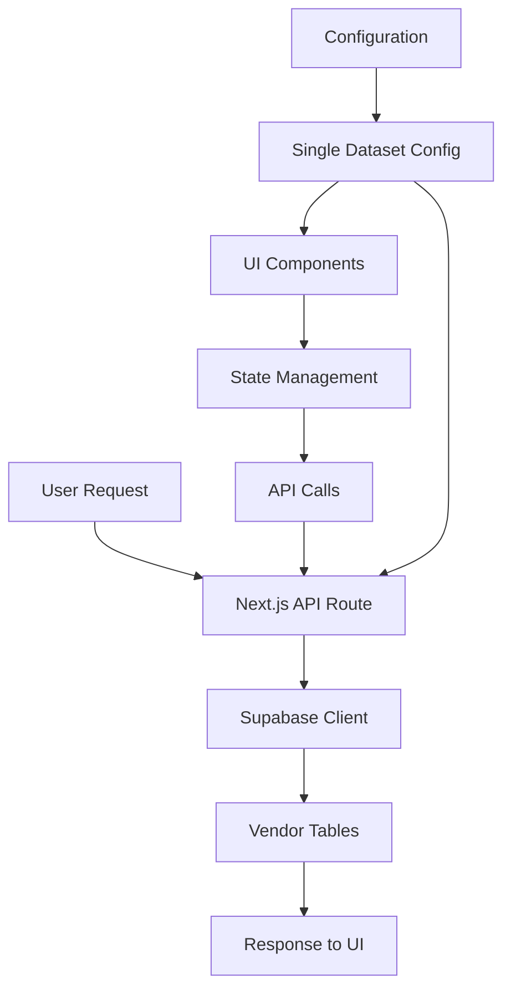

# CSV to Supabase Migration Strategy

**Date:** August 28, 2025  
**Purpose:** Complete migration from dual CSV/Database architecture to Supabase-only  
**Status:** In Progress — Phase 2A + Phase 3A applied

## Current CSV Integration Analysis

### Integration Depth: DEEPLY INTEGRATED

The CSV system is extensively integrated throughout the application at multiple levels:

### 1. API Route Level Integration

**Primary Integration Point:** `/src/app/api/market-data/[dataset]/route.ts`
```typescript
// Current dual-source architecture
const useVendorData = searchParams.get('source') === 'vendor'

if (useVendorData) {
  // Route to vendor-data API (Supabase)
  const vendorUrl = new URL(request.url)
  vendorUrl.pathname = `/api/vendor-data/${dataset}`
  // ... proxy to vendor data
} else {
  // Default to CSV files
  const csvPath = path.join(process.cwd(), 'docs', 'project-documents', '04-data', 'market-data', fileName)
  const csvContent = fs.readFileSync(csvPath, 'utf8')
  // ... parse and return CSV data
}
```

**Status:** 🔴 **Critical Dependency** - Main data routing logic

### 2. Dedicated CSV Data Source Library

**File:** `/src/lib/datasource/csv.ts`
- **Purpose:** Centralized CSV parsing and data extraction
- **Dependencies:** Used by 8+ API routes
- **Functions:**
  - `getMarketTotalsCsv()`
  - `getMarketCountriesCsv()`
  - `getPricingCsv()`
  - `getDirectoryCompaniesCsv()`
  - `getHeatmapCsv()`
  - `getCatalogCsv()`

**Status:** 🔴 **Core Infrastructure** - Multiple API dependencies

### 3. API Routes Using CSV Data Source

**Affected Routes:**
1. `/api/companies/search/route.ts` - Company search
2. `/api/companies/filters/route.ts` - Filter options
3. `/api/companies/heatmap/route.ts` - Geographic heatmap
4. `/api/market/totals/route.ts` - Market totals
5. `/api/market/countries/route.ts` - Country data
6. `/api/quotes/benchmarks/route.ts` - Pricing benchmarks
7. `/api/lookup/catalog/route.ts` - Product catalog

**Status:** 🟡 **Moderate Impact** - Need Supabase replacements

### 4. UI Component Integration

**Main Component:** `/src/app/(dashboard-template)/market-data/page.tsx`

```typescript
// UI state management for data source switching
const [dataSource, setDataSource] = useState<'csv' | 'vendor'>('csv')
const currentSource = searchParams.get('source') || 'csv' // Defaults to CSV!

const toggleDataSource = () => {
  const newSource = dataSource === 'csv' ? 'vendor' : 'csv'
  // Updates URL parameters and re-fetches data
}

// Visual indicators
<Badge variant={dataSource === 'vendor' ? 'default' : 'outline'}>
  <Database className="h-3 w-3 mr-1" />
  {dataSource === 'vendor' ? 'Live Database' : 'CSV Files'}
</Badge>
```

**Status:** 🟡 **UI Integration** - Toggle buttons and state management

### 5. Configuration Systems

**Dataset Configuration Duplication:**
- `DATASET_CONFIGS` in `/src/app/api/market-data/[dataset]/route.ts` (CSV mapping)
- `VENDOR_DATASET_CONFIGS` in `/src/app/api/vendor-data/[dataset]/route.ts` (Supabase mapping)
- `DATASET_CONFIGS` in `/src/app/(dashboard-template)/market-data/page.tsx` (UI mapping)

**Status:** 🟡 **Configuration Complexity** - Multiple config sources

## Migration Strategy: 3-Phase Approach

### Phase 1: Data Verification & Preparation (1-2 hours)

**Objectives:**
- Verify all CSV data is properly imported to Supabase
- Ensure data integrity and completeness
- Test all vendor data API endpoints

**Tasks:**
1. **Data Import Verification**
   ```bash
   # Verify all vendor tables have data
   SELECT 'vendor_company_information' as table_name, count(*) as records FROM vendor_company_information
   UNION ALL
   SELECT 'vendor_fundings_investments', count(*) FROM vendor_fundings_investments
   -- ... continue for all 11 vendor tables
   ```

2. **API Endpoint Testing**
   ```bash
   # Test all vendor data endpoints
   curl "http://localhost:3000/api/vendor-data/company-information"
   curl "http://localhost:3000/api/vendor-data/fundings-investments"
   # ... test all endpoints
   ```

3. **Performance Baseline**
   - Measure response times for vendor data vs CSV
   - Identify any performance gaps that need addressing

**Deliverables:**
- ✅ Data completeness verification report
- ✅ API endpoint functionality confirmation
- ✅ Performance comparison analysis

### Phase 2: Core API Migration (2-3 hours)

**Objectives:**
- Replace CSV dependencies in all API routes
- Update data source library to use Supabase exclusively
- Remove CSV file reading logic

**Tasks:**

#### 2A. Update Market Data API (Primary Route)
**File:** `/src/app/api/market-data/[dataset]/route.ts`

**BEFORE:**
```typescript
const useVendorData = searchParams.get('source') === 'vendor'
if (useVendorData) {
  // Route to vendor data...
} else {
  // Read CSV files...
}
```

**AFTER (implemented):**
```typescript
// Direct routing to vendor data - no CSV fallback
const vendorUrl = new URL(request.url)
vendorUrl.pathname = `/api/vendor-data/${dataset}`
const vendorResponse = await fetch(vendorUrl.toString())
return NextResponse.json(await vendorResponse.json())
```

#### 2B. Create Supabase Data Source Library
**New File:** `/src/lib/datasource/supabase.ts`

```typescript
// Replace csv.ts with Supabase-based functions
import { createClient } from '@/lib/supabase/server'

export async function getMarketTotalsFromSupabase() {
  const supabase = await createClient()
  const { data } = await supabase
    .from('vendor_total_am_market_size')
    .select('*')
  return data
}

export async function getDirectoryCompaniesFromSupabase() {
  const supabase = await createClient()
  const { data } = await supabase
    .from('vendor_company_information')
    .select('*')
  return data
}
// ... continue for all functions
```

#### 2C. Update Dependent API Routes
Replace CSV fallbacks with Supabase-only logic in:
- `/api/companies/search/route.ts` (implemented)
- `/api/companies/filters/route.ts` (implemented)
- `/api/companies/heatmap/route.ts` (implemented)
- `/api/market/totals/route.ts` (implemented)
- `/api/market/countries/route.ts` (implemented)
- `/api/quotes/benchmarks/route.ts` (implemented)
- `/api/lookup/catalog/route.ts` (implemented)

**Example Migration:**
```typescript
// BEFORE
import { getDirectoryCompaniesCsv } from '@/lib/datasource/csv'
const companies = await getDirectoryCompaniesCsv()

// AFTER  
import { getDirectoryCompaniesFromSupabase } from '@/lib/datasource/supabase'
const companies = await getDirectoryCompaniesFromSupabase()
```

**Deliverables:**
- ✅ All listed API routes migrated to Supabase-only
- ⏳ New Supabase data source library (deferred; routes use direct queries today)
- ⏳ CSV dependencies eliminated from backend (partially complete; cleanup pending)

### Phase 3: UI & Configuration Cleanup (1 hour)

**Objectives:**
- Remove data source toggle functionality
- Simplify UI components and state management
- Clean up configuration duplication
- Remove CSV-related files and dependencies

**Tasks:**

#### 3A. Update Market Data Page UI
**File:** `/src/app/(dashboard-template)/market-data/page.tsx`

**BEFORE:**
```typescript
const [dataSource, setDataSource] = useState<'csv' | 'vendor'>('csv')
const toggleDataSource = () => { /* toggle logic */ }

<Button onClick={toggleDataSource}>
  {dataSource === 'vendor' ? 'Using Live Data' : 'Using CSV Files'}
</Button>
```

**AFTER (implemented):**
```typescript
// Remove dataSource state entirely
// Remove toggleDataSource function
// Remove source URL parameters

<Badge variant="default">
  <Database className="h-3 w-3 mr-1" />
  Live Database
</Badge>
```

#### 3B. Consolidate Configuration
**Single configuration source** in `/src/lib/config/datasets.ts`:

```typescript
export const DATASET_CONFIGS = {
  'company-information': {
    table: 'vendor_company_information',
    name: 'Company Information', 
    description: 'Vendor company profiles and headquarters',
    columns: ['company_name', 'website', 'headquarters'],
    displayColumns: ['Company Name', 'Website', 'Headquarters']
  },
  // ... all datasets with unified config
}
```

#### 3C. Remove CSV Dependencies

**Files to Remove:**
- `/src/lib/datasource/csv.ts`
- CSV parsing logic from `/src/app/api/market-data/[dataset]/route.ts`
- Source parameter handling from UI components

**Package Dependencies to Remove (later):**
- Defer removing `csv-parse` until `scripts/*` are migrated off of it. It is still referenced by:
  - `scripts/import-pricing-data.js`
  - `scripts/import-vendor-csv-data.js`

**Deliverables:**
- ✅ Simplified UI without data source toggles
- ✅ Unified configuration system  
- ✅ CSV files and dependencies removed
- ✅ Clean, Supabase-only architecture

## Implementation Checklist

### Pre-Migration Verification
- [ ] All 11 vendor tables populated with data
- [ ] All vendor API endpoints responding correctly
- [ ] Performance benchmarks established
- [ ] Backup of current working system

### Phase 1: Data Verification
- [ ] Data completeness check across all vendor tables
- [ ] API endpoint functionality verification
- [ ] Performance comparison (CSV vs Supabase)
- [ ] Identify any data quality issues

### Phase 2: API Migration
- [x] Update `/api/market-data/[dataset]/route.ts` to Supabase-only
- [ ] Create new `/src/lib/datasource/supabase.ts` (optional; routes currently use direct Supabase queries)
- [x] Migrate all dependent API routes (companies, market, quotes, lookup)
- [x] Remove CSV reading functionality from API routes (remaining cleanup in `csv.ts`)
- [ ] Test all API endpoints after migration

### Phase 3: UI & Cleanup
- [x] Remove data source toggle from market-data page
- [x] Simplify UI state management
- [ ] Create unified dataset configuration
- [ ] Remove `/src/lib/datasource/csv.ts`
- [ ] Uninstall csv-parse dependency (after scripts are updated)
- [x] Update documentation (this file)

### Post-Migration Verification
- [ ] Full application functionality test
- [ ] Performance verification
- [ ] No broken links or API calls
- [ ] All CSV references removed from codebase

## Risk Assessment

### Low Risk
- ✅ **Data Availability**: All data already in Supabase vendor tables
- ✅ **API Compatibility**: Vendor data API already functional and tested
- ✅ **UI Flexibility**: Toggle functionality can be easily removed

### Medium Risk  
- ⚠️ **Performance Changes**: Supabase queries vs CSV file reads (likely faster)
- ⚠️ **Configuration Complexity**: Multiple config sources need consolidation
- ⚠️ **Testing Coverage**: Need comprehensive testing after migration

### Mitigation Strategies
1. **Phased Approach**: Implement in stages with testing between phases
2. **Rollback Plan**: Git-based rollback is available; CSV files remain in repo until final cleanup
3. **Performance Monitoring**: Track response times before/after migration
4. **Comprehensive Testing**: Test all affected routes and UI components

## Expected Benefits

### Performance Improvements
- **Database Queries**: Faster than file system reads for large datasets
- **Caching**: Built-in Supabase connection pooling and caching
- **Scalability**: Better handling of concurrent requests

### Maintenance Simplification
- **Single Source of Truth**: Eliminate CSV/database synchronization issues
- **Reduced Complexity**: Remove dual-source logic and state management
- **Cleaner Architecture**: Simplified data flow and configuration

### Development Velocity
- **Faster Features**: No need to maintain dual data sources
- **Easier Testing**: Single data source reduces test scenarios
- **Better DX**: Clearer separation of concerns

## Post-Migration Architecture



**Clean, simplified data flow with no CSV dependencies**

---

**Implementation Time Estimate:** 4-6 hours total
**Risk Level:** Low-Medium  
**Recommended Approach:** Phased implementation with thorough testing
**Next Steps:**
- Verify endpoints in local/dev for migrated routes
- Decide on adding `/src/lib/datasource/supabase.ts` for shared query helpers vs. keeping route-local queries
- Consolidate dataset configs into `/src/lib/config/datasets.ts`
- Remove `src/lib/datasource/csv.ts` and update health checks
