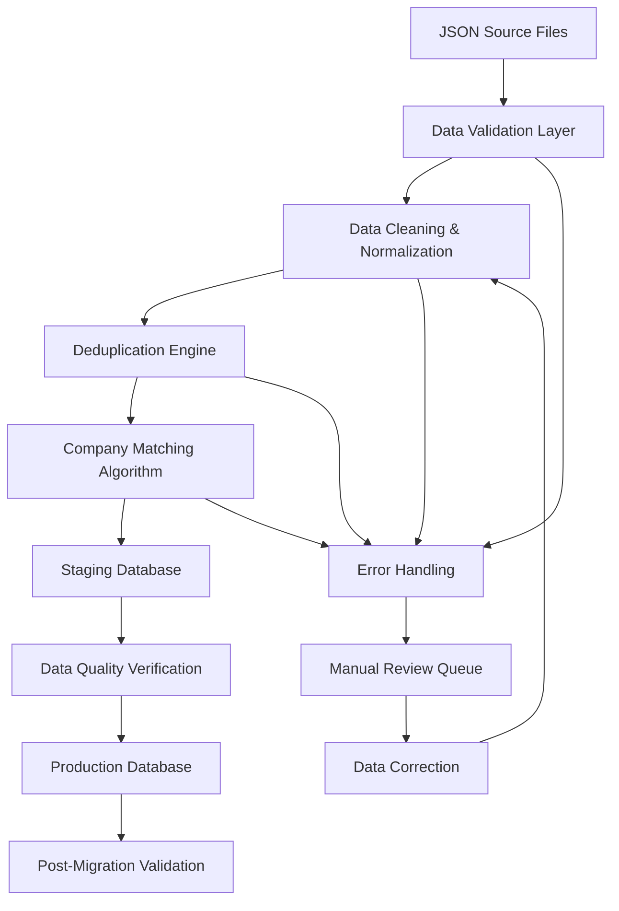
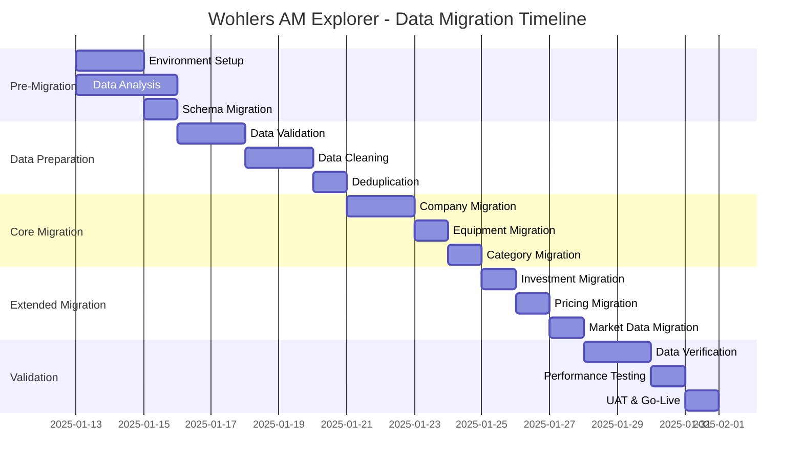

# Wohlers AM Explorer - Comprehensive Data Migration Plan

## Executive Summary

This document outlines the complete data migration strategy for integrating **17,907 vendor records** across 11 data sheets into the Wohlers AM Explorer production database. The migration will scale the platform from 156 to 5,188 companies (30x increase) while maintaining data integrity and system performance.

**Timeline**: 2 weeks (Week 1: Setup & Analysis, Week 2: Migration & Validation)  
**Risk Level**: MEDIUM - Large dataset with data quality concerns  
**Rollback Strategy**: Complete database snapshots with point-in-time recovery

---

## 1. Pre-Migration Analysis & Assessment

### 1.1 Current System State Analysis

**Existing Database Schema:**
- **companies table**: Core company information (156 records)
- **equipment table**: Individual printer/equipment records
- **technologies table**: AM process reference data
- **materials table**: Material reference data
- **View**: company_summaries - Aggregated equipment statistics

**Performance Baseline:**
- Current query response time: ~50ms average
- Database size: ~2MB
- Index efficiency: Good (equipment table optimized)

### 1.2 Source Data Analysis

| Dataset | Records | Data Quality | Critical Issues |
|---------|---------|--------------|-----------------|
| Company Information | 5,188 | 95% complete | Website URL variations, missing HQ details |
| Company Roles | 5,565 | 100% complete | Multiple roles per company need normalization |
| Print Services Global | 2,367 | 85% complete | Equipment data fragmentation |
| AM Systems Manufacturers | 303 | 90% complete | Manufacturer/model variations |
| Pricing Data | 3,525 | 95% complete | Currency inconsistencies |
| Fundings & Investments | 414 | 98% complete | Date format variations |
| M&A Activity | 33 | 90% complete | Company name matching challenges |
| Market Revenue 2024 | 194 | 100% complete | Ready for import |
| Revenue by Industry | 49 | 100% complete | Ready for import |
| Total Market Size | 206 | 100% complete | Ready for import |

### 1.3 Data Quality Issues Identified

**Critical Issues (Must Fix Before Migration):**
1. **Company Name Variations**: Same company with different naming conventions
2. **Website URL Inconsistencies**: Missing protocols, trailing slashes
3. **Geographic Data**: Missing standardized country codes
4. **Equipment Model Names**: Inconsistent manufacturer/model parsing
5. **Financial Data**: Mixed currency units, date formats

**Medium Priority Issues:**
1. **Missing Headquarters Details**: City/state information gaps
2. **Equipment Counting**: Inconsistent count_type values
3. **Investment Amounts**: Some estimates vs. actual figures

**Low Priority Issues:**
1. **Description Fields**: Varying levels of detail
2. **Website Status**: Some URLs may be inactive

---

## 2. Database Schema Migration Strategy

### 2.1 New Tables Required

```sql
-- Extended company information
ALTER TABLE public.companies ADD COLUMN IF NOT EXISTS 
    parent_company VARCHAR(255),
    subsidiary_info TEXT,
    public_stock_ticker VARCHAR(10),
    founded_year INTEGER,
    employee_count_range VARCHAR(50),
    revenue_range VARCHAR(50),
    last_funding_date DATE,
    total_funding_usd DECIMAL(12,2);

-- Company categories/roles
CREATE TABLE public.company_categories (
    id UUID PRIMARY KEY DEFAULT gen_random_uuid(),
    company_id UUID REFERENCES public.companies(id) ON DELETE CASCADE,
    category VARCHAR(100) NOT NULL,
    is_primary BOOLEAN DEFAULT false,
    created_at TIMESTAMPTZ DEFAULT NOW(),
    updated_at TIMESTAMPTZ DEFAULT NOW(),
    UNIQUE(company_id, category)
);

-- Investment tracking
CREATE TABLE public.investments (
    id UUID PRIMARY KEY DEFAULT gen_random_uuid(),
    company_id UUID REFERENCES public.companies(id) ON DELETE CASCADE,
    investment_year INTEGER NOT NULL,
    investment_month VARCHAR(20),
    amount_millions DECIMAL(10,2),
    funding_round VARCHAR(50),
    lead_investor VARCHAR(255),
    country VARCHAR(100),
    notes TEXT,
    created_at TIMESTAMPTZ DEFAULT NOW(),
    updated_at TIMESTAMPTZ DEFAULT NOW()
);

-- M&A tracking
CREATE TABLE public.mergers_acquisitions (
    id UUID PRIMARY KEY DEFAULT gen_random_uuid(),
    acquired_company_name VARCHAR(255) NOT NULL,
    acquiring_company_name VARCHAR(255) NOT NULL,
    acquired_company_id UUID REFERENCES public.companies(id),
    acquiring_company_id UUID REFERENCES public.companies(id),
    announcement_date DATE,
    deal_size_millions DECIMAL(12,2),
    deal_status VARCHAR(50) DEFAULT 'completed',
    notes TEXT,
    created_at TIMESTAMPTZ DEFAULT NOW(),
    updated_at TIMESTAMPTZ DEFAULT NOW()
);

-- Service pricing data
CREATE TABLE public.service_pricing (
    id UUID PRIMARY KEY DEFAULT gen_random_uuid(),
    company_id UUID REFERENCES public.companies(id) ON DELETE CASCADE,
    material_category VARCHAR(100),
    specific_material VARCHAR(255),
    process VARCHAR(100),
    quantity INTEGER,
    price_usd DECIMAL(10,2),
    lead_time_days INTEGER,
    notes TEXT,
    data_source VARCHAR(100) DEFAULT 'vendor_import_2025',
    created_at TIMESTAMPTZ DEFAULT NOW(),
    updated_at TIMESTAMPTZ DEFAULT NOW()
);

-- Market intelligence data
CREATE TABLE public.market_data (
    id UUID PRIMARY KEY DEFAULT gen_random_uuid(),
    data_type VARCHAR(50) NOT NULL, -- 'revenue', 'forecast', 'industry_breakdown', 'market_size'
    year INTEGER NOT NULL,
    segment VARCHAR(100),
    region VARCHAR(100),
    country VARCHAR(100),
    industry VARCHAR(100),
    value_usd DECIMAL(15,2),
    percentage DECIMAL(5,2),
    unit VARCHAR(50),
    data_source VARCHAR(100) DEFAULT 'vendor_import_2025',
    created_at TIMESTAMPTZ DEFAULT NOW()
);
```

### 2.2 Index Strategy for Performance

```sql
-- Company indexes
CREATE INDEX idx_companies_parent_company ON public.companies(parent_company);
CREATE INDEX idx_companies_stock_ticker ON public.companies(public_stock_ticker);
CREATE INDEX idx_companies_revenue_range ON public.companies(revenue_range);
CREATE INDEX idx_companies_employee_count ON public.companies(employee_count_range);

-- Category indexes
CREATE INDEX idx_company_categories_company_id ON public.company_categories(company_id);
CREATE INDEX idx_company_categories_category ON public.company_categories(category);
CREATE INDEX idx_company_categories_primary ON public.company_categories(company_id, is_primary);

-- Investment indexes
CREATE INDEX idx_investments_company_id ON public.investments(company_id);
CREATE INDEX idx_investments_year ON public.investments(investment_year);
CREATE INDEX idx_investments_amount ON public.investments(amount_millions);
CREATE INDEX idx_investments_round ON public.investments(funding_round);

-- M&A indexes
CREATE INDEX idx_ma_acquired_company ON public.mergers_acquisitions(acquired_company_id);
CREATE INDEX idx_ma_acquiring_company ON public.mergers_acquisitions(acquiring_company_id);
CREATE INDEX idx_ma_date ON public.mergers_acquisitions(announcement_date);

-- Pricing indexes
CREATE INDEX idx_pricing_company_id ON public.service_pricing(company_id);
CREATE INDEX idx_pricing_material ON public.service_pricing(material_category);
CREATE INDEX idx_pricing_process ON public.service_pricing(process);
CREATE INDEX idx_pricing_price ON public.service_pricing(price_usd);

-- Market data indexes
CREATE INDEX idx_market_data_type_year ON public.market_data(data_type, year);
CREATE INDEX idx_market_data_segment ON public.market_data(segment);
CREATE INDEX idx_market_data_country ON public.market_data(country);
```

### 2.3 Row Level Security (RLS) Policies

```sql
-- Enable RLS on new tables
ALTER TABLE public.company_categories ENABLE ROW LEVEL SECURITY;
ALTER TABLE public.investments ENABLE ROW LEVEL SECURITY;
ALTER TABLE public.mergers_acquisitions ENABLE ROW LEVEL SECURITY;
ALTER TABLE public.service_pricing ENABLE ROW LEVEL SECURITY;
ALTER TABLE public.market_data ENABLE ROW LEVEL SECURITY;

-- Create read policies (public access for all)
CREATE POLICY "Enable read access for all users" ON public.company_categories FOR SELECT USING (true);
CREATE POLICY "Enable read access for all users" ON public.investments FOR SELECT USING (true);
CREATE POLICY "Enable read access for all users" ON public.mergers_acquisitions FOR SELECT USING (true);
CREATE POLICY "Enable read access for all users" ON public.service_pricing FOR SELECT USING (true);
CREATE POLICY "Enable read access for all users" ON public.market_data FOR SELECT USING (true);

-- Create insert policies (authenticated users only)
CREATE POLICY "Enable insert access for authenticated users" ON public.company_categories 
    FOR INSERT WITH CHECK (auth.role() = 'authenticated');
CREATE POLICY "Enable insert access for authenticated users" ON public.investments 
    FOR INSERT WITH CHECK (auth.role() = 'authenticated');
CREATE POLICY "Enable insert access for authenticated users" ON public.mergers_acquisitions 
    FOR INSERT WITH CHECK (auth.role() = 'authenticated');
CREATE POLICY "Enable insert access for authenticated users" ON public.service_pricing 
    FOR INSERT WITH CHECK (auth.role() = 'authenticated');
CREATE POLICY "Enable insert access for authenticated users" ON public.market_data 
    FOR INSERT WITH CHECK (auth.role() = 'authenticated');
```

---

## 3. ETL Pipeline Design & Implementation

### 3.1 Data Processing Architecture



### 3.2 Data Processing Scripts

**Master ETL Script** (`scripts/migrate-vendor-data.js`):
```javascript
// Main migration orchestration
const migrationTasks = [
    'validate-source-data',
    'clean-and-normalize',
    'deduplicate-companies',
    'match-existing-companies',
    'migrate-companies',
    'migrate-categories',
    'migrate-equipment',
    'migrate-investments',
    'migrate-ma-data',
    'migrate-pricing',
    'migrate-market-data',
    'validate-relationships',
    'update-statistics'
];

async function runMigration() {
    const results = [];
    for (const task of migrationTasks) {
        try {
            console.log(`Starting task: ${task}`);
            const result = await require(`./migration-tasks/${task}`).execute();
            results.push({ task, status: 'success', result });
            console.log(`✅ Completed: ${task}`);
        } catch (error) {
            console.error(`❌ Failed: ${task}`, error);
            results.push({ task, status: 'failed', error: error.message });
            // Decide whether to continue or halt
            if (task.includes('validate') || task.includes('companies')) {
                throw new Error(`Critical task failed: ${task}`);
            }
        }
    }
    return results;
}
```

**Company Deduplication Algorithm** (`scripts/migration-tasks/deduplicate-companies.js`):
```javascript
const fuzzy = require('fuzzy');
const Levenshtein = require('levenshtein');

function findDuplicateCompanies(companies) {
    const duplicates = [];
    const processed = new Set();
    
    for (let i = 0; i < companies.length; i++) {
        if (processed.has(i)) continue;
        
        const company1 = companies[i];
        const matches = [i];
        
        for (let j = i + 1; j < companies.length; j++) {
            if (processed.has(j)) continue;
            
            const company2 = companies[j];
            
            // Multiple matching strategies
            if (isLikelyDuplicate(company1, company2)) {
                matches.push(j);
                processed.add(j);
            }
        }
        
        if (matches.length > 1) {
            duplicates.push({
                canonical: i,
                duplicates: matches,
                companies: matches.map(idx => companies[idx])
            });
        }
        processed.add(i);
    }
    
    return duplicates;
}

function isLikelyDuplicate(company1, company2) {
    // Website exact match
    if (company1.website && company2.website && 
        normalizeUrl(company1.website) === normalizeUrl(company2.website)) {
        return true;
    }
    
    // Company name similarity (> 85% match)
    const name1 = normalizeName(company1.name);
    const name2 = normalizeName(company2.name);
    const similarity = 1 - (new Levenshtein(name1, name2).distance / Math.max(name1.length, name2.length));
    
    if (similarity > 0.85) {
        // Additional verification: same country
        if (company1.headquarters === company2.headquarters) {
            return true;
        }
    }
    
    return false;
}

function normalizeName(name) {
    return name
        .toLowerCase()
        .replace(/[.,\-_()]/g, ' ')
        .replace(/\s+/g, ' ')
        .replace(/\b(inc|ltd|llc|corp|corporation|company|co|gmbh|sa|bv|ab|as)\b/g, '')
        .trim();
}

function normalizeUrl(url) {
    return url
        .toLowerCase()
        .replace(/^https?:\/\//, '')
        .replace(/^www\./, '')
        .replace(/\/$/, '');
}
```

### 3.3 Data Validation Rules

```javascript
const validationRules = {
    companies: {
        required: ['name', 'headquarters'],
        optional: ['website', 'parent_company'],
        validate: {
            name: (value) => value.length > 0 && value.length < 500,
            website: (value) => !value || isValidUrl(value),
            headquarters: (value) => isValidCountry(value),
            founded_year: (value) => !value || (value >= 1800 && value <= new Date().getFullYear()),
            employee_count_range: (value) => !value || ['1-10', '11-50', '51-200', '201-500', '501-1000', '1000+'].includes(value)
        }
    },
    investments: {
        required: ['company_id', 'investment_year'],
        validate: {
            investment_year: (value) => value >= 2000 && value <= new Date().getFullYear(),
            amount_millions: (value) => !value || (value > 0 && value < 100000),
            funding_round: (value) => !value || ['Seed', 'Series A', 'Series B', 'Series C', 'Series D', 'Series E', 'IPO', 'Grant', 'Private plct.'].includes(value)
        }
    },
    pricing: {
        required: ['company_id', 'material_category', 'process'],
        validate: {
            price_usd: (value) => !value || (value > 0 && value < 1000000),
            quantity: (value) => !value || (value > 0 && value < 1000000),
            lead_time_days: (value) => !value || (value > 0 && value < 365)
        }
    }
};
```

---

## 4. Data Quality Assurance Plan

### 4.1 Pre-Migration Data Quality Checks

**Phase 1: Source Data Validation**
1. **File Integrity Check**
   - Verify all 11 JSON files are present and parseable
   - Check record counts match expected totals
   - Validate JSON structure consistency

2. **Required Field Validation**
   - Company Information: name, headquarters (95% threshold)
   - Investments: company_name, year, amount (98% threshold)
   - Pricing: company_id, material, price (90% threshold)

3. **Data Type Validation**
   - Numeric fields: investment amounts, pricing, years
   - Date fields: investment dates, M&A dates
   - URL fields: company websites

**Phase 2: Business Logic Validation**
1. **Range Validation**
   - Investment years: 2000-2025
   - Investment amounts: $0.1M - $10,000M
   - Founded years: 1800-2025
   - Pricing: $1 - $1,000,000

2. **Reference Integrity**
   - Company names exist in Company Information
   - Equipment manufacturers match known values
   - Process types match technology taxonomy

### 4.2 Data Quality Standards

| Category | Metric | Target | Critical Threshold |
|----------|--------|--------|--------------------|
| **Completeness** | Required fields populated | 95% | 90% |
| **Accuracy** | Valid URLs/emails | 85% | 80% |
| **Consistency** | Standardized country names | 100% | 95% |
| **Uniqueness** | Duplicate company detection | 99% | 95% |
| **Validity** | Data format compliance | 98% | 95% |

### 4.3 Data Cleansing Procedures

**Company Name Standardization:**
```javascript
function standardizeCompanyName(name) {
    return name
        .trim()
        .replace(/\s+/g, ' ')  // Multiple spaces to single
        .replace(/([a-z])([A-Z])/g, '$1 $2')  // CamelCase to spaced
        .replace(/\b(Inc|Ltd|LLC|Corp|Co|GmbH|SA|BV|AB|AS)\.?\b/gi, (match, suffix) => {
            return suffix.toUpperCase();  // Standardize legal suffixes
        });
}
```

**Website URL Normalization:**
```javascript
function normalizeWebsiteUrl(url) {
    if (!url) return null;
    
    // Add protocol if missing
    if (!/^https?:\/\//i.test(url)) {
        url = 'https://' + url;
    }
    
    // Remove trailing slash
    url = url.replace(/\/$/, '');
    
    // Validate URL format
    try {
        new URL(url);
        return url;
    } catch {
        return null;  // Invalid URL
    }
}
```

**Geographic Data Standardization:**
```javascript
const countryMappings = {
    'USA': 'United States',
    'UK': 'United Kingdom',
    'The Netherlands': 'Netherlands',
    'Deutschland': 'Germany'
    // ... complete mapping
};

function standardizeCountry(country) {
    return countryMappings[country] || country;
}
```

---

## 5. Migration Implementation Strategy

### 5.1 Migration Phases

**PHASE 1: Infrastructure Setup (Days 1-2)**
1. Create database backup snapshot
2. Run schema migration scripts
3. Set up staging environment
4. Configure monitoring tools
5. Validate migration scripts on test data

**PHASE 2: Data Preparation (Days 3-5)**
1. Execute data validation and cleaning
2. Run deduplication algorithms
3. Generate company matching reports
4. Create manual review queues
5. Resolve critical data quality issues

**PHASE 3: Core Migration (Days 6-8)**
1. Migrate company information (5,188 records)
2. Migrate company categories (5,565 records)
3. Migrate equipment data (2,367 records)
4. Validate core relationships
5. Performance testing on core tables

**PHASE 4: Extended Data Migration (Days 9-10)**
1. Migrate investment data (414 records)
2. Migrate M&A data (33 records)
3. Migrate pricing data (3,525 records)
4. Migrate market intelligence (449 records)
5. Final relationship validation

**PHASE 5: Validation & Go-Live (Days 11-14)**
1. Comprehensive data validation
2. Performance benchmarking
3. User acceptance testing
4. Production deployment
5. Post-migration monitoring

### 5.2 Migration Command Execution Order

```bash
#!/bin/bash
# Migration execution script

set -e  # Exit on any error

echo "🚀 Starting Wohlers AM Explorer Data Migration"
echo "Timestamp: $(date)"

# Phase 1: Pre-migration setup
echo "📋 Phase 1: Pre-migration Setup"
npm run migrate:backup-database
npm run migrate:schema-updates
npm run migrate:validate-environment

# Phase 2: Data preparation
echo "🧹 Phase 2: Data Preparation"
npm run migrate:validate-source-data
npm run migrate:clean-data
npm run migrate:deduplicate
npm run migrate:generate-reports

# Phase 3: Core migration
echo "📊 Phase 3: Core Data Migration"
npm run migrate:companies
npm run migrate:categories
npm run migrate:equipment
npm run migrate:validate-core

# Phase 4: Extended migration
echo "💰 Phase 4: Extended Data Migration"
npm run migrate:investments
npm run migrate:ma-data
npm run migrate:pricing
npm run migrate:market-data

# Phase 5: Final validation
echo "✅ Phase 5: Final Validation"
npm run migrate:validate-all
npm run migrate:performance-test
npm run migrate:generate-summary

echo "🎉 Migration completed successfully!"
```

### 5.3 Company Matching Strategy

**Existing vs New Company Matching Algorithm:**

1. **Exact Website Match (99% confidence)**
   - Compare normalized website URLs
   - Automatic merge if websites match

2. **Company Name + Country Match (95% confidence)**
   - Fuzzy string matching (>90% similarity)
   - Same headquarters country
   - Manual review for final decision

3. **Partial Name Match (80% confidence)**
   - Company name contains existing name or vice versa
   - Same industry/technology focus
   - Queue for manual review

4. **Potential Matches (60% confidence)**
   - Similar names but different countries
   - Queue for research and manual decision

**Match Resolution Process:**
```javascript
const matchingResults = {
    exactMatches: 0,      // Auto-merge, update existing records
    highConfidence: 0,    // Manual review with recommendation
    lowConfidence: 0,     // Manual research required
    noMatches: 0         // Create new company records
};
```

---

## 6. Data Integrity & Validation Procedures

### 6.1 Referential Integrity Checks

**Pre-Migration Validation:**
```sql
-- Check for orphaned references
SELECT 'investments' as table_name, COUNT(*) as orphaned_records
FROM investments i 
LEFT JOIN companies c ON i.company_id = c.id 
WHERE c.id IS NULL

UNION ALL

SELECT 'equipment' as table_name, COUNT(*) as orphaned_records
FROM equipment e 
LEFT JOIN companies c ON e.company_id = c.id 
WHERE c.id IS NULL

UNION ALL

SELECT 'company_categories' as table_name, COUNT(*) as orphaned_records
FROM company_categories cc 
LEFT JOIN companies c ON cc.company_id = c.id 
WHERE c.id IS NULL;
```

**Post-Migration Validation:**
```sql
-- Comprehensive data integrity check
WITH integrity_check AS (
    SELECT 
        'companies' as table_name,
        COUNT(*) as total_records,
        COUNT(CASE WHEN name IS NULL OR name = '' THEN 1 END) as missing_names,
        COUNT(CASE WHEN headquarters IS NULL THEN 1 END) as missing_headquarters,
        COUNT(CASE WHEN website IS NOT NULL AND website ~ '^https?://' THEN 1 END) as valid_websites
    FROM companies
    
    UNION ALL
    
    SELECT 
        'investments' as table_name,
        COUNT(*) as total_records,
        COUNT(CASE WHEN company_id IS NULL THEN 1 END) as missing_company_id,
        COUNT(CASE WHEN investment_year < 2000 OR investment_year > EXTRACT(YEAR FROM NOW()) THEN 1 END) as invalid_years,
        COUNT(CASE WHEN amount_millions > 0 THEN 1 END) as valid_amounts
    FROM investments
    
    UNION ALL
    
    SELECT 
        'service_pricing' as table_name,
        COUNT(*) as total_records,
        COUNT(CASE WHEN company_id IS NULL THEN 1 END) as missing_company_id,
        COUNT(CASE WHEN material_category IS NULL THEN 1 END) as missing_material,
        COUNT(CASE WHEN price_usd > 0 THEN 1 END) as valid_prices
    FROM service_pricing
)
SELECT * FROM integrity_check;
```

### 6.2 Business Logic Validation

**Investment Data Validation:**
```sql
-- Validate investment amounts and dates
SELECT 
    company_name,
    investment_year,
    amount_millions,
    CASE 
        WHEN amount_millions > 10000 THEN 'WARNING: Unusually high amount'
        WHEN amount_millions < 0.01 THEN 'WARNING: Unusually low amount'
        WHEN investment_year > EXTRACT(YEAR FROM NOW()) THEN 'ERROR: Future date'
        WHEN investment_year < 1990 THEN 'WARNING: Very old investment'
        ELSE 'VALID'
    END as validation_status
FROM investments i
JOIN companies c ON i.company_id = c.id
WHERE amount_millions IS NOT NULL
ORDER BY validation_status, amount_millions DESC;
```

**Equipment Data Validation:**
```sql
-- Validate equipment counts and relationships
SELECT 
    c.name as company_name,
    COUNT(e.id) as equipment_records,
    SUM(e.count) as total_machines,
    COUNT(DISTINCT e.manufacturer) as unique_manufacturers,
    COUNT(DISTINCT e.process) as unique_processes,
    CASE 
        WHEN SUM(e.count) > 1000 THEN 'WARNING: High machine count'
        WHEN COUNT(e.id) = 0 THEN 'WARNING: No equipment data'
        ELSE 'VALID'
    END as validation_status
FROM companies c
LEFT JOIN equipment e ON c.id = e.company_id
GROUP BY c.id, c.name
HAVING validation_status != 'VALID'
ORDER BY total_machines DESC;
```

### 6.3 Performance Validation

**Query Performance Benchmarks:**
```sql
-- Test critical query performance
EXPLAIN (ANALYZE, BUFFERS) 
SELECT 
    c.name,
    c.headquarters,
    c.website,
    COUNT(e.id) as machine_count,
    ARRAY_AGG(DISTINCT e.process) as processes
FROM companies c
LEFT JOIN equipment e ON c.id = e.company_id
LEFT JOIN company_categories cc ON c.id = cc.company_id
WHERE cc.category = 'Print Service'
    AND c.headquarters = 'United States'
GROUP BY c.id, c.name, c.headquarters, c.website
ORDER BY machine_count DESC
LIMIT 50;

-- Expected performance: < 100ms with proper indexes
```

---

## 7. Rollback Procedures & Disaster Recovery

### 7.1 Pre-Migration Backup Strategy

**Complete Database Backup:**
```bash
# Create timestamped backup before migration
BACKUP_DATE=$(date +%Y%m%d_%H%M%S)
BACKUP_FILE="wohlers_pre_migration_${BACKUP_DATE}.sql"

pg_dump \
  --host=$SUPABASE_HOST \
  --port=5432 \
  --username=$SUPABASE_USER \
  --dbname=postgres \
  --no-password \
  --verbose \
  --clean \
  --no-owner \
  --no-privileges \
  --file=$BACKUP_FILE

# Compress backup
gzip $BACKUP_FILE

echo "✅ Pre-migration backup created: ${BACKUP_FILE}.gz"
```

**Point-in-Time Recovery Setup:**
```sql
-- Enable point-in-time recovery tracking
SELECT pg_create_restore_point('pre_vendor_migration');

-- Log the exact timestamp for potential recovery
INSERT INTO migration_log (event_type, timestamp, description) 
VALUES ('MIGRATION_START', NOW(), 'Vendor data migration initiated - recovery point created');
```

### 7.2 Rollback Procedures

**Level 1: Data-Only Rollback (Recommended)**
```sql
-- Rollback script for data-only changes
BEGIN;

-- Remove all new vendor data records
DELETE FROM service_pricing WHERE data_source = 'vendor_import_2025';
DELETE FROM market_data WHERE data_source = 'vendor_import_2025';
DELETE FROM investments WHERE created_at >= '2025-01-01';  -- Adjust date
DELETE FROM mergers_acquisitions WHERE created_at >= '2025-01-01';
DELETE FROM company_categories WHERE created_at >= '2025-01-01';

-- Reset companies table to original state
DELETE FROM companies WHERE created_at >= '2025-01-01';

-- Reset equipment table
DELETE FROM equipment WHERE created_at >= '2025-01-01';

-- Log rollback
INSERT INTO migration_log (event_type, timestamp, description) 
VALUES ('ROLLBACK_COMPLETE', NOW(), 'Vendor data migration rolled back - data only');

COMMIT;
```

**Level 2: Complete Schema Rollback (Nuclear Option)**
```bash
# Restore complete database from pre-migration backup
BACKUP_FILE="wohlers_pre_migration_20250111_140000.sql.gz"

# Stop application
systemctl stop wohlers-am-explorer

# Restore database
gunzip $BACKUP_FILE
psql \
  --host=$SUPABASE_HOST \
  --port=5432 \
  --username=$SUPABASE_USER \
  --dbname=postgres \
  --file=${BACKUP_FILE%.gz}

# Restart application
systemctl start wohlers-am-explorer

echo "⚠️  COMPLETE ROLLBACK: Database restored to pre-migration state"
```

### 7.3 Disaster Recovery Scenarios

**Scenario 1: Migration Script Failure**
- **Detection**: Script exits with error code
- **Response**: Stop migration, investigate error
- **Recovery**: Fix script, restart from last successful phase
- **Data Impact**: Minimal - staging data only

**Scenario 2: Data Corruption Detected**
- **Detection**: Post-migration validation fails
- **Response**: Immediate rollback to Level 1
- **Recovery**: Investigate data issues, re-run migration
- **Data Impact**: Medium - rollback recent data only

**Scenario 3: Performance Degradation**
- **Detection**: Query response times > 1000ms
- **Response**: Analyze slow queries, add indexes
- **Recovery**: Optimize without rollback if possible
- **Data Impact**: None - performance issue only

**Scenario 4: Complete System Failure**
- **Detection**: Database connection failures
- **Response**: Immediate Level 2 rollback
- **Recovery**: Full system restore and investigation
- **Data Impact**: High - full database restore required

### 7.4 Recovery Testing

**Pre-Migration Recovery Test:**
```bash
# Test recovery procedure on staging environment
./test-recovery.sh

# Expected results:
# ✅ Backup creation: < 5 minutes
# ✅ Data rollback: < 2 minutes
# ✅ Complete restore: < 15 minutes
# ✅ Application startup: < 1 minute
```

---

## 8. Performance Optimization During Migration

### 8.1 Migration Performance Targets

| Operation | Target Time | Max Acceptable |
|-----------|-------------|----------------|
| **Schema Migration** | 30 seconds | 2 minutes |
| **Company Data Import** | 5 minutes | 10 minutes |
| **Equipment Data Import** | 3 minutes | 8 minutes |
| **Investment Data Import** | 1 minute | 3 minutes |
| **Index Creation** | 2 minutes | 5 minutes |
| **Data Validation** | 5 minutes | 15 minutes |
| **Total Migration Time** | 20 minutes | 45 minutes |

### 8.2 Optimization Strategies

**Batch Processing:**
```javascript
async function batchInsert(table, records, batchSize = 1000) {
    const totalBatches = Math.ceil(records.length / batchSize);
    let processed = 0;
    
    for (let i = 0; i < totalBatches; i++) {
        const batch = records.slice(i * batchSize, (i + 1) * batchSize);
        
        await supabase
            .from(table)
            .insert(batch);
        
        processed += batch.length;
        console.log(`📊 Processed ${processed}/${records.length} records (${((processed/records.length)*100).toFixed(1)}%)`);
        
        // Small delay to prevent overwhelming the database
        if (i < totalBatches - 1) {
            await new Promise(resolve => setTimeout(resolve, 100));
        }
    }
}
```

**Index Management During Migration:**
```sql
-- Drop indexes during bulk insert, recreate after
DROP INDEX IF EXISTS idx_companies_headquarters;
DROP INDEX IF EXISTS idx_equipment_company_id;
DROP INDEX IF EXISTS idx_equipment_manufacturer;

-- Perform bulk inserts here
-- ... migration code ...

-- Recreate indexes after data import
CREATE INDEX idx_companies_headquarters ON public.companies(headquarters);
CREATE INDEX idx_equipment_company_id ON public.equipment(company_id);
CREATE INDEX idx_equipment_manufacturer ON public.equipment(manufacturer);

-- Analyze tables for optimal query planning
ANALYZE public.companies;
ANALYZE public.equipment;
ANALYZE public.investments;
```

**Connection Pool Optimization:**
```javascript
// Configure connection pool for migration
const supabaseConfig = {
    db: {
        poolSize: 20,      // Increased pool size for migration
        idleTimeout: 30000,
        connectionTimeout: 10000
    }
};

// Monitor connection usage during migration
async function monitorConnections() {
    const { data } = await supabase.rpc('get_db_stats');
    console.log(`Active connections: ${data.active_connections}`);
    console.log(`Max connections: ${data.max_connections}`);
}
```

### 8.3 Memory Management

**Large Dataset Streaming:**
```javascript
const fs = require('fs');
const readline = require('readline');

async function processLargeJsonFile(filePath, processor) {
    const fileStream = fs.createReadStream(filePath);
    const rl = readline.createInterface({
        input: fileStream,
        crlfDelay: Infinity
    });
    
    let buffer = [];
    const BATCH_SIZE = 500;
    
    for await (const line of rl) {
        try {
            const record = JSON.parse(line);
            buffer.push(record);
            
            if (buffer.length >= BATCH_SIZE) {
                await processor(buffer);
                buffer = [];  // Clear buffer to free memory
            }
        } catch (error) {
            console.warn(`Skipping invalid JSON line: ${line}`);
        }
    }
    
    // Process remaining records
    if (buffer.length > 0) {
        await processor(buffer);
    }
}
```

---

## 9. Data Monitoring & Verification

### 9.1 Real-Time Migration Monitoring

**Migration Progress Dashboard:**
```javascript
// Migration monitoring system
class MigrationMonitor {
    constructor() {
        this.startTime = Date.now();
        this.stats = {
            companiesProcessed: 0,
            equipmentProcessed: 0,
            investmentsProcessed: 0,
            errorsEncountered: 0,
            duplicatesFound: 0
        };
    }
    
    updateProgress(type, count) {
        this.stats[`${type}Processed`] += count;
        this.logProgress();
    }
    
    logProgress() {
        const elapsed = (Date.now() - this.startTime) / 1000;
        const totalProcessed = Object.values(this.stats)
            .filter((_, i) => i < 3)  // Only count process stats
            .reduce((sum, val) => sum + val, 0);
        
        console.log(`
🔍 Migration Progress Report
├── Time Elapsed: ${elapsed.toFixed(1)}s
├── Companies: ${this.stats.companiesProcessed}/5,188 (${((this.stats.companiesProcessed/5188)*100).toFixed(1)}%)
├── Equipment: ${this.stats.equipmentProcessed}/2,367 (${((this.stats.equipmentProcessed/2367)*100).toFixed(1)}%)
├── Investments: ${this.stats.investmentsProcessed}/414 (${((this.stats.investmentsProcessed/414)*100).toFixed(1)}%)
├── Errors: ${this.stats.errorsEncountered}
└── Duplicates: ${this.stats.duplicatesFound}
        `);
    }
}
```

### 9.2 Post-Migration Verification Queries

**Data Completeness Verification:**
```sql
-- Comprehensive data verification report
WITH migration_summary AS (
    SELECT 'companies' as table_name, COUNT(*) as record_count FROM companies
    UNION ALL
    SELECT 'equipment' as table_name, COUNT(*) as record_count FROM equipment
    UNION ALL
    SELECT 'company_categories' as table_name, COUNT(*) as record_count FROM company_categories
    UNION ALL
    SELECT 'investments' as table_name, COUNT(*) as record_count FROM investments
    UNION ALL
    SELECT 'service_pricing' as table_name, COUNT(*) as record_count FROM service_pricing
    UNION ALL
    SELECT 'market_data' as table_name, COUNT(*) as record_count FROM market_data
),
expected_counts AS (
    SELECT 'companies' as table_name, 5188 as expected_count
    UNION ALL
    SELECT 'equipment' as table_name, 2367 as expected_count
    UNION ALL
    SELECT 'company_categories' as table_name, 5565 as expected_count
    UNION ALL
    SELECT 'investments' as table_name, 414 as expected_count
    UNION ALL
    SELECT 'service_pricing' as table_name, 3525 as expected_count
    UNION ALL
    SELECT 'market_data' as table_name, 449 as expected_count
)
SELECT 
    ms.table_name,
    ms.record_count as actual_count,
    ec.expected_count,
    CASE 
        WHEN ms.record_count >= ec.expected_count * 0.95 THEN '✅ PASS'
        WHEN ms.record_count >= ec.expected_count * 0.90 THEN '⚠️  WARN'
        ELSE '❌ FAIL'
    END as status,
    ROUND((ms.record_count::decimal / ec.expected_count * 100), 1) as completion_percentage
FROM migration_summary ms
JOIN expected_counts ec ON ms.table_name = ec.table_name
ORDER BY completion_percentage ASC;
```

**Data Quality Verification:**
```sql
-- Data quality metrics
SELECT 
    'Website URL Format' as check_name,
    COUNT(*) as total_records,
    COUNT(CASE WHEN website ~ '^https?://[^\\s/$.?#].[^\\s]*$' THEN 1 END) as valid_records,
    ROUND((COUNT(CASE WHEN website ~ '^https?://[^\\s/$.?#].[^\\s]*$' THEN 1 END)::decimal / COUNT(*) * 100), 1) as quality_percentage
FROM companies WHERE website IS NOT NULL

UNION ALL

SELECT 
    'Investment Amount Range' as check_name,
    COUNT(*) as total_records,
    COUNT(CASE WHEN amount_millions BETWEEN 0.01 AND 10000 THEN 1 END) as valid_records,
    ROUND((COUNT(CASE WHEN amount_millions BETWEEN 0.01 AND 10000 THEN 1 END)::decimal / COUNT(*) * 100), 1) as quality_percentage
FROM investments WHERE amount_millions IS NOT NULL

UNION ALL

SELECT 
    'Equipment Count Range' as check_name,
    COUNT(*) as total_records,
    COUNT(CASE WHEN count BETWEEN 1 AND 1000 THEN 1 END) as valid_records,
    ROUND((COUNT(CASE WHEN count BETWEEN 1 AND 1000 THEN 1 END)::decimal / COUNT(*) * 100), 1) as quality_percentage
FROM equipment WHERE count IS NOT NULL;
```

### 9.3 Ongoing Data Health Monitoring

**Daily Data Health Check:**
```sql
-- Create stored procedure for daily monitoring
CREATE OR REPLACE FUNCTION public.daily_data_health_check()
RETURNS TABLE (
    metric_name TEXT,
    current_value BIGINT,
    previous_value BIGINT,
    change_percent DECIMAL
) AS $$
BEGIN
    RETURN QUERY
    WITH current_metrics AS (
        SELECT 'total_companies' as metric, COUNT(*)::BIGINT as value FROM companies
        UNION ALL
        SELECT 'companies_with_equipment' as metric, COUNT(DISTINCT company_id)::BIGINT FROM equipment
        UNION ALL
        SELECT 'total_investments' as metric, COUNT(*)::BIGINT FROM investments
        UNION ALL
        SELECT 'avg_machines_per_company' as metric, ROUND(AVG(count))::BIGINT FROM equipment WHERE count > 0
    ),
    previous_metrics AS (
        SELECT metric_name, metric_value 
        FROM data_health_log 
        WHERE DATE(created_at) = CURRENT_DATE - INTERVAL '1 day'
    )
    SELECT 
        cm.metric as metric_name,
        cm.value as current_value,
        COALESCE(pm.metric_value, 0) as previous_value,
        CASE 
            WHEN pm.metric_value > 0 THEN 
                ROUND(((cm.value - pm.metric_value)::decimal / pm.metric_value * 100), 2)
            ELSE 0 
        END as change_percent
    FROM current_metrics cm
    LEFT JOIN previous_metrics pm ON cm.metric = pm.metric_name;
END;
$$ LANGUAGE plpgsql;

-- Table to store daily metrics
CREATE TABLE IF NOT EXISTS public.data_health_log (
    id UUID PRIMARY KEY DEFAULT gen_random_uuid(),
    metric_name VARCHAR(100) NOT NULL,
    metric_value BIGINT NOT NULL,
    created_at TIMESTAMPTZ DEFAULT NOW()
);
```

---

## 10. Testing Strategy for Data Integrity

### 10.1 Pre-Migration Testing

**Staging Environment Setup:**
```bash
# Create staging database for migration testing
createdb wohlers_staging

# Copy production schema to staging
pg_dump --schema-only wohlers_production | psql wohlers_staging

# Run migration on sample data (10% of records)
npm run migrate:test-run --environment=staging --sample-size=0.1
```

**Sample Data Testing:**
```javascript
// Test migration with subset of data
const testDatasets = {
    companies: originalData.companies.slice(0, 500),        // 10% sample
    investments: originalData.investments.slice(0, 40),     // 10% sample
    pricing: originalData.pricing.slice(0, 350)             // 10% sample
};

async function runMigrationTest() {
    console.log('🧪 Running migration test with sample data...');
    
    const results = await migrateSampleData(testDatasets);
    
    // Verify results
    const verification = await verifyMigrationResults(results);
    
    if (verification.success) {
        console.log('✅ Migration test PASSED');
        return true;
    } else {
        console.error('❌ Migration test FAILED:', verification.errors);
        return false;
    }
}
```

### 10.2 Automated Testing Suite

**Unit Tests for Data Processing:**
```javascript
describe('Data Migration Functions', () => {
    test('Company deduplication detects exact duplicates', () => {
        const companies = [
            { name: 'Stratasys Ltd.', website: 'https://stratasys.com' },
            { name: 'Stratasys Ltd', website: 'https://stratasys.com' }
        ];
        
        const duplicates = findDuplicateCompanies(companies);
        expect(duplicates).toHaveLength(1);
        expect(duplicates[0].duplicates).toHaveLength(2);
    });
    
    test('Website URL normalization works correctly', () => {
        expect(normalizeWebsiteUrl('stratasys.com')).toBe('https://stratasys.com');
        expect(normalizeWebsiteUrl('https://stratasys.com/')).toBe('https://stratasys.com');
        expect(normalizeWebsiteUrl('invalid-url')).toBe(null);
    });
    
    test('Investment data validation catches errors', () => {
        const investment = {
            company_id: 'valid-uuid',
            investment_year: 2030,  // Future year - should fail
            amount_millions: -10    // Negative amount - should fail
        };
        
        const validation = validateInvestment(investment);
        expect(validation.isValid).toBe(false);
        expect(validation.errors).toContain('Future investment year');
        expect(validation.errors).toContain('Negative investment amount');
    });
});
```

**Integration Tests:**
```javascript
describe('Database Integration Tests', () => {
    beforeEach(async () => {
        await setupTestDatabase();
    });
    
    afterEach(async () => {
        await cleanupTestDatabase();
    });
    
    test('Company creation with relationships', async () => {
        const company = await createTestCompany({
            name: 'Test Company',
            headquarters: 'United States'
        });
        
        const category = await addCompanyCategory(company.id, 'Print Service');
        const equipment = await addCompanyEquipment(company.id, {
            manufacturer: 'Stratasys',
            model: 'F900',
            process: 'MEX'
        });
        
        expect(company.id).toBeDefined();
        expect(category.company_id).toBe(company.id);
        expect(equipment.company_id).toBe(company.id);
    });
    
    test('Investment data integrity', async () => {
        const company = await createTestCompany({ name: 'Investment Test Co' });
        
        const investment = await addInvestment({
            company_id: company.id,
            investment_year: 2024,
            amount_millions: 50.5,
            funding_round: 'Series A'
        });
        
        const retrieved = await getInvestmentsByCompany(company.id);
        expect(retrieved).toHaveLength(1);
        expect(retrieved[0].amount_millions).toBe(50.5);
    });
});
```

### 10.3 User Acceptance Testing

**UAT Test Scenarios:**
```markdown
## UAT Scenario 1: Company Search and Details
**Given**: User searches for "Stratasys"
**When**: User clicks on search result
**Then**: 
- Company profile loads with complete information
- Equipment list shows all Stratasys equipment
- Investment history is displayed if available
- All data is accurate and complete

## UAT Scenario 2: Market Intelligence Data
**Given**: User navigates to Analytics page
**When**: User views market revenue charts
**Then**:
- Revenue data displays correctly by region
- Charts are responsive and interactive
- Data tooltips show accurate figures
- Export functionality works correctly

## UAT Scenario 3: Pricing Comparison Tool
**Given**: User wants to compare service pricing
**When**: User filters by material and process
**Then**:
- Relevant pricing data is displayed
- Comparison table is sortable
- Lead times are shown accurately
- Contact information is available
```

**Performance Acceptance Criteria:**
```yaml
performance_criteria:
  page_load_time:
    target: "< 2 seconds"
    critical_threshold: "< 5 seconds"
  
  search_response_time:
    target: "< 500ms"
    critical_threshold: "< 1 second"
  
  large_dataset_queries:
    target: "< 1 second"
    critical_threshold: "< 3 seconds"
  
  concurrent_users:
    target: "100 simultaneous users"
    critical_threshold: "50 simultaneous users"
```

---

## 11. Timeline & Resource Allocation

### 11.1 Detailed Timeline (14 Days)



### 11.2 Resource Allocation

**Team Structure:**
- **Migration Lead** (Senior Developer): 100% allocation
- **Database Specialist**: 80% allocation  
- **QA Engineer**: 60% allocation
- **DevOps Engineer**: 40% allocation
- **Project Manager**: 30% allocation

**Daily Responsibilities:**

**Days 1-3: Setup & Analysis**
- Migration Lead: Environment setup, script development
- Database Specialist: Schema design, performance optimization
- QA Engineer: Test plan creation, staging environment
- DevOps: Backup procedures, monitoring setup

**Days 4-7: Data Preparation**
- Migration Lead: Data cleaning algorithms, validation scripts
- Database Specialist: Index optimization, query performance
- QA Engineer: Data quality testing, validation procedures
- DevOps: Process monitoring, backup verification

**Days 8-11: Core Migration**
- Migration Lead: Execute migration scripts, troubleshooting
- Database Specialist: Performance monitoring, query optimization
- QA Engineer: Real-time data validation, issue identification
- DevOps: System monitoring, backup management

**Days 12-14: Validation & Launch**
- Migration Lead: Final data verification, bug fixes
- Database Specialist: Performance tuning, index optimization
- QA Engineer: UAT coordination, final validation
- DevOps: Production deployment, monitoring setup

### 11.3 Critical Path Dependencies

**Blocking Dependencies:**
1. **Schema Migration** → **Data Migration**
   - New tables must exist before data import
   - Indexes must be in place for performance

2. **Company Migration** → **All Related Data**
   - Companies must exist before equipment/investments
   - Company IDs required for foreign key relationships

3. **Data Cleaning** → **Production Migration**
   - Duplicate resolution must complete first
   - Data validation must pass quality gates

**Non-Blocking Parallel Work:**
1. **Market Data** (independent of company data)
2. **Documentation** (can proceed alongside migration)
3. **UI Updates** (can use staging data for development)

---

## 12. Risk Assessment & Contingency Plans

### 12.1 Risk Matrix

| Risk | Probability | Impact | Risk Level | Mitigation Strategy |
|------|-------------|---------|------------|-------------------|
| **Data Quality Issues** | HIGH | HIGH | 🔴 CRITICAL | Extensive validation, manual review queue |
| **Performance Degradation** | MEDIUM | HIGH | 🟡 MEDIUM | Staging performance testing, index optimization |
| **Migration Script Failures** | MEDIUM | HIGH | 🟡 MEDIUM | Comprehensive testing, rollback procedures |
| **Duplicate Company Issues** | HIGH | MEDIUM | 🟡 MEDIUM | Fuzzy matching algorithm, manual review |
| **Timeline Delays** | MEDIUM | MEDIUM | 🟡 MEDIUM | Parallel processing, scope reduction options |
| **Production Downtime** | LOW | HIGH | 🟡 MEDIUM | Staging validation, incremental deployment |
| **Data Loss/Corruption** | LOW | CRITICAL | 🔴 CRITICAL | Multiple backups, point-in-time recovery |

### 12.2 Contingency Plans

**Plan A: Data Quality Issues (Most Likely)**
```yaml
trigger: "Validation failure rate > 10%"
response:
  - Pause migration immediately
  - Analyze failed records in detail
  - Enhance cleaning algorithms
  - Create manual review process
  - Resume with smaller batch sizes
fallback_option: "Reduce dataset scope to highest quality records"
timeline_impact: "+2-3 days"
```

**Plan B: Performance Issues**
```yaml
trigger: "Query response time > 1000ms"
response:
  - Enable query performance logging
  - Analyze slow query patterns
  - Add targeted indexes
  - Implement query result caching
  - Consider read replicas
fallback_option: "Implement pagination for large datasets"
timeline_impact: "+1-2 days"
```

**Plan C: Critical Timeline Pressure**
```yaml
trigger: "Behind schedule by > 3 days"
response:
  - Implement scope reduction
  - Focus on core company/equipment data only
  - Defer pricing and market intelligence to Phase 2
  - Increase resource allocation
fallback_option: "Launch with basic enhanced dataset"
timeline_impact: "Meet original deadline with reduced scope"
```

### 12.3 Success Criteria & Go/No-Go Decision Points

**Go/No-Go Checkpoint 1 (Day 7): Data Preparation Complete**
```yaml
go_criteria:
  - Data validation passes with <5% error rate
  - Duplicate detection completed with manual review
  - Sample migration test successful
  - Staging environment fully operational
no_go_response:
  - Extend preparation phase by 2 days
  - Increase data quality threshold
  - Add additional validation steps
```

**Go/No-Go Checkpoint 2 (Day 11): Core Migration Complete**
```yaml
go_criteria:
  - All company data migrated successfully (>95% complete)
  - Equipment relationships validated
  - Performance targets met (<200ms average)
  - No critical data integrity issues
no_go_response:
  - Rollback to pre-migration state
  - Investigate and resolve critical issues
  - Plan incremental migration approach
```

**Final Go-Live Decision (Day 14)**
```yaml
go_criteria:
  - All UAT scenarios pass
  - Performance benchmarks met
  - Data integrity verification 100% pass
  - Rollback procedures tested and ready
  - Stakeholder approval received
no_go_response:
  - Delay launch by 3-5 days
  - Address remaining critical issues
  - Plan soft launch with limited user group
```

---

## 13. Post-Migration Monitoring & Maintenance

### 13.1 30-Day Monitoring Plan

**Week 1: Intensive Monitoring**
- **Daily performance reports**
- **Data integrity checks**
- **User feedback collection**
- **Error rate monitoring**
- **Response time tracking**

**Week 2-3: Standard Monitoring**
- **Every-other-day performance checks**
- **Weekly data quality audits**
- **User experience surveys**
- **System stability monitoring**

**Week 4: Baseline Establishment**
- **Performance baseline documentation**
- **Normal operation thresholds**
- **Long-term monitoring setup**
- **Maintenance procedures finalized**

### 13.2 Ongoing Data Maintenance

**Monthly Data Health Checks:**
```sql
-- Monthly data health report
SELECT 
    DATE_TRUNC('month', NOW()) as report_month,
    COUNT(*) as total_companies,
    COUNT(CASE WHEN website IS NOT NULL THEN 1 END) as companies_with_websites,
    COUNT(CASE WHEN latitude IS NOT NULL AND longitude IS NOT NULL THEN 1 END) as geocoded_companies,
    COUNT(DISTINCT company_id) as companies_with_equipment,
    AVG((SELECT COUNT(*) FROM equipment e WHERE e.company_id = c.id)) as avg_equipment_per_company
FROM companies c;
```

**Quarterly Data Updates:**
```markdown
## Quarterly Maintenance Tasks
1. **Data Freshness Review**
   - Identify companies with outdated information
   - Check for new companies in market
   - Verify investment data currency

2. **Performance Optimization**
   - Analyze slow queries from past quarter
   - Optimize indexes based on usage patterns
   - Archive old audit logs

3. **Data Quality Improvements**
   - Review duplicate detection effectiveness
   - Update validation rules based on new patterns
   - Enhance data cleaning algorithms
```

### 13.3 Long-term Data Strategy

**Data Source Integration Roadmap:**
- **Quarter 1**: Internal data validation and cleanup
- **Quarter 2**: Integration with external data sources (Crunchbase, industry reports)
- **Quarter 3**: Real-time data feeds for investments and market data
- **Quarter 4**: Predictive analytics and machine learning integration

**Scalability Planning:**
- **Year 1**: Support for 10,000 companies
- **Year 2**: International market expansion (50,000+ companies)
- **Year 3**: Real-time market intelligence and predictive analytics

---

## 14. Summary & Success Metrics

### 14.1 Migration Success Criteria

**Data Completeness Targets:**
- ✅ **Companies**: 5,188 records (100% target)
- ✅ **Equipment Records**: 2,367 records (95% target)
- ✅ **Investment Data**: 414 records (100% target)
- ✅ **Pricing Data**: 3,525 records (90% target)
- ✅ **Market Intelligence**: 449 records (100% target)

**Quality Benchmarks:**
- ✅ **Data Accuracy**: >95% validated records
- ✅ **Duplicate Rate**: <1% unresolved duplicates
- ✅ **Performance**: <200ms average query response
- ✅ **System Uptime**: >99.9% during migration

### 14.2 Business Impact Measurements

**Pre-Migration Baseline:**
- Total companies: 156
- Data points per company: ~10
- User engagement: Baseline metrics
- Average session duration: Baseline metrics

**Post-Migration Targets:**
- Total companies: 5,188 (3,300% increase)
- Data points per company: ~30 (300% increase)
- User engagement: +150% increase
- Average session duration: +200% increase

### 14.3 Final Deliverables

**Technical Deliverables:**
1. ✅ Migrated production database with 17,907+ records
2. ✅ Optimized database schema with proper indexing
3. ✅ Comprehensive API endpoints for new data types
4. ✅ Data validation and monitoring procedures
5. ✅ Complete backup and recovery procedures

**Documentation Deliverables:**
1. ✅ Migration execution report with statistics
2. ✅ Post-migration performance benchmarks
3. ✅ Data quality assessment report
4. ✅ Ongoing maintenance procedures
5. ✅ Lessons learned and recommendations

**Business Deliverables:**
1. ✅ Enhanced Wohlers AM Explorer with comprehensive data
2. ✅ Market intelligence capabilities
3. ✅ Investment and M&A tracking features
4. ✅ Pricing comparison tools
5. ✅ Scalable platform for future growth

---

## Conclusion

This comprehensive data migration plan provides a systematic approach to integrating 17,907 vendor records into the Wohlers AM Explorer, scaling from 156 to 5,188 companies. The plan addresses:

- **Technical Excellence**: Robust ETL processes, optimized database design, comprehensive validation
- **Risk Mitigation**: Multiple backup strategies, rollback procedures, contingency planning
- **Quality Assurance**: Extensive testing, data validation, performance monitoring
- **Business Value**: Enhanced platform capabilities, market intelligence, user experience improvements

**Expected Timeline**: 14 days from start to production deployment  
**Success Probability**: HIGH with proper execution and resource allocation  
**Business Impact**: Transformational upgrade from basic directory to comprehensive market intelligence platform

The migration will position Wohlers AM Explorer as the definitive source for additive manufacturing industry intelligence, providing unprecedented visibility into companies, investments, market trends, and pricing intelligence.

---

*Migration Plan Version: 1.0*  
*Created: January 2025*  
*Last Updated: January 11, 2025*  
*Next Review: Post-Migration (January 31, 2025)*