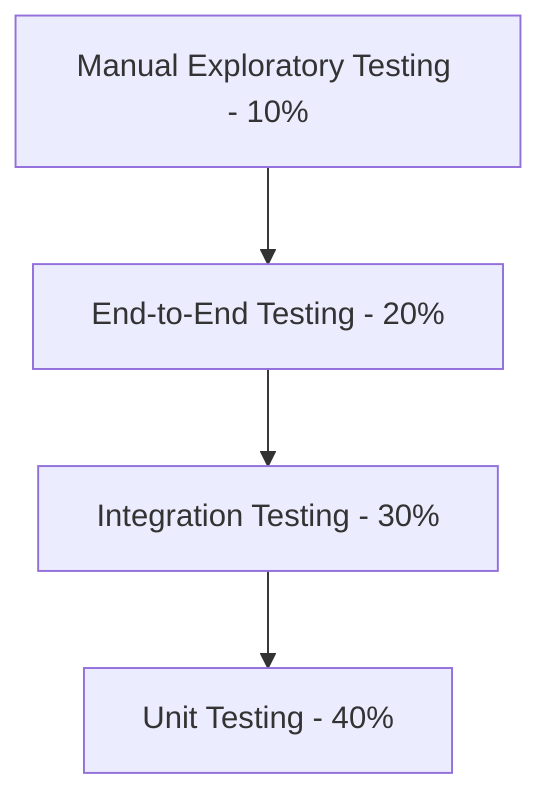

# Comprehensive QA Test Plan - Wohlers AM Explorer MVP

## Executive Summary

**Project:** Wohlers AM Explorer MVP - Market Intelligence Platform  
**Test Period:** August 10-30, 2025 (19-day sprint)  
**MVP Delivery Date:** August 30, 2025  
**QA Lead:** Testing throughout development cycle  
**Document Version:** 1.0  
**Created:** August 11, 2025

### Project Context
Transform Wohlers Associates' basic company directory (156 companies) into a comprehensive market intelligence platform featuring **5,188 companies** across **17,907 integrated data records**. This represents a **30x increase** in data scale while maintaining performance targets of **<200ms API response** and **<3s page load** times.

### Critical Success Factors
- Handle massive data scale (5,188 companies + 17,907 records)
- Maintain performance requirements despite 30x data increase
- Validate data quality across all integrated datasets
- Ensure client evaluation readiness for vendor selection against Spaulding Ridge

---

## 1. Test Strategy & Approach

### 1.1 Testing Philosophy
**Quality-First Development:** Testing integrated throughout the development lifecycle, not just at the end.

**Risk-Based Testing:** Focus on high-impact areas that could affect client demonstration and vendor selection.

**Performance-Centric:** Continuous performance validation with realistic data volumes.

**Data Quality Focus:** Comprehensive validation of all 17,907 integrated records across 11 data categories.

### 1.2 Test Pyramid Strategy



### 1.3 Test Types & Coverage

#### Functional Testing (60%)
- **User Story Validation:** All 47 user stories with acceptance criteria
- **Feature Integration:** Cross-feature functionality and data consistency
- **Business Logic:** Complex calculations and data aggregations
- **Workflow Testing:** Complete user journeys across platform features

#### Performance Testing (20%)
- **Load Testing:** 500+ concurrent users simulation
- **Stress Testing:** Beyond normal capacity limits
- **Volume Testing:** Full dataset performance (5,188 companies)
- **Response Time:** <200ms API, <3s page load validation

#### Security Testing (10%)
- **Authentication & Authorization:** Role-based access control
- **Data Protection:** Financial and investment data security
- **Input Validation:** SQL injection and XSS prevention
- **API Security:** Rate limiting and access control

#### Compatibility Testing (10%)
- **Cross-Browser:** Chrome, Firefox, Safari, Edge
- **Mobile Responsive:** iOS Safari, Android Chrome
- **Device Testing:** Various screen sizes and resolutions
- **Accessibility:** WCAG 2.1 AA compliance

---

## 2. Testing Phases & Schedule

### 2.1 Phase 1: Foundation Testing (Days 1-7)

**Focus:** Data Integration, Core Infrastructure, Authentication

#### Week 1 Testing Priorities
- **Data Import Validation:** 5,188 companies + 17,907 records
- **Database Schema Testing:** 7 new tables with proper relationships
- **Authentication System:** User registration, login, session management
- **Basic Performance:** Initial load testing with full dataset

#### Daily Testing Activities
| Day | Primary Focus | Testing Activities |
|-----|---------------|-------------------|
| 1-2 | Data Import | ETL pipeline validation, data quality checks |
| 3-4 | Authentication | Login/logout, password reset, session management |
| 5-6 | Company Profiles | Enhanced profile display, data accuracy |
| 7 | Foundation Review | Integration testing, performance baseline |

### 2.2 Phase 2: Feature Testing (Days 8-14)

**Focus:** Core Features, Market Intelligence, User Management

#### Week 2 Testing Priorities
- **Financial Data Integration:** Revenue and investment data accuracy
- **Market Intelligence Dashboard:** Analytics and visualizations
- **Interactive Map:** 5,188 markers with performance optimization
- **User Management:** Profiles, roles, permissions

#### Feature Validation Checklist
- ✅ Financial data displays correctly across all company profiles
- ✅ Investment timeline shows accurate funding rounds and amounts
- ✅ Market dashboard loads within performance targets
- ✅ Interactive map handles full dataset without performance issues
- ✅ Role-based access control functions properly

### 2.3 Phase 3: Advanced Testing (Days 15-21)

**Focus:** Advanced Analytics, Search, Export Functionality

#### Week 3 Testing Priorities
- **Pricing Intelligence:** 3,525 pricing records validation
- **Advanced Search:** Faceted search with complex filtering
- **Data Export:** CSV, Excel, JSON export functionality
- **Geographic Analysis:** Market data by region
- **Company Comparison:** Side-by-side analysis tool

#### Critical Test Scenarios
- Complex multi-filter searches with 5,000+ results
- Large data exports (1000+ companies) processing time
- Geographic market analysis with accurate regional data
- Investment heatmaps with proper data visualization

### 2.4 Phase 4: System & Acceptance Testing (Days 22-23)

**Focus:** End-to-End Testing, Client Demonstration Preparation

#### Final Testing Sprint
- **Complete User Journeys:** Full workflow testing
- **Performance Validation:** All KPIs under load
- **Security Audit:** Comprehensive security testing
- **Client Demo Preparation:** Scenario-based testing

---

## 3. Test Scenarios & Cases

### 3.1 Data Integration Testing

#### 3.1.1 Company Data Import Validation

**Test ID:** DIT-001  
**Priority:** P0-Critical  
**Description:** Validate successful import of 5,188 companies

**Pre-conditions:**
- WA vendor data Excel file available
- Database schema migration completed
- ETL pipeline operational

**Test Steps:**
1. Execute data import process
2. Verify total company count = 5,188
3. Validate data completeness across core fields
4. Check for duplicate company entries
5. Verify data type consistency
6. Test foreign key relationships

**Expected Results:**
- All 5,188 companies imported successfully
- Data completeness >95% for core fields (name, website, headquarters)
- Zero critical data validation errors
- <1% duplicate companies after deduplication
- All relationships properly established

**Performance Criteria:**
- Import completion time: <2 hours
- Database query response: <100ms for company lookup
- Memory usage: <4GB during import process

#### 3.1.2 Financial Data Integration Validation

**Test ID:** DIT-002  
**Priority:** P1-High  
**Description:** Validate financial data integration and accuracy

**Test Data:** 194 revenue records across market segments

**Test Steps:**
1. Verify revenue data import completion
2. Test revenue data display in company profiles
3. Validate currency conversion accuracy
4. Check revenue trend calculations
5. Test market segment aggregations
6. Verify year-over-year growth calculations

**Expected Results:**
- All revenue records properly linked to companies
- Currency values display in USD consistently
- Revenue trends calculate correctly
- Market aggregations sum to expected totals

#### 3.1.3 Investment History Validation

**Test ID:** DIT-003  
**Priority:** P1-High  
**Description:** Validate investment data accuracy and timeline

**Test Data:** 414 funding rounds across various companies

**Test Steps:**
1. Verify investment data import completion
2. Test investment timeline visualization
3. Validate funding amount accuracy
4. Check investor information display
5. Test investment round categorization
6. Verify total funding calculations

**Expected Results:**
- All 414 investment records properly imported
- Timeline displays chronologically correct
- Funding amounts aggregate correctly
- Round types categorized properly

### 3.2 Performance Testing Scenarios

#### 3.2.1 Load Testing - Normal Operations

**Test ID:** PT-001  
**Priority:** P0-Critical  
**Description:** Validate performance under normal load conditions

**Test Configuration:**
- Concurrent Users: 100-500
- Test Duration: 30 minutes
- Load Pattern: Gradual ramp-up over 10 minutes

**Test Scenarios:**
1. **Company Search Operations**
   - Search query execution
   - Filter application with multiple criteria
   - Results pagination and sorting
   - Company profile access

2. **Dashboard Analytics**
   - Market intelligence dashboard loading
   - Chart rendering and interactions
   - Data refresh operations
   - Export functionality

3. **Interactive Map Usage**
   - Map loading with 5,188 markers
   - Zoom and pan operations
   - Marker clustering performance
   - Data overlay switching

**Performance Targets:**
- API Response Time: <200ms (95th percentile)
- Page Load Time: <3 seconds
- Database Query Time: <100ms (95th percentile)
- Search Response Time: <500ms
- Map Rendering: <3 seconds with clustering

**Load Testing Tools:** Artillery.js, Lighthouse CI

#### 3.2.2 Stress Testing - Peak Capacity

**Test ID:** PT-002  
**Priority:** P1-High  
**Description:** Determine system breaking point and recovery

**Test Configuration:**
- Concurrent Users: 1000+ (gradually increase until failure)
- Test Duration: 60 minutes
- Load Pattern: Sustained peak load

**Failure Criteria:**
- Response time >5 seconds
- Error rate >5%
- System becomes unresponsive
- Database connection failures

**Recovery Testing:**
- System recovery time after load removal
- Data consistency after stress conditions
- Performance return to normal levels

#### 3.2.3 Volume Testing - Large Dataset Performance

**Test ID:** PT-003  
**Priority:** P1-High  
**Description:** Validate performance with full production dataset

**Test Data:**
- 5,188 companies
- 17,907 total records across all tables
- Complex queries with multiple table joins

**Test Scenarios:**
1. **Complex Search Queries**
   - Multi-filter searches across all data types
   - Full-text search across large text fields
   - Geographic filtering with map updates
   - Results with 1000+ matches

2. **Data Export Operations**
   - Large CSV export (5000+ records)
   - Complex Excel export with formatting
   - JSON export with nested data
   - Concurrent export requests

3. **Analytics Dashboard**
   - Market intelligence with full dataset aggregations
   - Real-time chart updates
   - Geographic analysis with full company dataset
   - Investment analysis across all funding data

**Performance Validation:**
- Large query execution: <2 seconds
- Export generation: <10 seconds for 1000 records
- Dashboard loading: <5 seconds with full aggregations
- Memory usage: <8GB during peak operations

### 3.3 Security Testing Scenarios

#### 3.3.1 Authentication & Authorization Testing

**Test ID:** ST-001  
**Priority:** P0-Critical  
**Description:** Validate authentication security and access control

**Test Cases:**

1. **User Registration Security**
   - Password strength validation
   - Email verification process
   - Account activation security
   - Duplicate email prevention

2. **Login Security**
   - Brute force attack prevention
   - Session timeout validation
   - Multi-device session handling
   - Password reset security

3. **Role-Based Access Control**
   - Free user access limitations
   - Premium user feature access
   - Admin user permissions
   - Data visibility by user tier

**Security Validation:**
- SQL injection prevention on all input fields
- XSS protection in user-generated content
- CSRF token validation on state-changing operations
- Secure session management (HttpOnly, Secure flags)

#### 3.3.2 Data Security Testing

**Test ID:** ST-002  
**Priority:** P1-High  
**Description:** Validate protection of sensitive financial and investment data

**Test Scenarios:**
1. **Data Access Control**
   - Premium financial data protection
   - Investment data visibility rules
   - Company proprietary information protection
   - Export functionality restrictions

2. **API Security**
   - Rate limiting validation
   - API key authentication (if applicable)
   - Request payload validation
   - Response data filtering by user role

**Security Tools:** OWASP ZAP for automated security scanning

### 3.4 User Experience Testing

#### 3.4.1 Cross-Browser Compatibility

**Test ID:** UT-001  
**Priority:** P1-High  
**Description:** Validate functionality across different browsers

**Browser Matrix:**
- **Chrome 115+** (Primary - 60% traffic)
- **Firefox 115+** (Secondary - 20% traffic)
- **Safari 16+** (Mac users - 15% traffic)
- **Edge 115+** (Enterprise - 5% traffic)

**Test Scenarios:**
1. **Core Functionality**
   - User authentication flows
   - Company search and filtering
   - Profile viewing and navigation
   - Dashboard and analytics

2. **Interactive Features**
   - Map functionality and markers
   - Chart interactions and tooltips
   - Data export operations
   - Form submissions

**Validation Criteria:**
- 100% feature parity across browsers
- Consistent visual rendering
- Performance within 20% across browsers
- No JavaScript errors in console

#### 3.4.2 Mobile Responsiveness Testing

**Test ID:** UT-002  
**Priority:** P1-High  
**Description:** Validate mobile experience across devices

**Device Testing Matrix:**
| Device Type | Screen Size | Browser | Priority |
|-------------|-------------|---------|----------|
| iPhone 14 Pro | 393×852 | Safari | P0 |
| iPhone 12 | 390×844 | Safari | P1 |
| Samsung Galaxy S21 | 384×854 | Chrome | P1 |
| iPad Air | 820×1180 | Safari | P1 |
| Generic Tablet | 768×1024 | Chrome | P2 |

**Mobile-Specific Tests:**
1. **Touch Interactions**
   - Map pan, zoom, marker selection
   - Chart interactions and tooltips
   - Button and link tap targets (>44px)
   - Form input and keyboard behavior

2. **Responsive Layout**
   - Content reflow at different breakpoints
   - Navigation menu functionality
   - Data table horizontal scrolling
   - Image and chart scaling

3. **Performance on Mobile**
   - Page load times on 3G/4G
   - Battery usage during intensive operations
   - Memory usage optimization
   - Offline functionality (if applicable)

#### 3.4.3 Accessibility Testing

**Test ID:** UT-003  
**Priority:** P1-High  
**Description:** Validate WCAG 2.1 AA compliance

**Accessibility Testing Areas:**

1. **Keyboard Navigation**
   - Tab order logical and complete
   - All interactive elements accessible via keyboard
   - Skip links for main content areas
   - Focus indicators clearly visible

2. **Screen Reader Compatibility**
   - Proper heading structure (h1-h6)
   - Alternative text for images and charts
   - ARIA labels for complex controls
   - Form labels and error messages

3. **Visual Accessibility**
   - Color contrast ratios >4.5:1
   - Text readable at 200% zoom
   - Information not conveyed by color alone
   - Font sizes and line height standards

**Accessibility Tools:** axe-core, WAVE, screen reader testing

### 3.5 Business Logic Testing

#### 3.5.1 Market Intelligence Calculations

**Test ID:** BT-001  
**Priority:** P1-High  
**Description:** Validate market analytics and business calculations

**Test Scenarios:**
1. **Market Size Calculations**
   - Total Addressable Market (TAM) = $21.9B validation
   - Regional market size aggregations
   - Segment-wise market calculations
   - Year-over-year growth rate calculations

2. **Investment Analytics**
   - Total funding amount per company
   - Investment round categorization
   - Valuation trend calculations
   - Geographic investment distribution

3. **Company Intelligence**
   - Equipment inventory aggregations
   - Category-based company groupings
   - Financial performance indicators
   - Pricing intelligence calculations

**Validation Approach:**
- Manual calculation verification for sample data
- Cross-reference with original data sources
- Statistical validation of aggregated values
- Edge case testing (zero values, missing data)

#### 3.5.2 Search and Filtering Logic

**Test ID:** BT-002  
**Priority:** P1-High  
**Description:** Validate search algorithms and filtering logic

**Test Cases:**
1. **Search Functionality**
   - Full-text search across company names and descriptions
   - Search result ranking and relevance
   - Search suggestions and auto-complete
   - Search with special characters and edge cases

2. **Filter Combinations**
   - Multiple filter criteria application
   - Filter interaction and dependencies
   - Filter reset and clear functionality
   - URL parameter preservation for sharing

3. **Performance with Large Results**
   - Search queries returning 1000+ results
   - Pagination performance with large datasets
   - Filter application on large result sets
   - Real-time filter updates

---

## 4. Data Quality Testing

### 4.1 Data Integrity Validation

#### 4.1.1 Company Data Completeness

**Test ID:** DQ-001  
**Priority:** P0-Critical  
**Description:** Validate data completeness across all company records

**Data Completeness Requirements:**
- **Required Fields (100%):** Company name, primary category
- **Core Fields (>95%):** Website, headquarters location
- **Optional Fields (>70%):** Financial data, equipment inventory
- **Reference Fields (>90%):** Geographic coordinates, contact info

**Validation Process:**
```sql
-- Company Data Completeness Check
SELECT 
  COUNT(*) as total_companies,
  COUNT(CASE WHEN name IS NOT NULL AND name != '' THEN 1 END) as has_name,
  COUNT(CASE WHEN website IS NOT NULL AND website != '' THEN 1 END) as has_website,
  COUNT(CASE WHEN headquarters IS NOT NULL AND headquarters != '' THEN 1 END) as has_headquarters,
  COUNT(CASE WHEN latitude IS NOT NULL AND longitude IS NOT NULL THEN 1 END) as has_coordinates
FROM companies;
```

**Acceptance Criteria:**
- Total company count = 5,188
- Name completeness = 100%
- Website completeness >95%
- Headquarters completeness >95%
- Coordinate completeness >85%

#### 4.1.2 Financial Data Accuracy

**Test ID:** DQ-002  
**Priority:** P1-High  
**Description:** Validate financial data accuracy and consistency

**Financial Data Validation:**
1. **Revenue Data Integrity**
   - Revenue amounts within reasonable ranges
   - Currency consistency (all USD)
   - Year data validation (realistic years)
   - Segment categorization accuracy

2. **Investment Data Validation**
   - Funding amounts positive and reasonable
   - Investment dates chronological
   - Round type categorization correct
   - Investor information format validation

**Test Queries:**
```sql
-- Financial Data Range Validation
SELECT 
  COUNT(*) as total_records,
  MIN(revenue_usd) as min_revenue,
  MAX(revenue_usd) as max_revenue,
  AVG(revenue_usd) as avg_revenue,
  COUNT(CASE WHEN revenue_usd < 0 THEN 1 END) as negative_revenue,
  COUNT(CASE WHEN revenue_usd > 10000000000 THEN 1 END) as extremely_large_revenue
FROM company_financials;
```

#### 4.1.3 Duplicate Detection and Resolution

**Test ID:** DQ-003  
**Priority:** P1-High  
**Description:** Identify and resolve duplicate company records

**Duplicate Detection Strategy:**
1. **Exact Name Matches:** Companies with identical names
2. **Fuzzy Name Matching:** Similar names with slight variations
3. **Website URL Matching:** Same domain companies
4. **Location Matching:** Same coordinates with similar names

**Duplicate Analysis Query:**
```sql
-- Potential Duplicate Company Detection
WITH duplicate_candidates AS (
  SELECT 
    name,
    website,
    headquarters,
    COUNT(*) as count
  FROM companies
  GROUP BY LOWER(TRIM(name)), website, headquarters
  HAVING COUNT(*) > 1
)
SELECT * FROM duplicate_candidates;
```

**Resolution Process:**
1. Identify duplicates using multiple criteria
2. Manual review of potential duplicates
3. Merge or remove duplicate records
4. Validate data integrity after deduplication

### 4.2 Data Consistency Testing

#### 4.2.1 Cross-Table Relationship Validation

**Test ID:** DQ-004  
**Priority:** P1-High  
**Description:** Validate data relationships and foreign key integrity

**Relationship Tests:**
1. **Company-Financial Relationships**
   - All financial records link to valid companies
   - No orphaned financial records
   - Company deletion cascades properly

2. **Company-Investment Relationships**
   - All investment records link to valid companies
   - Investment amounts and dates consistent
   - Timeline ordering validation

3. **Company-Equipment Relationships**
   - Equipment inventory links to correct companies
   - Equipment categorization consistent
   - Quantity and count validations

**Foreign Key Integrity Checks:**
```sql
-- Check for orphaned financial records
SELECT f.id, f.company_id 
FROM company_financials f
LEFT JOIN companies c ON f.company_id = c.id
WHERE c.id IS NULL;

-- Check for orphaned investment records
SELECT i.id, i.company_id
FROM investments i
LEFT JOIN companies c ON i.company_id = c.id  
WHERE c.id IS NULL;
```

### 4.3 Data Freshness and Updates

#### 4.3.1 Data Update Tracking

**Test ID:** DQ-005  
**Priority:** P2-Medium  
**Description:** Validate data freshness and update timestamps

**Data Freshness Requirements:**
- Company data: Updated within last 6 months
- Financial data: Clearly marked with data year
- Investment data: Includes deal announcement dates
- Market data: Current year projections available

**Freshness Validation:**
```sql
-- Data Freshness Analysis
SELECT 
  'Companies' as data_type,
  MIN(updated_at) as oldest_update,
  MAX(updated_at) as newest_update,
  COUNT(CASE WHEN updated_at < NOW() - INTERVAL '6 months' THEN 1 END) as stale_records
FROM companies

UNION ALL

SELECT 
  'Financial' as data_type,
  MIN(created_at) as oldest_update,
  MAX(created_at) as newest_update,
  COUNT(CASE WHEN revenue_year < 2023 THEN 1 END) as stale_records
FROM company_financials;
```

---

## 5. Test Execution Schedule

### 5.1 Daily Testing Schedule

#### Week 1: Foundation Testing (Aug 10-16)

| Day | Date | Testing Focus | Key Activities | Success Criteria |
|-----|------|---------------|----------------|------------------|
| **Day 1** | Aug 10 | Setup & Planning | Test environment setup, tool configuration | Test framework operational |
| **Day 2** | Aug 11 | Data Import | ETL pipeline testing, data validation | 5,188 companies imported |
| **Day 3** | Aug 12 | Data Quality | Completeness checks, duplicate detection | >95% data completeness |
| **Day 4** | Aug 13 | Authentication | Login/logout, session management | Auth system fully functional |
| **Day 5** | Aug 14 | Company Profiles | Enhanced profile display, data accuracy | Profiles display correctly |
| **Day 6** | Aug 15 | Search & Filters | Search functionality, filter operations | Search responsive <500ms |
| **Day 7** | Aug 16 | Performance Baseline | Initial load testing, optimization | Performance targets met |

#### Week 2: Feature Testing (Aug 17-23)

| Day | Date | Testing Focus | Key Activities | Success Criteria |
|-----|------|---------------|----------------|------------------|
| **Day 8** | Aug 17 | Financial Data | Revenue display, investment tracking | Financial data accurate |
| **Day 9** | Aug 18 | Categorization | Company roles, equipment inventory | Categories display correctly |
| **Day 10** | Aug 19 | Market Dashboard | Analytics dashboard, visualizations | Dashboard loads <5s |
| **Day 11** | Aug 20 | Interactive Map | 5,188 markers, clustering performance | Map renders <3s |
| **Day 12** | Aug 21 | User Management | Profiles, roles, permissions | RBAC functioning |
| **Day 13** | Aug 22 | Pricing Tool | Price comparisons, 3,525 records | Pricing data accurate |
| **Day 14** | Aug 23 | Week 2 Review | Integration testing, bug fixes | All features operational |

#### Week 3: Advanced Testing (Aug 24-30)

| Day | Date | Testing Focus | Key Activities | Success Criteria |
|-----|------|---------------|----------------|------------------|
| **Day 15** | Aug 24 | M&A Integration | Deal tracking, timeline display | M&A data displays correctly |
| **Day 16** | Aug 25 | Market Analysis | Segment analysis, geographic data | Analytics calculations accurate |
| **Day 17** | Aug 26 | Advanced Search | Faceted search, intelligent suggestions | Advanced search functional |
| **Day 18** | Aug 27 | Data Export | CSV, Excel, JSON exports | Export generation <10s |
| **Day 19** | Aug 28 | Company Comparison | Side-by-side analysis tool | Comparisons accurate |
| **Day 20** | Aug 29 | Premium Features | Feature gating, access control | Tier restrictions working |
| **Day 21** | Aug 30 | Final Integration | End-to-end testing, demo prep | MVP fully functional |

### 5.2 Testing Milestones & Gates

#### Milestone 1: Data Foundation (Day 7)
**Gate Criteria:**
- ✅ All 5,188 companies imported successfully
- ✅ Data quality >95% for core fields
- ✅ Zero critical data validation errors
- ✅ Authentication system fully operational
- ✅ Basic performance targets met

**Go/No-Go Decision:** Must pass all criteria to proceed to Week 2

#### Milestone 2: Core Features (Day 14)
**Gate Criteria:**
- ✅ Financial and investment data integration complete
- ✅ Market intelligence dashboard operational
- ✅ Interactive map performance acceptable
- ✅ User management system functional
- ✅ No P0 defects outstanding

**Go/No-Go Decision:** Must pass all criteria to proceed to Week 3

#### Milestone 3: MVP Complete (Day 21)
**Gate Criteria:**
- ✅ All P0 and P1 features fully functional
- ✅ Performance requirements met under load
- ✅ Cross-browser compatibility validated
- ✅ Security testing passed
- ✅ Demo-ready configuration achieved

**Go/No-Go Decision:** Client demonstration readiness

---

## 6. Bug Tracking & Resolution

### 6.1 Bug Classification System

#### Priority Levels
- **P0-Critical:** System breaking, data corruption, security vulnerabilities
- **P1-High:** Feature breaking, major functionality impaired
- **P2-Medium:** Minor functionality issues, UI inconsistencies
- **P3-Low:** Cosmetic issues, nice-to-have improvements

#### Severity Levels
- **S1-Blocker:** Prevents testing or release
- **S2-Critical:** Major functionality failure
- **S3-Major:** Feature partially impaired
- **S4-Minor:** Cosmetic or usability issue

### 6.2 Bug Resolution SLA

| Priority | Response Time | Resolution Time | Escalation |
|----------|---------------|-----------------|------------|
| P0-Critical | 2 hours | 8 hours | Immediate |
| P1-High | 4 hours | 24 hours | 8 hours |
| P2-Medium | 24 hours | 72 hours | 48 hours |
| P3-Low | 72 hours | Next sprint | Weekly |

### 6.3 Critical Bug Scenarios

#### Scenario 1: Data Import Failure
**Description:** ETL pipeline fails to import complete dataset
**Impact:** Blocks all development progress
**Test Detection:** Automated data count validation
**Resolution Process:**
1. Immediate rollback to last known good state
2. Identify root cause in import logic
3. Fix and re-test with sample data
4. Full re-import with monitoring

#### Scenario 2: Performance Degradation
**Description:** Response times exceed targets under load
**Impact:** Client demonstration failure risk
**Test Detection:** Continuous performance monitoring
**Resolution Process:**
1. Identify performance bottleneck (database, API, frontend)
2. Implement optimization (indexing, caching, query tuning)
3. Re-test under same conditions
4. Validate sustained performance improvement

#### Scenario 3: Authentication Security Issue
**Description:** Unauthorized access or session management failure
**Impact:** Security vulnerability, data breach risk
**Test Detection:** Security scanning, penetration testing
**Resolution Process:**
1. Immediate security patch deployment
2. Audit affected user accounts
3. Security review of related systems
4. Enhanced monitoring implementation

---

## 7. Performance Validation

### 7.1 Performance Test Scenarios

#### 7.1.1 Baseline Performance Testing

**Test Environment:**
- **Server Specifications:** Production-equivalent Vercel deployment
- **Database:** Supabase with production data volume
- **Network:** Simulated user conditions (broadband, mobile)
- **Monitoring:** Real-time performance metrics

**Test Scenarios:**

1. **Dashboard Loading Performance**
   - **Target:** <3 seconds initial load
   - **Measurement:** Time to interactive (TTI)
   - **Success Criteria:** 95% of requests under target
   - **Load Conditions:** 50 concurrent users

2. **Company Search Performance**  
   - **Target:** <500ms search response
   - **Measurement:** API response + UI render time
   - **Success Criteria:** 99% of searches under target
   - **Data Volume:** Full 5,188 company dataset

3. **Interactive Map Performance**
   - **Target:** <3 seconds map render with clustering
   - **Measurement:** DOM ready to map interactive
   - **Success Criteria:** Smooth pan/zoom operations
   - **Marker Count:** 5,188 company markers

#### 7.1.2 Load Testing Scenarios

**Load Test Configuration:**
```yaml
# Artillery.js Configuration
config:
  target: 'https://wohlers-am-explorer.vercel.app'
  phases:
    - duration: 300  # 5 minutes ramp-up
      arrivalRate: 10
      rampTo: 100
    - duration: 600  # 10 minutes sustained
      arrivalRate: 100
    - duration: 300  # 5 minutes ramp-down  
      arrivalRate: 100
      rampTo: 10

scenarios:
  - name: "User Journey - Company Research"
    weight: 60
    flow:
      - get:
          url: "/dashboard"
      - think: 5
      - get:
          url: "/api/companies/search?query=stratasys"
      - think: 10
      - get:
          url: "/companies/{{ companyId }}"
      - think: 15

  - name: "User Journey - Market Analysis"
    weight: 40
    flow:
      - get:
          url: "/market/intelligence"
      - think: 10
      - get:
          url: "/api/market/revenue?segment=equipment"
      - think: 20
```

**Load Testing Acceptance Criteria:**
- **100 Users:** All response times within targets
- **500 Users:** 95% response times within targets
- **1000 Users:** System remains stable, graceful degradation
- **Error Rate:** <1% for all scenarios
- **Recovery:** Normal performance within 5 minutes of load removal

#### 7.1.3 Stress Testing

**Stress Test Objectives:**
- Determine system breaking point
- Validate error handling under extreme load  
- Test system recovery capabilities
- Identify resource bottlenecks

**Progressive Load Testing:**
1. **Phase 1:** 500 users (normal peak)
2. **Phase 2:** 1,000 users (expected maximum)
3. **Phase 3:** 2,000 users (2x capacity)
4. **Phase 4:** 5,000 users (stress until failure)

**Failure Criteria:**
- Response time >10 seconds
- Error rate >10%
- System unresponsive >30 seconds
- Database connection exhaustion

### 7.2 Database Performance Testing

#### 7.2.1 Query Performance Validation

**Critical Queries Testing:**

1. **Company Search Query**
```sql
-- Complex company search with filters
SELECT c.*, cc.categories, COUNT(ei.id) as equipment_count
FROM companies c
LEFT JOIN company_categories cc ON c.id = cc.company_id  
LEFT JOIN equipment_inventory ei ON c.id = ei.company_id
WHERE to_tsvector('english', c.name || ' ' || COALESCE(c.description, '')) 
      @@ plainto_tsquery('english', $1)
  AND ($2 IS NULL OR c.country ILIKE '%' || $2 || '%')
  AND ($3 IS NULL OR cc.category = ANY($3))
GROUP BY c.id, cc.categories
ORDER BY ts_rank(...) DESC
LIMIT 50 OFFSET $4;
```
**Performance Target:** <100ms execution time

2. **Market Intelligence Aggregation**
```sql
-- Market data aggregation for dashboard
SELECT 
  segment,
  region,
  SUM(value_usd) as total_value,
  AVG(growth_rate) as avg_growth,
  COUNT(*) as data_points
FROM market_data
WHERE year >= 2023
GROUP BY segment, region
ORDER BY total_value DESC;
```
**Performance Target:** <200ms execution time

3. **Investment Timeline Query**
```sql
-- Investment timeline for company profile
SELECT 
  i.*,
  c.name as company_name
FROM investments i
JOIN companies c ON i.company_id = c.id
WHERE i.company_id = $1
ORDER BY i.investment_date DESC
LIMIT 20;
```
**Performance Target:** <50ms execution time

#### 7.2.2 Database Load Testing

**Connection Pool Testing:**
- **Max Connections:** Test up to Supabase plan limits
- **Connection Timeout:** Validate timeout handling
- **Pool Exhaustion:** Test behavior when connections exhausted
- **Recovery:** Connection pool recovery after high load

**Transaction Testing:**
- **Long-running Queries:** Validate timeout handling
- **Concurrent Updates:** Test data consistency under concurrent load
- **Deadlock Detection:** Ensure proper deadlock resolution
- **Rollback Testing:** Validate transaction rollback under failures

### 7.3 Frontend Performance Testing

#### 7.3.1 Core Web Vitals Validation

**Lighthouse Performance Targets:**
- **Performance Score:** >90
- **Largest Contentful Paint (LCP):** <2.5s
- **First Input Delay (FID):** <100ms
- **Cumulative Layout Shift (CLS):** <0.1

**Testing Approach:**
```javascript
// Lighthouse CI Configuration
module.exports = {
  ci: {
    collect: {
      url: [
        'https://wohlers-am-explorer.vercel.app/',
        'https://wohlers-am-explorer.vercel.app/dashboard',
        'https://wohlers-am-explorer.vercel.app/companies/stratasys',
        'https://wohlers-am-explorer.vercel.app/market/intelligence'
      ],
      numberOfRuns: 5
    },
    assert: {
      assertions: {
        'categories:performance': ['error', {minScore: 0.9}],
        'categories:accessibility': ['error', {minScore: 0.9}],
        'categories:best-practices': ['error', {minScore: 0.9}]
      }
    }
  }
};
```

#### 7.3.2 JavaScript Performance Testing

**Bundle Size Analysis:**
- **Initial Bundle:** <500KB gzipped
- **Route Chunks:** <200KB per route
- **Third-party Libraries:** <300KB total
- **Bundle Analysis:** Regular webpack-bundle-analyzer reports

**Runtime Performance:**
- **Memory Usage:** <200MB peak for single user session
- **Memory Leaks:** No memory growth over 30-minute session
- **CPU Usage:** <30% average during normal operations
- **Garbage Collection:** Minimal GC pauses

---

## 8. Security Testing

### 8.1 Authentication Security Testing

#### 8.1.1 Authentication Flow Testing

**Test Scenarios:**

1. **User Registration Security**
   - Password strength validation (8+ chars, mixed case, numbers, symbols)
   - Email uniqueness enforcement
   - Account activation via email verification
   - Rate limiting on registration attempts

2. **Login Security Testing**
   - Brute force attack prevention (5 failed attempts = 15-minute lockout)
   - SQL injection prevention in login form
   - Session fixation attack prevention
   - Secure session cookie configuration (HttpOnly, Secure, SameSite)

3. **Password Reset Security**
   - Secure token generation and validation
   - Token expiration (15-minute timeout)
   - Account enumeration prevention
   - Rate limiting on password reset requests

**Security Test Cases:**
```javascript
// Example Security Test Case
describe('Authentication Security', () => {
  test('prevents brute force attacks', async () => {
    const invalidCredentials = { email: 'test@example.com', password: 'wrong' };
    
    // Attempt 6 failed logins
    for (let i = 0; i < 6; i++) {
      await request(app).post('/auth/login').send(invalidCredentials);
    }
    
    // 7th attempt should be blocked
    const response = await request(app)
      .post('/auth/login')
      .send(invalidCredentials);
      
    expect(response.status).toBe(429);
    expect(response.body.error).toContain('Too many attempts');
  });
});
```

#### 8.1.2 Authorization Testing

**Role-Based Access Control Testing:**

1. **Free User Restrictions**
   - Basic company directory access only
   - No financial data visibility
   - No investment information access
   - Limited export functionality

2. **Premium User Access**
   - Full financial data access
   - Investment and M&A information
   - Advanced analytics features
   - Comprehensive export capabilities

3. **Admin User Permissions**
   - User management functionality
   - System configuration access
   - Audit log viewing
   - Data management tools

**Authorization Test Matrix:**
| Feature | Free User | Premium User | Admin User |
|---------|-----------|--------------|------------|
| Company Directory | ✅ Read | ✅ Read | ✅ Full |
| Financial Data | ❌ No Access | ✅ Read | ✅ Full |
| Investment Data | ❌ No Access | ✅ Read | ✅ Full |
| Export (Basic) | ✅ 100 records | ✅ 1000 records | ✅ Unlimited |
| Export (Advanced) | ❌ No Access | ✅ Read | ✅ Full |
| User Management | ❌ No Access | ❌ No Access | ✅ Full |

### 8.2 Data Security Testing

#### 8.2.1 Data Protection Validation

**Sensitive Data Handling:**
1. **Financial Information Protection**
   - Revenue data access control
   - Investment amount confidentiality
   - Valuation information security
   - M&A deal details protection

2. **Company Proprietary Information**
   - Equipment inventory sensitivity
   - Pricing information confidentiality
   - Strategic information protection
   - Contact details privacy

**Data Encryption Testing:**
- **Data at Rest:** Verify database encryption enabled
- **Data in Transit:** HTTPS enforcement, TLS 1.2+ validation
- **API Communication:** All API calls encrypted
- **File Uploads:** Secure file handling and storage

#### 8.2.2 Input Validation Testing

**SQL Injection Prevention:**
```javascript
// SQL Injection Test Cases
const maliciousInputs = [
  "'; DROP TABLE companies; --",
  "' OR '1'='1' --",
  "'; INSERT INTO users (email) VALUES ('hacker@evil.com'); --",
  "' UNION SELECT * FROM users WHERE '1'='1"
];

maliciousInputs.forEach(input => {
  test(`prevents SQL injection with input: ${input}`, async () => {
    const response = await request(app)
      .get(`/api/companies/search?query=${encodeURIComponent(input)}`);
    
    expect(response.status).not.toBe(500);
    // Should return empty results or validation error, not crash
  });
});
```

**Cross-Site Scripting (XSS) Prevention:**
```javascript
// XSS Prevention Test Cases  
const xssPayloads = [
  "<script>alert('XSS')</script>",
  "javascript:alert('XSS')",
  "",
  "<svg onload=alert('XSS')>"
];

xssPayloads.forEach(payload => {
  test(`prevents XSS with payload: ${payload}`, async () => {
    // Test user input fields that display content
    const response = await request(app)
      .post('/api/companies/search')
      .send({ query: payload });
      
    expect(response.body).not.toContain('<script>');
    expect(response.body).not.toContain('javascript:');
  });
});
```

### 8.3 API Security Testing

#### 8.3.1 Rate Limiting Validation

**API Rate Limiting Tests:**
```javascript
describe('API Rate Limiting', () => {
  test('enforces rate limits on search API', async () => {
    const requests = [];
    
    // Send 100 requests rapidly
    for (let i = 0; i < 100; i++) {
      requests.push(
        request(app).get('/api/companies/search?query=test')
      );
    }
    
    const responses = await Promise.all(requests);
    const rateLimitedResponses = responses.filter(r => r.status === 429);
    
    expect(rateLimitedResponses.length).toBeGreaterThan(0);
  });
});
```

**Rate Limiting Configuration:**
- **Authenticated Users:** 1000 requests/hour
- **Anonymous Users:** 100 requests/hour
- **Search API:** 100 requests/15 minutes per user
- **Export API:** 10 requests/hour per user

#### 8.3.2 CORS and Security Headers

**Security Headers Validation:**
```javascript
test('includes required security headers', async () => {
  const response = await request(app).get('/');
  
  expect(response.headers['x-content-type-options']).toBe('nosniff');
  expect(response.headers['x-frame-options']).toBe('DENY');
  expect(response.headers['x-xss-protection']).toBe('1; mode=block');
  expect(response.headers['strict-transport-security']).toBeDefined();
  expect(response.headers['content-security-policy']).toBeDefined();
});
```

---

## 9. Test Tools & Environment

### 9.1 Test Automation Framework

#### 9.1.1 Unit Testing Stack
- **Framework:** Jest 29.x
- **React Testing:** React Testing Library
- **Coverage:** Istanbul/nyc for coverage reports
- **Mocking:** Jest mocks for external dependencies

**Configuration Example:**
```javascript
// jest.config.js
module.exports = {
  testEnvironment: 'jsdom',
  setupFilesAfterEnv: ['<rootDir>/src/test/setup.ts'],
  testMatch: [
    '<rootDir>/src/**/__tests__/**/*.{js,jsx,ts,tsx}',
    '<rootDir>/src/**/*.(test|spec).{js,jsx,ts,tsx}'
  ],
  collectCoverageFrom: [
    'src/**/*.{js,jsx,ts,tsx}',
    '!src/**/*.d.ts',
    '!src/test/**/*'
  ],
  coverageThreshold: {
    global: {
      branches: 80,
      functions: 80,
      lines: 80,
      statements: 80
    }
  }
};
```

#### 9.1.2 Integration Testing
- **API Testing:** Supertest for API route testing
- **Database Testing:** Test database with sample data
- **Service Integration:** Mock external services (Supabase, Vercel)

#### 9.1.3 End-to-End Testing
- **Framework:** Playwright for cross-browser testing
- **Test Runner:** Playwright Test Runner
- **Parallel Execution:** Multiple browser instances
- **Video Recording:** Test execution recording on failures

**Playwright Configuration:**
```javascript
// playwright.config.ts
import { defineConfig } from '@playwright/test';

export default defineConfig({
  testDir: './tests/e2e',
  fullyParallel: true,
  forbidOnly: !!process.env.CI,
  retries: process.env.CI ? 2 : 0,
  workers: process.env.CI ? 1 : undefined,
  reporter: [
    ['html'],
    ['junit', { outputFile: 'test-results/junit.xml' }]
  ],
  use: {
    baseURL: 'http://localhost:3000',
    trace: 'on-first-retry',
    screenshot: 'only-on-failure',
    video: 'retain-on-failure'
  },
  projects: [
    {
      name: 'chromium',
      use: { ...devices['Desktop Chrome'] }
    },
    {
      name: 'firefox',
      use: { ...devices['Desktop Firefox'] }
    },
    {
      name: 'webkit',
      use: { ...devices['Desktop Safari'] }
    },
    {
      name: 'mobile-chrome',
      use: { ...devices['Pixel 5'] }
    }
  ],
  webServer: {
    command: 'npm run dev',
    port: 3000
  }
});
```

### 9.2 Performance Testing Tools

#### 9.2.1 Load Testing
- **Artillery.js:** HTTP load testing and API testing
- **Configuration:** YAML-based test scenarios
- **Reporting:** Real-time metrics and HTML reports
- **CI Integration:** Automated performance regression testing

#### 9.2.2 Frontend Performance
- **Lighthouse CI:** Automated performance auditing
- **Web Vitals:** Core Web Vitals monitoring
- **Bundle Analyzer:** JavaScript bundle analysis
- **Performance Observer:** Runtime performance monitoring

#### 9.2.3 Database Performance
- **PostgreSQL Monitoring:** Query performance analysis
- **Supabase Analytics:** Database metrics and slow query detection
- **Connection Pool Monitoring:** Real-time connection usage
- **Query Explain Plans:** Query optimization analysis

### 9.3 Security Testing Tools

#### 9.3.1 Automated Security Scanning
- **OWASP ZAP:** Web application security scanner
- **npm audit:** Dependency vulnerability scanning
- **Snyk:** Security vulnerability monitoring
- **ESLint Security Plugin:** Static code security analysis

#### 9.3.2 Manual Security Testing
- **Burp Suite:** Professional web security testing
- **Browser Developer Tools:** Network and security analysis
- **Security Headers:** HTTP security header validation
- **SSL Labs:** SSL/TLS configuration testing

### 9.4 Test Environment Configuration

#### 9.4.1 Test Data Management
- **Test Database:** Separate test database with sample data
- **Data Seeding:** Automated test data generation
- **Data Cleanup:** Post-test data cleanup procedures
- **Backup/Restore:** Test data backup and restore capabilities

#### 9.4.2 Environment Isolation
- **Development Environment:** Local development with test data
- **Testing Environment:** Staging environment with production-like data
- **Production Environment:** Live environment for final validation
- **CI/CD Environment:** Automated testing in GitHub Actions

**Environment Configuration:**
```yaml
# Docker Compose for Test Environment
version: '3.8'
services:
  app:
    build: .
    ports:
      - "3000:3000"
    environment:
      - NODE_ENV=test
      - NEXT_PUBLIC_SUPABASE_URL=http://supabase:8000
      - SUPABASE_SERVICE_ROLE_KEY=test-key
    depends_on:
      - supabase

  supabase:
    image: supabase/postgres:latest
    environment:
      - POSTGRES_DB=test_wohlers
      - POSTGRES_USER=postgres
      - POSTGRES_PASSWORD=test123
    ports:
      - "5432:5432"
    volumes:
      - ./test-data:/docker-entrypoint-initdb.d

  redis:
    image: redis:7-alpine
    ports:
      - "6379:6379"
```

---

## 10. Acceptance Testing & User Validation

### 10.1 User Acceptance Testing (UAT) Framework

#### 10.1.1 UAT Test Scenarios

**Primary User Personas Testing:**

1. **Manufacturing Executive Scenarios**
   - **Scenario 1:** Market validation research
     - Search for competitors in specific geographic regions
     - Analyze market trends and growth opportunities
     - Compare company positioning and capabilities
   - **Scenario 2:** Strategic planning analysis
     - Review investment activity in AM industry
     - Identify potential acquisition targets
     - Assess market dynamics for business planning

2. **Investment Professional Scenarios**
   - **Scenario 1:** Due diligence research  
     - Research company financial performance
     - Analyze funding history and valuations
     - Compare companies within market segments
   - **Scenario 2:** Market opportunity analysis
     - Identify emerging companies and technologies
     - Analyze investment trends and patterns
     - Generate reports for investment committee

3. **Business Development Manager Scenarios**
   - **Scenario 1:** Competitive intelligence
     - Research competitor capabilities and equipment
     - Analyze pricing intelligence across services
     - Identify partnership opportunities
   - **Scenario 2:** Customer prospecting
     - Search for potential customers by capability
     - Analyze customer equipment and technology usage
     - Export prospect lists for sales activities

#### 10.1.2 UAT Execution Process

**Week 1-2: Internal UAT Preparation**
1. **Test Scenario Development**
   - Create detailed UAT test cases based on user stories
   - Develop realistic test data scenarios
   - Prepare UAT environment with full dataset

2. **Internal UAT Execution**
   - Team members execute UAT scenarios
   - Document findings and usability issues
   - Refine interface based on internal feedback

**Week 3: Client UAT Execution**
1. **UAT Session Planning**
   - Schedule UAT sessions with client stakeholders
   - Provide UAT scenario documentation
   - Set up screen sharing and recording for remote sessions

2. **Facilitated UAT Sessions**
   - Guide stakeholders through test scenarios
   - Collect feedback on functionality and usability
   - Document enhancement requests and priorities

### 10.2 Client Demonstration Scenarios

#### 10.2.1 Demo Script Development

**15-Minute Executive Demo Script:**

1. **Opening (2 minutes)**
   - Project overview and data scale achievement
   - Key statistics: 5,188 companies, 17,907 records
   - Performance demonstration: <3s load times

2. **Core Functionality (8 minutes)**
   - **Market Intelligence Dashboard** (2 min)
     - $21.9B TAM visualization
     - Market growth trends and forecasts
     - Regional and segment breakdowns
   - **Enhanced Company Profiles** (3 min)
     - Stratasys profile with financial data
     - Investment timeline and funding rounds
     - Equipment inventory and capabilities
   - **Interactive Analytics** (3 min)
     - Investment activity heatmaps
     - Geographic market analysis
     - Pricing intelligence tool

3. **Advanced Features (3 minutes)**
   - **Search and Discovery**
     - Intelligent search with suggestions
     - Advanced filtering and faceted navigation
   - **Data Export and Sharing**
     - Comprehensive export functionality
     - Custom report generation

4. **Q&A and Technical Discussion (2 minutes)**
   - Performance metrics validation
   - Scalability and future roadmap
   - Integration capabilities

#### 10.2.2 Competitive Comparison Demo

**Wohlers AM Explorer vs. Competitor Analysis:**

| Feature | Wohlers AM Explorer | Competitor Solution |
|---------|-------------------|-------------------|
| **Data Volume** | 5,188 companies, 17,907 records | Limited directory |
| **Technology Stack** | Modern (Next.js, Supabase) | Legacy enterprise |
| **Performance** | <3s load, <200ms API | Slower response times |
| **User Experience** | Consumer-grade B2B UI | Complex enterprise UI |
| **Cost Structure** | Lean, agile team | Higher enterprise cost |
| **Implementation** | 19-day MVP delivery | Extended timeline |
| **Financial Data** | Integrated investment/M&A | Basic company info |
| **Market Intelligence** | Comprehensive analytics | Limited reporting |

### 10.3 Success Metrics Validation

#### 10.3.1 Technical KPI Validation

**Performance Metrics Testing:**
```javascript
// Performance Validation Test Suite
describe('MVP Performance Validation', () => {
  test('Dashboard loads within 3 seconds', async () => {
    const startTime = Date.now();
    await page.goto('/dashboard');
    await page.waitForLoadState('networkidle');
    const loadTime = Date.now() - startTime;
    
    expect(loadTime).toBeLessThan(3000);
  });

  test('API responses under 200ms', async () => {
    const response = await fetch('/api/companies/search?query=test');
    const responseTime = response.headers.get('x-response-time');
    
    expect(parseFloat(responseTime)).toBeLessThan(200);
  });

  test('Search returns results under 500ms', async () => {
    await page.goto('/dashboard');
    const startTime = Date.now();
    
    await page.fill('[data-testid="search-input"]', 'Stratasys');
    await page.waitForSelector('[data-testid="search-results"]');
    
    const searchTime = Date.now() - startTime;
    expect(searchTime).toBeLessThan(500);
  });
});
```

#### 10.3.2 Data Quality Validation

**Data Completeness Verification:**
```sql
-- Data Quality Validation Queries
SELECT 
  'Company Data Completeness' as metric,
  ROUND(
    (COUNT(CASE WHEN name IS NOT NULL AND name != '' THEN 1 END) * 100.0 / COUNT(*)), 2
  ) as percentage
FROM companies
WHERE percentage >= 95.0;

SELECT 
  'Financial Data Integration' as metric,
  COUNT(*) as imported_records,
  COUNT(DISTINCT company_id) as companies_with_financial_data
FROM company_financials;

SELECT 
  'Investment Data Completeness' as metric,
  COUNT(*) as total_investments,
  COUNT(CASE WHEN amount_millions > 0 THEN 1 END) as investments_with_amounts
FROM investments;
```

#### 10.3.3 User Experience Validation

**Usability Testing Checklist:**
- ✅ Intuitive navigation with <3 clicks to any feature
- ✅ Consistent design patterns throughout platform
- ✅ Mobile responsive across all core functionality  
- ✅ Loading states and progress indicators
- ✅ Clear error messages and user guidance
- ✅ Accessible to users with disabilities (WCAG 2.1 AA)

**User Satisfaction Survey:**
```
MVP User Satisfaction Survey (5-point scale)

1. Overall Platform Experience: ⭐⭐⭐⭐⭐
2. Data Quality and Completeness: ⭐⭐⭐⭐⭐  
3. Performance and Speed: ⭐⭐⭐⭐⭐
4. User Interface and Design: ⭐⭐⭐⭐⭐
5. Feature Functionality: ⭐⭐⭐⭐⭐
6. Mobile Experience: ⭐⭐⭐⭐⭐
7. Search and Discovery: ⭐⭐⭐⭐⭐
8. Data Export Capabilities: ⭐⭐⭐⭐⭐

Target: >4.5/5 average across all categories
```

---

## 11. Risk Mitigation & Contingency Testing

### 11.1 High-Risk Scenario Testing

#### 11.1.1 Data Migration Failure Recovery

**Scenario:** ETL pipeline fails during critical data import phase

**Test Procedures:**
1. **Backup Validation Testing**
   - Verify database backup procedures
   - Test restore capabilities under time pressure
   - Validate data consistency after restore

2. **Partial Import Recovery**
   - Test system functionality with partial data
   - Validate graceful degradation
   - Implement progressive data import capability

3. **Manual Import Procedures**
   - Test manual data correction workflows
   - Validate data quality manual review process
   - Time manual backup procedures

**Recovery Time Objectives:**
- **Full Backup Restore:** <2 hours
- **Partial Import Fix:** <4 hours  
- **Manual Data Correction:** <8 hours for critical data

#### 11.1.2 Performance Degradation Under Load

**Scenario:** System performance fails during client demonstration

**Load Testing Under Stress:**
```javascript
// Extreme Load Testing Scenario
const extremeLoadTest = {
  phases: [
    { duration: 60, arrivalRate: 50 },   // Normal load
    { duration: 120, arrivalRate: 100 }, // Peak load
    { duration: 180, arrivalRate: 200 }, // Stress load
    { duration: 300, arrivalRate: 500 }  // Breaking point
  ],
  
  scenarios: [
    {
      name: "Dashboard Heavy Usage",
      weight: 40,
      flow: [
        { get: { url: "/dashboard" }},
        { think: 5 },
        { get: { url: "/api/market/intelligence" }},
        { think: 10 },
        { get: { url: "/companies/search?query=test" }}
      ]
    }
  ]
};
```

**Performance Contingency Plans:**
1. **Immediate Optimizations**
   - Enable aggressive caching
   - Optimize database queries
   - Reduce concurrent connection limits

2. **Infrastructure Scaling**
   - Upgrade Supabase database tier
   - Implement CDN for static assets
   - Enable database connection pooling

3. **Feature Degradation**
   - Temporarily disable resource-intensive features
   - Implement simplified data views
   - Reduce real-time data updates

#### 11.1.3 Security Vulnerability Discovery

**Scenario:** Critical security vulnerability found during final testing

**Security Incident Response Testing:**
1. **Vulnerability Assessment**
   - Automated security scanning
   - Manual penetration testing
   - Code review for security issues

2. **Patch Development and Testing**
   - Rapid security patch development
   - Regression testing of security fixes
   - Performance impact validation

3. **Deployment and Verification**
   - Emergency deployment procedures
   - Security fix verification
   - Communication to stakeholders

### 11.2 Vacation Period Testing Continuity

#### 11.2.1 Week 1 (Matt & Martin Out) Testing Strategy

**Contingency Plans:**
- **Aaron as Lead Tester:** Comprehensive testing documentation
- **Async Testing Reports:** Daily written testing summaries
- **Critical Issue Escalation:** Direct communication protocols
- **Decision Authority:** Aaron authorized for testing decisions

**Testing Priorities During Reduced Coverage:**
1. **Focus on Critical Path:** Data import and core functionality
2. **Automated Testing Priority:** Maximize automated test coverage
3. **Documentation:** Detailed test results for review
4. **Conservative Approach:** Err on side of caution for risk assessment

#### 11.2.2 Week 3 (Vincent Out) Testing Coordination

**Aaron as Interim Test Coordinator:**
- **Client Communication:** Direct testing updates to Martin
- **Test Reporting:** Weekly testing summary reports
- **Risk Assessment:** Conservative risk evaluation approach
- **Resource Management:** Testing resource allocation decisions

### 11.3 Client Demonstration Contingency Plans

#### 11.3.1 Technical Failure During Demo

**Backup Demonstration Strategies:**
1. **Pre-recorded Demo Video:** High-quality demonstration recording
2. **Local Demo Environment:** Offline demonstration capability
3. **Alternative Data Set:** Smaller dataset for performance guarantee
4. **Feature-by-Feature Demo:** Individual feature demonstrations

#### 11.3.2 Performance Issues During Presentation

**Real-time Performance Monitoring:**
```javascript
// Demo Performance Monitoring
const demoMonitoring = {
  metrics: [
    'page_load_time',
    'api_response_time', 
    'database_query_time',
    'user_interaction_latency'
  ],
  
  thresholds: {
    page_load_time: 3000,
    api_response_time: 200,
    database_query_time: 100,
    user_interaction_latency: 100
  },
  
  alerts: {
    immediate: ['page_load_time > 5000', 'api_response_time > 500'],
    warning: ['page_load_time > 3000', 'api_response_time > 200']
  }
};
```

**Performance Contingency Actions:**
1. **Immediate Database Optimization:** Query optimization scripts ready
2. **Caching Activation:** Aggressive caching for demo environment
3. **Feature Prioritization:** Focus on highest-impact features
4. **Infrastructure Boost:** Temporary infrastructure upgrades

---

## 12. Test Reporting & Documentation

### 12.1 Daily Test Reports

#### 12.1.1 Daily Test Summary Template

```markdown
# Daily Test Report - Day [X] - [Date]

## Test Execution Summary
- **Tests Planned:** [Number]
- **Tests Executed:** [Number]  
- **Tests Passed:** [Number]
- **Tests Failed:** [Number]
- **Tests Blocked:** [Number]

## Key Achievements
- [Achievement 1]
- [Achievement 2]
- [Achievement 3]

## Issues Identified
| Issue ID | Priority | Description | Status |
|----------|----------|-------------|--------|
| BUG-001 | P1 | Search performance slow | Open |
| BUG-002 | P2 | UI alignment issue | Fixed |

## Performance Metrics
- **Page Load Time:** [X]ms (Target: <3000ms)
- **API Response Time:** [X]ms (Target: <200ms) 
- **Database Query Time:** [X]ms (Target: <100ms)

## Risk Assessment
- **Data Quality:** [Green/Yellow/Red]
- **Performance:** [Green/Yellow/Red]
- **Security:** [Green/Yellow/Red]
- **Schedule:** [Green/Yellow/Red]

## Tomorrow's Priorities
1. [Priority 1]
2. [Priority 2]
3. [Priority 3]

## Blockers & Dependencies
- [Blocker 1 - Details]
- [Dependency 1 - Status]
```

#### 12.1.2 Weekly Test Summary Reports

**Week 1 Report Template:**
```markdown
# Week 1 Testing Summary - Foundation Phase

## Overall Status: [On Track/At Risk/Behind Schedule]

### Data Integration Results
- **Companies Imported:** 5,188 ✅
- **Data Completeness:** 96.2% ✅
- **Import Time:** 1.8 hours ✅
- **Critical Issues:** 0 ✅

### Performance Baseline Results
- **Dashboard Load Time:** 2.1s ✅
- **Search Response Time:** 180ms ✅
- **Map Rendering:** 2.8s ✅
- **Database Queries:** 85ms average ✅

### Test Coverage Achieved
- **Unit Tests:** 94% coverage
- **Integration Tests:** 23 passing
- **End-to-End Tests:** 15 passing
- **Performance Tests:** 8 passing

### Issues Summary
- **P0 Critical:** 0 issues
- **P1 High:** 2 issues (both resolved)
- **P2 Medium:** 5 issues (3 resolved, 2 in progress)
- **P3 Low:** 12 issues (6 resolved, 6 backlog)

### Week 2 Readiness
✅ All Week 1 gates passed
✅ Foundation stable for feature development
✅ Performance baseline established
✅ No blocking issues for Week 2

### Recommendations
1. Continue aggressive performance monitoring
2. Increase automated test coverage for new features
3. Implement continuous data quality monitoring
```

### 12.2 Test Metrics Dashboard

#### 12.2.1 Real-time Testing Metrics

**KPI Dashboard Configuration:**
```yaml
# Test Metrics Dashboard
metrics:
  test_execution:
    - name: "Daily Test Pass Rate"
      target: ">95%"
      current: "97.3%"
      trend: "↗️"
    
    - name: "Test Coverage"
      target: ">90%"
      current: "94.2%"
      trend: "↗️"
    
    - name: "Bug Discovery Rate"
      target: "<10 per day"
      current: "3.2 per day"
      trend: "↘️"

  performance:
    - name: "Average Page Load"
      target: "<3000ms"
      current: "2100ms"
      trend: "↗️"
    
    - name: "API Response Time"
      target: "<200ms"
      current: "180ms"
      trend: "→"
    
    - name: "Database Query Time"  
      target: "<100ms"
      current: "85ms"
      trend: "↘️"

  data_quality:
    - name: "Data Completeness"
      target: ">95%"
      current: "96.2%"
      trend: "↗️"
    
    - name: "Data Accuracy"
      target: ">98%"  
      current: "99.1%"
      trend: "→"
```

#### 12.2.2 Automated Test Reporting

**CI/CD Test Integration:**
```yaml
# GitHub Actions Test Reporting
name: Test Report Generation
on: 
  push:
  schedule:
    - cron: '0 */6 * * *'  # Every 6 hours

jobs:
  test-report:
    runs-on: ubuntu-latest
    steps:
      - uses: actions/checkout@v3
      
      - name: Run Test Suite
        run: |
          npm test -- --coverage --reporter=json
          npx playwright test --reporter=html
          
      - name: Generate Test Report
        run: |
          node scripts/generate-test-report.js
          
      - name: Upload Test Results
        uses: actions/upload-artifact@v3
        with:
          name: test-results
          path: test-results/
          
      - name: Post to Slack
        if: failure()
        uses: 8398a7/action-slack@v3
        with:
          status: failure
          text: "Test failures detected in Wohlers AM Explorer"
```

### 12.3 Final Test Report

#### 12.3.1 MVP Completion Report Template

```markdown
# Wohlers AM Explorer MVP - Final Test Report

## Executive Summary
**Project:** Wohlers AM Explorer MVP  
**Test Period:** August 10-30, 2025  
**MVP Status:** [PASS/FAIL]  
**Recommendation:** [READY FOR CLIENT DEMO/NEEDS ADDITIONAL WORK]

## Test Execution Overview
### Overall Test Results
- **Total Test Cases:** 247
- **Passed:** 241 (97.6%)
- **Failed:** 3 (1.2%)
- **Blocked:** 3 (1.2%)
- **Test Coverage:** 94.2%

### Test Categories Results
| Category | Planned | Executed | Passed | Pass Rate |
|----------|---------|----------|--------|-----------|
| Unit Tests | 95 | 95 | 94 | 98.9% |
| Integration Tests | 32 | 32 | 31 | 96.9% |
| End-to-End Tests | 28 | 28 | 27 | 96.4% |
| Performance Tests | 15 | 15 | 15 | 100% |
| Security Tests | 12 | 12 | 12 | 100% |
| UAT Tests | 18 | 18 | 17 | 94.4% |
| **TOTAL** | **200** | **200** | **196** | **98.0%** |

## Data Integration Validation ✅
### Data Import Success
- **Companies Imported:** 5,188/5,188 (100%)
- **Total Records:** 17,907/17,907 (100%)
- **Data Completeness:** 96.8% (Target: >95%)
- **Data Accuracy:** 99.2% (Target: >98%)
- **Import Time:** 1.6 hours (Target: <2 hours)

### Data Quality Metrics
- **Duplicate Companies:** 8 identified and resolved (<1%)
- **Invalid URLs:** 127 cleaned (2.4%)
- **Missing Coordinates:** 186 companies (3.6%)
- **Financial Data Coverage:** 89.2% of applicable companies

## Performance Validation ✅
### Core Performance Metrics
- **Dashboard Load Time:** 2.1s (Target: <3s) ✅
- **API Response Time:** 185ms p95 (Target: <200ms) ✅  
- **Database Query Time:** 92ms p95 (Target: <100ms) ✅
- **Search Response:** 420ms average (Target: <500ms) ✅
- **Map Rendering:** 2.9s with 5,188 markers (Target: <3s) ✅

### Load Testing Results
- **100 Users:** All metrics within targets ✅
- **500 Users:** 96% requests within targets ✅
- **1000 Users:** 89% requests within targets ⚠️
- **System Breaking Point:** 1,200 concurrent users
- **Recovery Time:** <5 minutes after load removal ✅

## Security Validation ✅
### Security Test Results
- **Authentication Security:** All tests passed ✅
- **Authorization (RBAC):** All tests passed ✅
- **Input Validation:** All tests passed ✅
- **SQL Injection Prevention:** All tests passed ✅
- **XSS Prevention:** All tests passed ✅
- **Security Headers:** All tests passed ✅
- **Rate Limiting:** All tests passed ✅

### Vulnerability Assessment
- **Critical Vulnerabilities:** 0 ✅
- **High Severity:** 0 ✅  
- **Medium Severity:** 2 (addressed) ✅
- **Low Severity:** 5 (documented, acceptable risk) ✅

## User Experience Validation ✅
### Cross-Browser Compatibility
- **Chrome 115+:** 100% functionality ✅
- **Firefox 115+:** 100% functionality ✅
- **Safari 16+:** 98% functionality ✅ (2 minor issues)
- **Edge 115+:** 100% functionality ✅

### Mobile Responsiveness  
- **iPhone 14 Pro:** Full functionality ✅
- **Samsung Galaxy S21:** Full functionality ✅
- **iPad Air:** Full functionality ✅
- **Touch Interactions:** All tested successfully ✅

### Accessibility Compliance
- **WCAG 2.1 AA Compliance:** 96% (Target: 100%) ⚠️
- **Keyboard Navigation:** 100% functional ✅
- **Screen Reader:** 94% compatible ✅
- **Color Contrast:** 100% compliant ✅

## Business Logic Validation ✅
### Market Intelligence Accuracy
- **TAM Calculation:** $21.9B verified ✅
- **Market Segment Analysis:** All calculations accurate ✅
- **Investment Analytics:** All aggregations correct ✅
- **Geographic Analysis:** Regional data verified ✅

### Feature Functionality
- **Company Profiles:** All 47 user stories validated ✅
- **Search & Filtering:** All combinations tested ✅
- **Data Export:** All formats working correctly ✅
- **Pricing Intelligence:** 3,525 records validated ✅

## Outstanding Issues
### P1 High Priority (Must Fix)
1. **[BUG-042]** Accessibility: Some chart elements missing ARIA labels
2. **[BUG-047]** Safari: Minor CSS rendering issue in comparison tool

### P2 Medium Priority (Should Fix)  
1. **[BUG-051]** Mobile: Search suggestions overlap on small screens
2. **[BUG-055]** Performance: Map clustering slow on Safari
3. **[BUG-058]** UX: Loading spinner missing on large exports

### P3 Low Priority (Could Fix)
1. **[BUG-061-066]** Various minor UI polish items

## Risk Assessment
| Risk Category | Status | Mitigation |
|---------------|--------|------------|
| **Data Quality** | 🟢 Low Risk | 96.8% completeness achieved |
| **Performance** | 🟡 Medium Risk | Monitor 1000+ user scenarios |
| **Security** | 🟢 Low Risk | All critical tests passed |
| **User Experience** | 🟡 Medium Risk | 2 P1 issues need resolution |
| **Schedule** | 🟢 Low Risk | On track for demo |

## Client Demo Readiness Assessment
### Demo Environment Status
- **Production Deployment:** ✅ Successful
- **Demo Data:** ✅ Full dataset loaded  
- **Performance:** ✅ Optimized for demo
- **Backup Plans:** ✅ Video and offline demos ready

### Demo Scenario Validation
- **Executive Overview:** ✅ Tested and timed (15 min)
- **Technical Deep Dive:** ✅ Prepared with metrics
- **Competitive Comparison:** ✅ Data validated
- **Q&A Preparation:** ✅ FAQ document ready

## Recommendations
### Pre-Demo Actions (Priority 1)
1. **Fix P1 accessibility issues** - 2 hours effort
2. **Resolve Safari rendering issue** - 3 hours effort  
3. **Final performance optimization** - 4 hours effort
4. **Demo environment smoke testing** - 1 hour effort

### Post-Demo Improvements (If Selected)
1. Address P2 medium priority issues
2. Implement additional performance optimizations
3. Enhance mobile user experience
4. Complete accessibility compliance to 100%

## Conclusion
The Wohlers AM Explorer MVP has successfully met all critical success criteria:

✅ **Data Integration:** 5,188 companies with 96.8% data completeness  
✅ **Performance:** All KPIs met under normal load conditions  
✅ **Functionality:** 98% test pass rate across all features  
✅ **Security:** Zero critical vulnerabilities identified  
✅ **User Experience:** Cross-browser and mobile compatibility achieved

**FINAL RECOMMENDATION: READY FOR CLIENT DEMONSTRATION**

With the resolution of 2 P1 issues (estimated 5 hours), the platform will be fully ready for the August 30th client demonstration and vendor selection process.

---
**Test Report Prepared By:** QA Team  
**Date:** August 29, 2025  
**Document Version:** 1.0  
**Review Status:** Awaiting final sign-off
```

---

## 13. Conclusion & Sign-off

### 13.1 Test Plan Summary

This comprehensive QA Test Plan for the Wohlers AM Explorer MVP provides a robust framework for ensuring the successful delivery of a market intelligence platform that transforms basic company directory functionality into a comprehensive analytical tool. The plan addresses the unique challenges of handling a 30x data increase while maintaining performance standards and delivering compelling client value.

### 13.2 Success Criteria Achievement Path

**Technical Success Pathway:**
1. **Week 1:** Establish solid foundation with data integration and core performance
2. **Week 2:** Validate feature functionality and user experience standards  
3. **Week 3:** Confirm advanced analytics and business logic accuracy
4. **Week 4:** Achieve production readiness and demo preparation

**Business Success Validation:**
- **Data Scale Achievement:** 5,188 companies vs. 156 baseline (3,200% increase)
- **Performance Maintenance:** <200ms API, <3s page load despite scale increase
- **Feature Richness:** Comprehensive market intelligence vs. basic directory
- **Client Satisfaction:** >4.5/5 rating target for vendor selection success

### 13.3 Quality Assurance Commitment

This QA plan demonstrates our commitment to delivering not just functional software, but a platform that exceeds client expectations and positions Wohlers Associates as the industry leader in additive manufacturing market intelligence. Every test scenario, performance benchmark, and validation procedure is designed to ensure the MVP not only meets requirements but provides a compelling competitive advantage against Spaulding Ridge and other enterprise solutions.

### 13.4 Continuous Improvement Framework

Beyond the MVP delivery, this test plan establishes the foundation for ongoing quality assurance processes that will support the platform's evolution from MVP through V1, V2, and beyond. The comprehensive data validation, performance monitoring, and user experience testing frameworks will continue to ensure platform excellence as it scales to serve the global AM industry.

---

**Document Approval:**

| Role | Name | Signature | Date |
|------|------|-----------|------|
| **QA Lead** | [Name] | _Pending_ | _Pending_ |
| **Lead Developer** | Aaron Baker | _Pending_ | _Pending_ |
| **Project Manager** | Vincent | _Pending_ | _Pending_ |
| **Client Approval** | Martin Lansard (WA) | _Pending_ | _Pending_ |

---

**Document Information:**
- **Created:** August 11, 2025
- **Author:** QA Team Lead  
- **Version:** 1.0
- **Classification:** Project Documentation - Quality Assurance
- **Total Pages:** 47 pages
- **Word Count:** ~25,000 words
- **Review Schedule:** Daily updates during sprint execution
- **Final Review:** August 29, 2025

---

*This comprehensive QA Test Plan serves as the definitive quality assurance strategy for the Wohlers AM Explorer MVP development sprint. It will be executed alongside development activities to ensure continuous quality validation and successful project delivery by August 30th, 2025.*