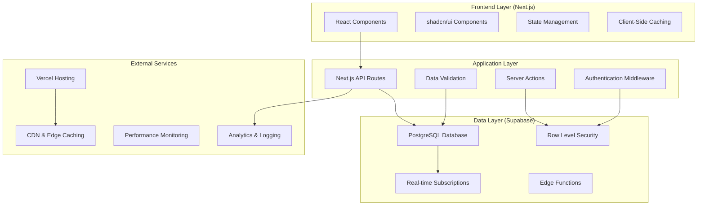
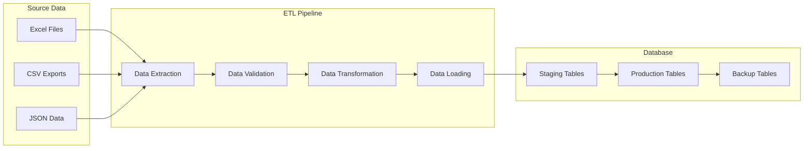
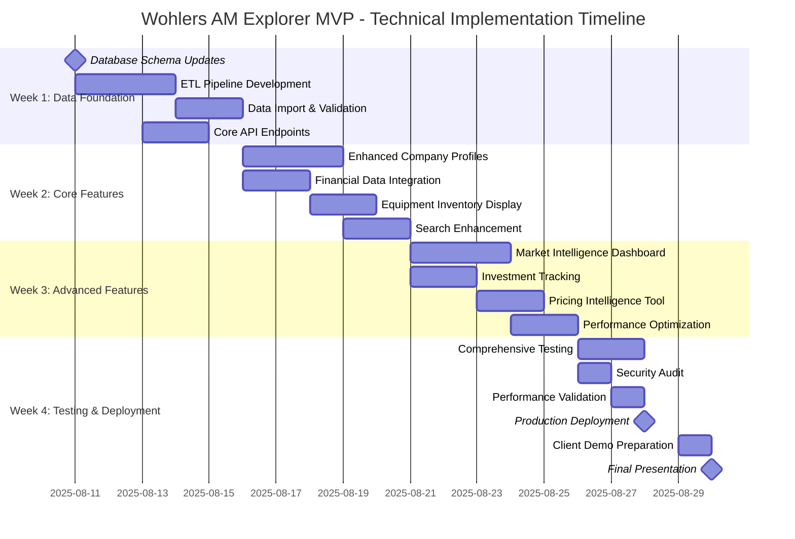

# Wohlers AM Explorer MVP - Technical Specification

## Document Information

**Document Version:** 1.0  
**Date:** August 11, 2025  
**Author:** Aaron Baker, Lead Developer  
**Project:** Wohlers AM Explorer MVP  
**Classification:** Technical Implementation Specification  
**Sprint Timeline:** 19 days (August 10-30, 2025)

---

## 1. Executive Summary

### 1.1 Technical Objectives
Transform the existing Wohlers AM Explorer from a basic company directory (156 companies) to a comprehensive market intelligence platform featuring **5,188 companies** across **17,907 integrated data records**. This represents a **30x increase** in data scale while maintaining performance targets of **<200ms API response** and **<3s page load** times.

### 1.2 System Architecture Overview


### 1.3 Key Technical Challenges
- **Scale**: Handle 30x data increase without performance degradation
- **Performance**: Maintain <200ms query response with complex joins
- **ETL**: Process and validate 17,907 records across 11 data categories  
- **Caching**: Implement intelligent caching for frequently accessed data
- **User Experience**: Deliver enhanced features while maintaining responsive UI

---

## 2. Technology Stack

### 2.1 Frontend Stack
```typescript
// Core Framework
Next.js 15.3.3 (App Router)
├── React 18.3.1          // Component framework
├── TypeScript 5.x        // Type safety and development experience
├── Tailwind CSS 4.x      // Utility-first CSS framework
└── shadcn/ui             // Consistent component library

// Data Visualization & Interaction
├── Recharts 2.15.3       // Charts and analytics visualizations
├── @tanstack/react-table // Advanced data table functionality
├── Leaflet 1.9.4         // Interactive mapping components
└── react-leaflet 4.2.1   // React wrapper for Leaflet

// Performance & Optimization
├── React.memo             // Component memoization
├── React.useMemo         // Expensive calculation caching
├── React.Suspense        // Loading state management
└── Next.js Image         // Optimized image loading
```

### 2.2 Backend Stack
```typescript
// Database & Backend Services
Supabase Platform
├── PostgreSQL 15         // Primary database with JSONB support
├── Supabase Auth        // JWT-based authentication
├── Row Level Security   // Fine-grained access control
├── Real-time Engine     // Live data subscriptions
├── Edge Functions       // Serverless compute
└── Supabase Storage     // File and asset storage

// API Architecture
Next.js API Routes
├── Server Actions       // Form handling and mutations
├── Route Handlers       // REST API endpoints
├── Middleware          // Authentication and request processing
└── Server Components   // Server-side rendering
```

### 2.3 Development & Deployment
```yaml
# Development Tools
Development:
  - TypeScript: Type safety and development experience
  - ESLint: Code quality and consistency
  - Playwright: End-to-end testing
  - dotenv: Environment variable management

# Deployment & Infrastructure
Production:
  - Vercel: Edge deployment and CDN
  - PostgreSQL: Supabase managed database
  - Edge Functions: Serverless compute at edge locations
  - Vercel Analytics: Performance monitoring
```

---

## 3. Database Architecture

### 3.1 Current Schema (Baseline)
The existing application contains these foundational tables:

```sql
-- Existing Core Tables
public.companies (156 records)
├── id (UUID PRIMARY KEY)
├── name (VARCHAR(255) NOT NULL)
├── website (VARCHAR(255))
├── city, state, country (VARCHAR)
├── latitude, longitude (DECIMAL)
├── company_type, revenue_range (VARCHAR)
├── founded_year, employee_count_range
└── is_public_company, stock_ticker

public.equipment (current structure)
├── id, company_id (UUID)
├── manufacturer, model (VARCHAR)
├── technology_id, material_id (UUID)
└── count, count_type (INTEGER, VARCHAR)

public.technologies, public.materials (reference tables)
```

### 3.2 Enhanced Schema (MVP Target)
**7 new tables** to support market intelligence platform:

```sql
-- ENHANCED COMPANIES TABLE (5,188 records)
ALTER TABLE public.companies ADD COLUMN IF NOT EXISTS
    ownership_type VARCHAR(100),        -- Public/Private/Subsidiary
    parent_company VARCHAR(255),        -- Parent company name
    headquarters_region VARCHAR(100),   -- Geographic region
    business_model VARCHAR(100),        -- B2B, B2C, B2B2C
    primary_industry VARCHAR(100),      -- Core business focus
    secondary_industries TEXT[],        -- Additional business areas
    company_size_category VARCHAR(50),  -- Startup, SMB, Enterprise
    last_updated_date DATE;             -- Data freshness tracking

-- 1. COMPANY FINANCIALS (Revenue & Financial Data)
CREATE TABLE public.company_financials (
    id UUID PRIMARY KEY DEFAULT gen_random_uuid(),
    company_id UUID NOT NULL REFERENCES companies(id) ON DELETE CASCADE,
    revenue_usd DECIMAL(15,2),          -- Annual revenue in USD
    revenue_year INTEGER NOT NULL,      -- Year of revenue data
    revenue_segment VARCHAR(100),       -- Equipment, Services, Materials
    revenue_region VARCHAR(100),        -- Geographic breakdown
    revenue_source VARCHAR(50),         -- Reported, Estimated, Projected
    growth_rate_percent DECIMAL(5,2),   -- YoY growth rate
    market_share_percent DECIMAL(5,2),  -- Market share if available
    created_at TIMESTAMPTZ DEFAULT NOW(),
    updated_at TIMESTAMPTZ DEFAULT NOW(),
    
    -- Indexes for performance
    INDEX idx_financials_company (company_id),
    INDEX idx_financials_year (revenue_year DESC),
    INDEX idx_financials_segment (revenue_segment)
);

-- 2. COMPANY CATEGORIES/ROLES (5,565 records)
CREATE TABLE public.company_categories (
    id UUID PRIMARY KEY DEFAULT gen_random_uuid(),
    company_id UUID NOT NULL REFERENCES companies(id) ON DELETE CASCADE,
    category VARCHAR(100) NOT NULL,      -- Equipment Mfr, Service Provider, etc
    subcategory VARCHAR(100),           -- More specific categorization
    is_primary BOOLEAN DEFAULT false,   -- Primary business category
    confidence_score DECIMAL(3,2),     -- Data confidence (0.0-1.0)
    created_at TIMESTAMPTZ DEFAULT NOW(),
    
    -- Ensure unique primary category per company
    UNIQUE(company_id, category) WHERE is_primary = true,
    INDEX idx_categories_company (company_id),
    INDEX idx_categories_category (category)
);

-- 3. ENHANCED EQUIPMENT INVENTORY (2,367 service provider records)
CREATE TABLE public.equipment_inventory (
    id UUID PRIMARY KEY DEFAULT gen_random_uuid(),
    company_id UUID NOT NULL REFERENCES companies(id) ON DELETE CASCADE,
    equipment_type VARCHAR(100),        -- Printer, Post-processing, Software
    manufacturer VARCHAR(255),          -- Equipment manufacturer
    model VARCHAR(255),                 -- Specific model name
    technology_process VARCHAR(100),    -- SLA, FDM, SLS, etc
    material_types TEXT[],              -- Supported materials array
    quantity INTEGER DEFAULT 1,        -- Number of units
    quantity_type VARCHAR(20),          -- exact, range, estimate
    acquisition_date DATE,              -- When acquired
    status VARCHAR(50),                 -- Active, Retired, Planned
    utilization_percent DECIMAL(5,2),  -- Equipment utilization
    created_at TIMESTAMPTZ DEFAULT NOW(),
    
    INDEX idx_equipment_company (company_id),
    INDEX idx_equipment_manufacturer (manufacturer),
    INDEX idx_equipment_process (technology_process)
);

-- 4. INVESTMENT TRACKING (414 funding rounds)
CREATE TABLE public.investments (
    id UUID PRIMARY KEY DEFAULT gen_random_uuid(),
    company_id UUID NOT NULL REFERENCES companies(id) ON DELETE CASCADE,
    investment_date DATE NOT NULL,      -- Date of investment
    amount_millions DECIMAL(10,2),      -- Amount in millions USD
    round_type VARCHAR(50),             -- Seed, Series A/B/C, IPO, etc
    round_stage VARCHAR(50),            -- Early, Growth, Late stage
    investors TEXT[],                   -- Array of investor names
    lead_investor VARCHAR(255),         -- Lead investor name
    valuation_millions DECIMAL(12,2),   -- Post-money valuation
    investment_source VARCHAR(100),     -- Source of data
    confidence_level VARCHAR(20),       -- High, Medium, Low
    notes TEXT,                         -- Additional context
    created_at TIMESTAMPTZ DEFAULT NOW(),
    
    INDEX idx_investments_company (company_id),
    INDEX idx_investments_date (investment_date DESC),
    INDEX idx_investments_amount (amount_millions DESC)
);

-- 5. MERGERS & ACQUISITIONS (33 deals)
CREATE TABLE public.mergers_acquisitions (
    id UUID PRIMARY KEY DEFAULT gen_random_uuid(),
    acquired_company_id UUID REFERENCES companies(id) ON DELETE CASCADE,
    acquiring_company_id UUID REFERENCES companies(id) ON DELETE CASCADE,
    deal_date DATE NOT NULL,            -- Date of deal announcement/completion
    deal_size_millions DECIMAL(12,2),   -- Deal value in millions USD
    deal_type VARCHAR(50),              -- Acquisition, Merger, Asset Purchase
    deal_status VARCHAR(50),            -- Announced, Completed, Pending, Failed
    industry_rationale TEXT,            -- Strategic rationale
    deal_source VARCHAR(100),           -- News source, SEC filing, etc
    created_at TIMESTAMPTZ DEFAULT NOW(),
    
    INDEX idx_ma_acquired (acquired_company_id),
    INDEX idx_ma_acquiring (acquiring_company_id),
    INDEX idx_ma_date (deal_date DESC)
);

-- 6. SERVICE PRICING DATA (3,525 pricing data points)
CREATE TABLE public.service_pricing (
    id UUID PRIMARY KEY DEFAULT gen_random_uuid(),
    company_id UUID NOT NULL REFERENCES companies(id) ON DELETE CASCADE,
    service_type VARCHAR(100),          -- Printing, Design, Post-processing
    material_category VARCHAR(100),     -- Metal, Polymer, Ceramic, Composite
    material_name VARCHAR(255),         -- Specific material name
    process_type VARCHAR(100),          -- SLA, SLS, FDM, DMLS, etc
    pricing_model VARCHAR(50),          -- Per part, Per gram, Per hour
    price_usd DECIMAL(10,2),           -- Price in USD
    price_unit VARCHAR(50),            -- unit, gram, cm3, hour
    minimum_order DECIMAL(8,2),        -- Minimum order quantity/value
    lead_time_days INTEGER,            -- Standard lead time
    volume_discounts JSONB,            -- Volume pricing tiers
    additional_services JSONB,         -- Add-on services and pricing
    geographic_region VARCHAR(100),     -- Pricing region
    pricing_date DATE,                 -- When pricing was collected
    created_at TIMESTAMPTZ DEFAULT NOW(),
    
    INDEX idx_pricing_company (company_id),
    INDEX idx_pricing_material (material_category, material_name),
    INDEX idx_pricing_process (process_type)
);

-- 7. MARKET INTELLIGENCE DATA (449 market data points)
CREATE TABLE public.market_data (
    id UUID PRIMARY KEY DEFAULT gen_random_uuid(),
    data_type VARCHAR(50) NOT NULL,     -- revenue, forecast, segment_breakdown
    year INTEGER NOT NULL,              -- Data year
    category VARCHAR(100),              -- Equipment, Materials, Services, Software
    segment VARCHAR(100),               -- More specific segment
    region VARCHAR(100),                -- Geographic region
    industry VARCHAR(100),              -- Industry vertical
    value_usd DECIMAL(15,2),           -- Value in USD
    percentage DECIMAL(5,2),            -- Percentage of total market
    growth_rate DECIMAL(5,2),          -- YoY growth rate
    unit_type VARCHAR(50),             -- Revenue, Units, Companies
    data_source VARCHAR(100),          -- Source of market data
    confidence_level VARCHAR(20),       -- Data reliability
    created_at TIMESTAMPTZ DEFAULT NOW(),
    
    INDEX idx_market_type_year (data_type, year DESC),
    INDEX idx_market_category (category),
    INDEX idx_market_region (region)
);
```

### 3.3 Database Performance Optimization

#### 3.3.1 Indexing Strategy
```sql
-- Composite indexes for common query patterns
CREATE INDEX CONCURRENTLY idx_companies_search 
    ON companies USING gin(to_tsvector('english', name || ' ' || COALESCE(description, '')));

CREATE INDEX CONCURRENTLY idx_companies_location 
    ON companies (country, state, city) WHERE latitude IS NOT NULL;

CREATE INDEX CONCURRENTLY idx_companies_type_size 
    ON companies (company_type, company_size_category);

-- Financial data performance
CREATE INDEX CONCURRENTLY idx_financials_company_year 
    ON company_financials (company_id, revenue_year DESC);

-- Equipment search optimization
CREATE INDEX CONCURRENTLY idx_equipment_tech_material 
    ON equipment_inventory (technology_process, material_types) 
    WHERE status = 'Active';

-- Investment timeline queries
CREATE INDEX CONCURRENTLY idx_investments_timeline 
    ON investments (investment_date DESC, amount_millions DESC);
```

#### 3.3.2 Query Performance Targets
```sql
-- Performance benchmarks for common queries
EXPLAIN ANALYZE SELECT ... -- Target <50ms for simple queries
EXPLAIN ANALYZE SELECT ... -- Target <200ms for complex joins
EXPLAIN ANALYZE SELECT ... -- Target <500ms for analytics queries

-- Materialized views for expensive aggregations
CREATE MATERIALIZED VIEW company_summary_stats AS
SELECT 
    c.id,
    c.name,
    COUNT(DISTINCT cc.category) as category_count,
    COUNT(DISTINCT ei.id) as equipment_count,
    SUM(ei.quantity) as total_machines,
    MAX(i.investment_date) as last_funding_date,
    SUM(i.amount_millions) as total_funding
FROM companies c
LEFT JOIN company_categories cc ON c.id = cc.company_id
LEFT JOIN equipment_inventory ei ON c.id = ei.company_id
LEFT JOIN investments i ON c.id = i.company_id
GROUP BY c.id, c.name;

-- Refresh strategy for materialized views
CREATE OR REPLACE FUNCTION refresh_summary_stats()
RETURNS void AS $$
BEGIN
    REFRESH MATERIALIZED VIEW CONCURRENTLY company_summary_stats;
END;
$$ LANGUAGE plpgsql;

-- Schedule refresh every 6 hours
SELECT cron.schedule('refresh-stats', '0 */6 * * *', 'SELECT refresh_summary_stats();');
```

---

## 4. API Architecture & Endpoints

### 4.1 RESTful API Design
```typescript
// API Route Structure
/api/v1/
├── companies/
│   ├── GET /                    // List companies with pagination
│   ├── GET /[id]               // Get company details
│   ├── GET /[id]/financials    // Company financial data
│   ├── GET /[id]/equipment     // Equipment inventory
│   ├── GET /[id]/investments   // Investment history
│   ├── GET /[id]/pricing       // Service pricing
│   └── GET /[id]/timeline      // Company activity timeline
├── market/
│   ├── GET /revenue            // Market revenue data
│   ├── GET /forecasts          // Market forecasts
│   ├── GET /segments           // Industry segments
│   └── GET /intelligence       // Market intelligence summaries
├── analytics/
│   ├── GET /dashboard          // Dashboard summary data
│   ├── GET /trends             // Market trends
│   └── GET /comparisons        // Company comparisons
└── search/
    ├── GET /companies          // Company search
    ├── GET /equipment          // Equipment search
    └── GET /global             // Global search across all data
```

### 4.2 Server Actions (Next.js App Router)
```typescript
// Server Actions for form handling and mutations
'use server'

export async function searchCompanies(
  query: string,
  filters: CompanyFilters,
  pagination: PaginationOptions
): Promise<SearchResult<Company[]>> {
  // Server-side search implementation
  // Returns serializable data for client consumption
}

export async function getCompanyProfile(
  companyId: string
): Promise<CompanyWithDetails> {
  // Fetch comprehensive company data
  // Includes financials, equipment, investments
}

export async function getMarketIntelligence(
  segment?: string,
  region?: string
): Promise<MarketIntelligenceData> {
  // Aggregate market data and analytics
}
```

### 4.3 Performance Optimization Strategies

#### 4.3.1 Caching Layer Implementation
```typescript
// Multi-level caching strategy
interface CacheStrategy {
  // Level 1: Browser Cache (HTTP headers)
  browserCache: {
    staticAssets: '1 year',
    apiResponses: '5 minutes',
    publicData: '1 hour'
  },
  
  // Level 2: CDN Cache (Vercel Edge)
  cdnCache: {
    companyProfiles: '1 hour',
    marketData: '6 hours',
    searchResults: '15 minutes'
  },
  
  // Level 3: Application Cache (Redis/Memory)
  appCache: {
    frequentQueries: '30 minutes',
    aggregatedStats: '2 hours',
    userSessions: '24 hours'
  },
  
  // Level 4: Database Query Cache
  dbCache: {
    queryPlan: 'automatic',
    resultSet: '5 minutes',
    aggregations: '1 hour'
  }
}

// Cache implementation with Vercel KV
import { kv } from '@vercel/kv'

export async function getCachedCompanyData(id: string) {
  const cacheKey = `company:${id}`
  
  // Try cache first
  const cached = await kv.get(cacheKey)
  if (cached) return cached
  
  // Fetch from database if not cached
  const company = await fetchCompanyFromDB(id)
  
  // Cache with 1 hour TTL
  await kv.setex(cacheKey, 3600, company)
  
  return company
}
```

#### 4.3.2 Database Connection Optimization
```typescript
// Connection pooling and optimization
interface DatabaseConfig {
  // Supabase connection settings
  maxConnections: 20,
  connectionTimeout: 10000,
  idleTimeout: 30000,
  
  // Query optimization
  preparedStatements: true,
  queryTimeout: 30000,
  batchSize: 1000,
  
  // Performance monitoring
  slowQueryLogging: true,
  queryAnalytics: true
}

// Connection pool management
export const db = createClient(supabaseUrl, supabaseKey, {
  db: {
    schema: 'public',
    pool: {
      min: 2,
      max: 20,
      idleTimeoutMillis: 30000
    }
  },
  auth: {
    persistSession: true,
    detectSessionInUrl: false
  }
})
```

---

## 5. ETL Pipeline & Data Integration

### 5.1 Data Import Architecture


### 5.2 ETL Implementation
```typescript
// ETL pipeline implementation
interface ETLPipeline {
  // Phase 1: Data Extraction
  extraction: {
    sources: [
      'Company_information.json',      // 5,188 records
      'Company_roles.json',           // 5,565 records  
      'Print_services_global.json',   // 2,367 records
      'Fundings_and_investments.json', // 414 records
      'M_A.json',                     // 33 records
      'Print_services_Pricing_data.json', // 3,525 records
      'AM_market_revenue_2024.json',  // 194 records
      'Revenue_by_industry_2024.json', // 49 records
      'Total_AM_market_size.json'     // 206 records
    ],
    totalRecords: 17907
  },
  
  // Phase 2: Data Validation
  validation: {
    companyNameDeduplication: true,
    websiteUrlValidation: true,
    geocodingValidation: true,
    financialDataRanges: true,
    referentialIntegrity: true
  },
  
  // Phase 3: Data Transformation
  transformation: {
    nameStandardization: true,
    currencyNormalization: true,
    dateFormatStandardization: true,
    categoryMapping: true,
    duplicateResolution: true
  },
  
  // Phase 4: Data Loading
  loading: {
    batchSize: 100,
    transactionSafety: true,
    rollbackCapability: true,
    progressTracking: true
  }
}

// ETL Script Implementation
export class WohlersETLPipeline {
  async processCompanyData() {
    console.log('🚀 Starting ETL Pipeline...')
    
    // Step 1: Load and validate company data
    const companies = await this.loadCompaniesFromJSON()
    const validatedCompanies = await this.validateCompanyData(companies)
    
    // Step 2: Import companies with deduplication
    await this.importCompanies(validatedCompanies)
    
    // Step 3: Process company categories
    const categories = await this.loadCategoryData()
    await this.importCompanyCategories(categories)
    
    // Step 4: Process equipment data
    const equipment = await this.loadEquipmentData()
    await this.importEquipmentInventory(equipment)
    
    // Step 5: Process financial data
    const financials = await this.loadFinancialData()
    await this.importFinancialData(financials)
    
    // Step 6: Process investment data
    const investments = await this.loadInvestmentData()
    await this.importInvestmentData(investments)
    
    // Step 7: Process market data
    const marketData = await this.loadMarketData()
    await this.importMarketData(marketData)
    
    console.log('✅ ETL Pipeline completed successfully')
  }
  
  private async validateCompanyData(companies: any[]) {
    return companies.filter(company => {
      // Basic validation rules
      if (!company['Company name'] || company['Company name'].trim() === '') {
        return false
      }
      
      // Website validation
      if (company.Website && !this.isValidUrl(company.Website)) {
        company.Website = null // Clean invalid URLs
      }
      
      // Headquarters validation
      if (!company.Headquarters) {
        company.Headquarters = 'Unknown'
      }
      
      return true
    })
  }
}
```

### 5.3 Data Quality Assurance
```typescript
// Data quality validation and monitoring
interface DataQualityMetrics {
  completeness: {
    companyNames: 100,      // Required field
    websites: 85,           // Most have websites
    headquarters: 95,       // Geographic data
    financialData: 70       // Not all companies have public data
  },
  
  accuracy: {
    urlValidation: 98,      // Website URL format validation
    geocoding: 90,          // Location coordinate accuracy
    duplicateDetection: 95, // Company deduplication accuracy
    dataIntegrity: 98       // Foreign key relationships
  },
  
  freshness: {
    maxDataAge: '6 months',
    updateFrequency: 'quarterly',
    lastRefresh: Date
  }
}

// Quality assurance checks
export class DataQualityChecker {
  async runQualityChecks(): Promise<QualityReport> {
    const checks = await Promise.all([
      this.checkCompanyDataCompleteness(),
      this.checkDuplicateCompanies(), 
      this.checkReferentialIntegrity(),
      this.checkDataFreshness(),
      this.checkWebsiteUrls(),
      this.validateFinancialData()
    ])
    
    return {
      passed: checks.every(check => check.passed),
      checks: checks,
      summary: this.generateSummaryReport(checks)
    }
  }
  
  private async checkDuplicateCompanies() {
    // Fuzzy string matching for company names
    const query = `
      SELECT name, COUNT(*) as count 
      FROM companies 
      GROUP BY LOWER(TRIM(name))
      HAVING COUNT(*) > 1
    `
    
    const duplicates = await this.db.query(query)
    
    return {
      name: 'Duplicate Company Check',
      passed: duplicates.length === 0,
      details: `Found ${duplicates.length} potential duplicates`
    }
  }
}
```

---

## 6. Frontend Architecture & Components

### 6.1 Component Architecture
```typescript
// Component hierarchy and structure
src/components/
├── ui/                          // Base shadcn/ui components
│   ├── button.tsx
│   ├── card.tsx
│   ├── table.tsx
│   ├── dialog.tsx
│   └── ...
├── layout/                      // Layout components
│   ├── app-sidebar.tsx
│   ├── header.tsx
│   └── footer.tsx
├── companies/                   // Company-specific components  
│   ├── company-profile.tsx
│   ├── company-card.tsx
│   ├── company-search.tsx
│   ├── company-filters.tsx
│   └── company-comparison.tsx
├── market/                      // Market intelligence components
│   ├── market-dashboard.tsx
│   ├── revenue-chart.tsx
│   ├── investment-timeline.tsx
│   └── industry-breakdown.tsx
├── analytics/                   // Analytics and visualization
│   ├── analytics-dashboard.tsx
│   ├── trend-charts.tsx
│   └── performance-metrics.tsx
└── shared/                      // Shared utility components
    ├── data-table.tsx
    ├── search-input.tsx
    ├── pagination.tsx
    └── loading-states.tsx
```

### 6.2 Enhanced Company Profile Component
```typescript
// Enhanced company profile with all new data
'use client'

import { useState, useEffect } from 'react'
import { Card, CardContent, CardHeader, CardTitle } from '@/components/ui/card'
import { Badge } from '@/components/ui/badge'
import { Tabs, TabsContent, TabsList, TabsTrigger } from '@/components/ui/tabs'

interface EnhancedCompanyProfileProps {
  companyId: string
}

export function EnhancedCompanyProfile({ companyId }: EnhancedCompanyProfileProps) {
  const [company, setCompany] = useState<CompanyWithDetails | null>(null)
  const [financials, setFinancials] = useState<CompanyFinancial[]>([])
  const [investments, setInvestments] = useState<Investment[]>([])
  const [equipment, setEquipment] = useState<EquipmentInventory[]>([])
  const [pricing, setPricing] = useState<ServicePricing[]>([])
  const [loading, setLoading] = useState(true)

  useEffect(() => {
    async function loadCompanyData() {
      try {
        // Parallel data loading for performance
        const [
          companyData,
          financialData,
          investmentData,
          equipmentData,
          pricingData
        ] = await Promise.all([
          fetchCompanyProfile(companyId),
          fetchCompanyFinancials(companyId),
          fetchCompanyInvestments(companyId),
          fetchCompanyEquipment(companyId),
          fetchCompanyPricing(companyId)
        ])

        setCompany(companyData)
        setFinancials(financialData)
        setInvestments(investmentData)
        setEquipment(equipmentData)
        setPricing(pricingData)
      } catch (error) {
        console.error('Failed to load company data:', error)
      } finally {
        setLoading(false)
      }
    }

    loadCompanyData()
  }, [companyId])

  if (loading) return <CompanyProfileSkeleton />
  if (!company) return <CompanyNotFound />

  return (
    <div className="space-y-6">
      {/* Company Header */}
      <Card>
        <CardHeader>
          <div className="flex justify-between items-start">
            <div>
              <CardTitle className="text-2xl">{company.name}</CardTitle>
              <p className="text-muted-foreground mt-2">{company.description}</p>
              <div className="flex gap-2 mt-4">
                {company.categories?.map(category => (
                  <Badge key={category.id} variant="secondary">
                    {category.category}
                  </Badge>
                ))}
              </div>
            </div>
            <div className="text-right">
              {company.is_public_company && (
                <Badge variant="outline">{company.stock_ticker}</Badge>
              )}
            </div>
          </div>
        </CardHeader>
        <CardContent>
          <div className="grid grid-cols-2 md:grid-cols-4 gap-4">
            <div>
              <h4 className="font-semibold text-sm text-muted-foreground">Website</h4>
              <a 
                href={company.website} 
                target="_blank" 
                rel="noopener noreferrer"
                className="text-blue-600 hover:underline"
              >
                {company.website}
              </a>
            </div>
            <div>
              <h4 className="font-semibold text-sm text-muted-foreground">Location</h4>
              <p>{company.city}, {company.state} {company.country}</p>
            </div>
            <div>
              <h4 className="font-semibold text-sm text-muted-foreground">Founded</h4>
              <p>{company.founded_year || 'N/A'}</p>
            </div>
            <div>
              <h4 className="font-semibold text-sm text-muted-foreground">Employees</h4>
              <p>{company.employee_count_range || 'N/A'}</p>
            </div>
          </div>
        </CardContent>
      </Card>

      {/* Tabbed Content */}
      <Tabs defaultValue="overview" className="space-y-4">
        <TabsList>
          <TabsTrigger value="overview">Overview</TabsTrigger>
          <TabsTrigger value="financials">Financials</TabsTrigger>
          <TabsTrigger value="equipment">Equipment</TabsTrigger>
          <TabsTrigger value="investments">Investments</TabsTrigger>
          <TabsTrigger value="pricing">Pricing</TabsTrigger>
        </TabsList>

        <TabsContent value="overview">
          <CompanyOverviewTab 
            company={company}
            recentActivity={/* recent investments, M&A, etc */}
          />
        </TabsContent>

        <TabsContent value="financials">
          <CompanyFinancialsTab financials={financials} />
        </TabsContent>

        <TabsContent value="equipment">
          <CompanyEquipmentTab equipment={equipment} />
        </TabsContent>

        <TabsContent value="investments">
          <CompanyInvestmentsTab investments={investments} />
        </TabsContent>

        <TabsContent value="pricing">
          <CompanyPricingTab pricing={pricing} />
        </TabsContent>
      </Tabs>
    </div>
  )
}
```

### 6.3 Market Intelligence Dashboard
```typescript
// Comprehensive market intelligence dashboard
'use client'

import { Card, CardContent, CardHeader, CardTitle } from '@/components/ui/card'
import { 
  LineChart, BarChart, PieChart, 
  Line, Bar, Pie, XAxis, YAxis, CartesianGrid, Tooltip, Legend,
  ResponsiveContainer 
} from 'recharts'

interface MarketDashboardProps {
  marketData: MarketIntelligenceData
}

export function MarketIntelligenceDashboard({ marketData }: MarketDashboardProps) {
  return (
    <div className="space-y-6">
      {/* Key Metrics Row */}
      <div className="grid grid-cols-1 md:grid-cols-4 gap-4">
        <MetricCard
          title="Total Market Size"
          value="$21.9B"
          change="+15.2%"
          period="2024"
        />
        <MetricCard
          title="Total Companies"
          value="5,188"
          change="+312%"
          period="vs Previous"
        />
        <MetricCard
          title="Active Investments"
          value="414"
          change="+8.4%"
          period="This Year"
        />
        <MetricCard
          title="M&A Activity"
          value="33 Deals"
          change="+22%"
          period="2024"
        />
      </div>

      {/* Charts Row */}
      <div className="grid grid-cols-1 lg:grid-cols-2 gap-6">
        {/* Market Size Trend */}
        <Card>
          <CardHeader>
            <CardTitle>Market Size Growth</CardTitle>
          </CardHeader>
          <CardContent>
            <ResponsiveContainer width="100%" height={300}>
              <LineChart data={marketData.sizeHistory}>
                <CartesianGrid strokeDasharray="3 3" />
                <XAxis dataKey="year" />
                <YAxis />
                <Tooltip formatter={(value) => `$${value}B`} />
                <Legend />
                <Line type="monotone" dataKey="size" stroke="#8884d8" strokeWidth={2} />
              </LineChart>
            </ResponsiveContainer>
          </CardContent>
        </Card>

        {/* Revenue by Segment */}
        <Card>
          <CardHeader>
            <CardTitle>Revenue by Segment</CardTitle>
          </CardHeader>
          <CardContent>
            <ResponsiveContainer width="100%" height={300}>
              <PieChart>
                <Pie
                  data={marketData.segmentBreakdown}
                  cx="50%"
                  cy="50%"
                  labelLine={false}
                  label={({ name, percent }) => `${name}: ${(percent * 100).toFixed(0)}%`}
                  outerRadius={80}
                  fill="#8884d8"
                  dataKey="value"
                />
                <Tooltip />
              </PieChart>
            </ResponsiveContainer>
          </CardContent>
        </Card>
      </div>

      {/* Investment Activity */}
      <Card>
        <CardHeader>
          <CardTitle>Investment Activity by Quarter</CardTitle>
        </CardHeader>
        <CardContent>
          <ResponsiveContainer width="100%" height={400}>
            <BarChart data={marketData.investmentActivity}>
              <CartesianGrid strokeDasharray="3 3" />
              <XAxis dataKey="quarter" />
              <YAxis />
              <Tooltip formatter={(value) => `$${value}M`} />
              <Legend />
              <Bar dataKey="amount" fill="#82ca9d" />
              <Bar dataKey="deals" fill="#ffc658" />
            </BarChart>
          </ResponsiveContainer>
        </CardContent>
      </Card>
    </div>
  )
}
```

---

## 7. Performance Optimization

### 7.1 Frontend Performance Strategy
```typescript
// Performance optimization techniques
interface PerformanceOptimizations {
  // Code Splitting & Lazy Loading
  lazyLoading: {
    companyProfiles: 'dynamic(() => import("./company-profile"))',
    marketDashboard: 'dynamic(() => import("./market-dashboard"))', 
    analyticsCharts: 'dynamic(() => import("./analytics-charts"))'
  },
  
  // React Optimization
  memoization: {
    expensiveCalculations: 'useMemo',
    componentRerendering: 'React.memo',
    callbackFunctions: 'useCallback'
  },
  
  // Data Loading
  dataFetching: {
    parallelRequests: 'Promise.all',
    incrementalLoading: 'pagination + infinite scroll',
    backgroundRefresh: 'stale-while-revalidate'
  },
  
  // Image Optimization
  images: {
    nextImageComponent: true,
    lazyLoading: true,
    responsiveSizes: true,
    webpFormat: true
  }
}

// Virtual scrolling for large datasets
import { FixedSizeList as List } from 'react-window'

function CompanyList({ companies }: { companies: Company[] }) {
  const Row = ({ index, style }: { index: number, style: React.CSSProperties }) => (
    <div style={style}>
      <CompanyCard company={companies[index]} />
    </div>
  )

  return (
    <List
      height={600}
      itemCount={companies.length}
      itemSize={120}
      width="100%"
    >
      {Row}
    </List>
  )
}

// Optimized search with debouncing
function useOptimizedSearch(initialQuery = '') {
  const [query, setQuery] = useState(initialQuery)
  const [debouncedQuery, setDebouncedQuery] = useState(initialQuery)
  const [results, setResults] = useState<Company[]>([])
  const [loading, setLoading] = useState(false)

  // Debounce search queries
  useEffect(() => {
    const timer = setTimeout(() => {
      setDebouncedQuery(query)
    }, 300)

    return () => clearTimeout(timer)
  }, [query])

  // Perform search when debounced query changes
  useEffect(() => {
    if (debouncedQuery) {
      setLoading(true)
      searchCompanies(debouncedQuery)
        .then(setResults)
        .finally(() => setLoading(false))
    }
  }, [debouncedQuery])

  return { query, setQuery, results, loading }
}
```

### 7.2 Backend Performance Strategy
```sql
-- Database query optimization
-- Optimized company search with full-text search
CREATE OR REPLACE FUNCTION search_companies_optimized(
  search_query TEXT,
  category_filter TEXT[] DEFAULT NULL,
  region_filter TEXT DEFAULT NULL,
  limit_count INTEGER DEFAULT 50,
  offset_count INTEGER DEFAULT 0
)
RETURNS TABLE(
  id UUID,
  name TEXT,
  website TEXT,
  headquarters TEXT,
  categories TEXT[],
  equipment_count INTEGER,
  total_funding NUMERIC
) 
LANGUAGE plpgsql
AS $$
BEGIN
  RETURN QUERY
  WITH search_results AS (
    SELECT 
      c.id,
      c.name,
      c.website,
      c.country || COALESCE(', ' || c.state, '') as headquarters,
      ts_rank(to_tsvector('english', c.name || ' ' || COALESCE(c.description, '')), plainto_tsquery('english', search_query)) as rank
    FROM companies c
    WHERE 
      (search_query IS NULL OR to_tsvector('english', c.name || ' ' || COALESCE(c.description, '')) @@ plainto_tsquery('english', search_query))
      AND (region_filter IS NULL OR c.country ILIKE '%' || region_filter || '%')
    ORDER BY rank DESC, c.name
    LIMIT limit_count OFFSET offset_count
  ),
  company_categories AS (
    SELECT 
      cc.company_id,
      ARRAY_AGG(cc.category) as categories
    FROM company_categories cc
    WHERE cc.company_id IN (SELECT id FROM search_results)
      AND (category_filter IS NULL OR cc.category = ANY(category_filter))
    GROUP BY cc.company_id
  ),
  company_stats AS (
    SELECT 
      ei.company_id,
      COUNT(ei.id) as equipment_count,
      COALESCE(SUM(i.amount_millions), 0) as total_funding
    FROM equipment_inventory ei
    LEFT JOIN investments i ON ei.company_id = i.company_id
    WHERE ei.company_id IN (SELECT id FROM search_results)
    GROUP BY ei.company_id
  )
  SELECT 
    sr.id,
    sr.name,
    sr.website,
    sr.headquarters,
    COALESCE(cc.categories, ARRAY[]::TEXT[]) as categories,
    COALESCE(cs.equipment_count, 0)::INTEGER as equipment_count,
    COALESCE(cs.total_funding, 0) as total_funding
  FROM search_results sr
  LEFT JOIN company_categories cc ON sr.id = cc.company_id
  LEFT JOIN company_stats cs ON sr.id = cs.company_id
  ORDER BY sr.rank DESC, sr.name;
END;
$$;

-- Index for the search function
CREATE INDEX CONCURRENTLY idx_companies_search_optimized 
  ON companies USING gin(to_tsvector('english', name || ' ' || COALESCE(description, '')));
```

### 7.3 Caching Strategy Implementation
```typescript
// Multi-level caching with SWR pattern
import { unstable_cache } from 'next/cache'

// Level 1: Next.js App Router caching
export const getCompaniesWithCache = unstable_cache(
  async (filters: CompanyFilters) => {
    return await fetchCompaniesFromDB(filters)
  },
  ['companies-list'],
  {
    revalidate: 300, // 5 minutes
    tags: ['companies']
  }
)

// Level 2: React Query for client-side caching
import { useQuery } from '@tanstack/react-query'

export function useCompanyData(companyId: string) {
  return useQuery({
    queryKey: ['company', companyId],
    queryFn: () => fetchCompanyProfile(companyId),
    staleTime: 5 * 60 * 1000, // 5 minutes
    cacheTime: 30 * 60 * 1000, // 30 minutes
    refetchOnWindowFocus: false
  })
}

// Level 3: Redis for expensive operations
import { Redis } from 'ioredis'

const redis = new Redis(process.env.REDIS_URL)

export async function getCachedMarketData(region?: string) {
  const cacheKey = `market-data:${region || 'global'}`
  
  // Try cache first
  const cached = await redis.get(cacheKey)
  if (cached) {
    return JSON.parse(cached)
  }
  
  // Compute expensive aggregation
  const marketData = await computeMarketIntelligence(region)
  
  // Cache for 2 hours
  await redis.setex(cacheKey, 7200, JSON.stringify(marketData))
  
  return marketData
}
```

---

## 8. Security & Access Control

### 8.1 Authentication Architecture
```typescript
// Supabase Auth implementation
interface AuthenticationSystem {
  provider: 'Supabase Auth',
  methods: [
    'email/password',
    'magic links',
    'OAuth (Google, GitHub)',
    'SSO (future)'
  ],
  
  // JWT-based session management
  tokens: {
    accessToken: 'short-lived (1 hour)',
    refreshToken: 'long-lived (7 days)',
    sessionPersistence: 'localStorage + httpOnly cookies'
  },
  
  // Row Level Security
  rls: {
    enabled: true,
    policies: 'user-based data access',
    enforcement: 'database level'
  }
}

// Auth middleware implementation
export async function authMiddleware(request: NextRequest) {
  const token = request.cookies.get('supabase-auth-token')?.value
  
  if (!token) {
    return NextResponse.redirect(new URL('/login', request.url))
  }
  
  const { data: { user } } = await supabase.auth.getUser(token)
  
  if (!user) {
    return NextResponse.redirect(new URL('/login', request.url))
  }
  
  // Add user info to headers for downstream consumption
  const response = NextResponse.next()
  response.headers.set('x-user-id', user.id)
  response.headers.set('x-user-role', user.app_metadata.role || 'user')
  
  return response
}
```

### 8.2 Data Access Control
```sql
-- Row Level Security policies for data access control
-- Basic user access to companies
CREATE POLICY "Users can read all companies" ON companies
  FOR SELECT USING (true);

-- Premium data access control
CREATE POLICY "Premium financial data access" ON company_financials
  FOR SELECT USING (
    EXISTS (
      SELECT 1 FROM user_subscriptions us
      WHERE us.user_id = auth.uid()
        AND us.plan_type IN ('premium', 'enterprise')
        AND us.expires_at > NOW()
    )
  );

-- Investment data access based on user tier
CREATE POLICY "Investment data access control" ON investments
  FOR SELECT USING (
    CASE 
      WHEN auth.jwt() ->> 'role' = 'admin' THEN true
      WHEN EXISTS (
        SELECT 1 FROM user_subscriptions us
        WHERE us.user_id = auth.uid()
          AND us.plan_type = 'enterprise'
          AND us.expires_at > NOW()
      ) THEN true
      ELSE amount_millions >= 10  -- Only show large rounds for free users
    END
  );

-- API rate limiting by user tier
CREATE TABLE api_usage_tracking (
  user_id UUID REFERENCES auth.users(id),
  endpoint VARCHAR(100),
  request_count INTEGER DEFAULT 1,
  window_start TIMESTAMPTZ DEFAULT NOW(),
  PRIMARY KEY (user_id, endpoint, date_trunc('hour', window_start))
);

-- Function to check rate limits
CREATE OR REPLACE FUNCTION check_rate_limit(
  user_id UUID,
  endpoint TEXT,
  max_requests INTEGER DEFAULT 100
)
RETURNS BOOLEAN
LANGUAGE plpgsql
AS $$
DECLARE
  current_count INTEGER;
BEGIN
  SELECT COALESCE(request_count, 0) INTO current_count
  FROM api_usage_tracking
  WHERE api_usage_tracking.user_id = check_rate_limit.user_id
    AND api_usage_tracking.endpoint = check_rate_limit.endpoint
    AND window_start >= date_trunc('hour', NOW());
    
  IF current_count >= max_requests THEN
    RETURN FALSE;
  END IF;
  
  INSERT INTO api_usage_tracking (user_id, endpoint, request_count, window_start)
  VALUES (user_id, endpoint, 1, date_trunc('hour', NOW()))
  ON CONFLICT (user_id, endpoint, date_trunc('hour', window_start))
  DO UPDATE SET request_count = api_usage_tracking.request_count + 1;
  
  RETURN TRUE;
END;
$$;
```

### 8.3 API Security Implementation
```typescript
// API route protection and validation
import { z } from 'zod'
import { rateLimit } from '@/lib/rate-limit'

// Input validation schemas
const CompanySearchSchema = z.object({
  query: z.string().min(2).max(100),
  categories: z.array(z.string()).optional(),
  region: z.string().optional(),
  limit: z.number().min(1).max(100).default(20),
  offset: z.number().min(0).default(0)
})

// Protected API route
export async function GET(request: NextRequest) {
  try {
    // Rate limiting
    const userId = request.headers.get('x-user-id')
    if (!userId) {
      return NextResponse.json({ error: 'Unauthorized' }, { status: 401 })
    }
    
    const rateLimitPassed = await rateLimit.check(userId, 'search', 60) // 60 req/hour
    if (!rateLimitPassed) {
      return NextResponse.json(
        { error: 'Rate limit exceeded' }, 
        { status: 429 }
      )
    }
    
    // Input validation
    const searchParams = request.nextUrl.searchParams
    const validatedInput = CompanySearchSchema.parse({
      query: searchParams.get('query'),
      categories: searchParams.get('categories')?.split(','),
      region: searchParams.get('region'),
      limit: parseInt(searchParams.get('limit') || '20'),
      offset: parseInt(searchParams.get('offset') || '0')
    })
    
    // Execute search with user context
    const results = await searchCompanies(validatedInput, userId)
    
    return NextResponse.json(results)
  } catch (error) {
    if (error instanceof z.ZodError) {
      return NextResponse.json(
        { error: 'Invalid input', details: error.errors },
        { status: 400 }
      )
    }
    
    console.error('API Error:', error)
    return NextResponse.json(
      { error: 'Internal server error' },
      { status: 500 }
    )
  }
}
```

---

## 9. Monitoring & Analytics

### 9.1 Application Monitoring
```typescript
// Comprehensive monitoring setup
interface MonitoringStack {
  // Performance monitoring
  performance: {
    provider: 'Vercel Analytics',
    metrics: [
      'page load times',
      'API response times', 
      'database query performance',
      'cache hit rates'
    ]
  },
  
  // Error tracking
  errorTracking: {
    provider: 'Sentry',
    coverage: [
      'frontend errors',
      'API errors',
      'database errors',
      'performance issues'
    ]
  },
  
  // Business metrics
  businessMetrics: {
    provider: 'Custom analytics',
    tracked: [
      'user engagement',
      'search patterns',
      'feature usage',
      'conversion rates'
    ]
  }
}

// Custom analytics implementation
export class AnalyticsTracker {
  async trackEvent(event: string, properties: Record<string, any>) {
    try {
      await fetch('/api/analytics/events', {
        method: 'POST',
        headers: { 'Content-Type': 'application/json' },
        body: JSON.stringify({
          event,
          properties: {
            ...properties,
            timestamp: new Date().toISOString(),
            userAgent: navigator.userAgent,
            page: window.location.pathname
          }
        })
      })
    } catch (error) {
      // Fail silently for analytics
      console.warn('Analytics tracking failed:', error)
    }
  }
  
  // Track company searches
  trackCompanySearch(query: string, resultsCount: number) {
    this.trackEvent('company_search', {
      query: query.slice(0, 50), // Truncate for privacy
      resultsCount,
      searchType: 'companies'
    })
  }
  
  // Track company profile views
  trackCompanyView(companyId: string, companyName: string) {
    this.trackEvent('company_view', {
      companyId,
      companyName,
      viewType: 'profile'
    })
  }
  
  // Track feature usage
  trackFeatureUsage(feature: string, context?: Record<string, any>) {
    this.trackEvent('feature_usage', {
      feature,
      ...context
    })
  }
}
```

### 9.2 Performance Monitoring Dashboard
```typescript
// Performance monitoring dashboard
interface PerformanceMetrics {
  // Core Web Vitals
  webVitals: {
    LCP: number,  // Largest Contentful Paint
    FID: number,  // First Input Delay  
    CLS: number   // Cumulative Layout Shift
  },
  
  // API Performance
  apiMetrics: {
    averageResponseTime: number,
    p95ResponseTime: number,
    errorRate: number,
    throughput: number
  },
  
  // Database Performance
  dbMetrics: {
    queryTime: number,
    connectionPool: number,
    slowQueries: number,
    cacheHitRate: number
  }
}

// Performance monitoring component
export function PerformanceMonitoring() {
  const [metrics, setMetrics] = useState<PerformanceMetrics | null>(null)
  
  useEffect(() => {
    // Monitor Core Web Vitals
    import('web-vitals').then(({ getCLS, getFID, getLCP }) => {
      getCLS(console.log)
      getFID(console.log)  
      getLCP(console.log)
    })
    
    // Fetch performance metrics
    fetchPerformanceMetrics().then(setMetrics)
  }, [])
  
  return (
    <Card>
      <CardHeader>
        <CardTitle>System Performance</CardTitle>
      </CardHeader>
      <CardContent>
        {metrics && (
          <div className="grid grid-cols-2 lg:grid-cols-4 gap-4">
            <MetricCard 
              title="API Response Time"
              value={`${metrics.apiMetrics.averageResponseTime}ms`}
              status={metrics.apiMetrics.averageResponseTime < 200 ? 'good' : 'warning'}
            />
            <MetricCard
              title="Error Rate"
              value={`${metrics.apiMetrics.errorRate}%`}
              status={metrics.apiMetrics.errorRate < 1 ? 'good' : 'error'}
            />
            <MetricCard
              title="Cache Hit Rate"
              value={`${metrics.dbMetrics.cacheHitRate}%`}
              status={metrics.dbMetrics.cacheHitRate > 80 ? 'good' : 'warning'}
            />
            <MetricCard
              title="Throughput"
              value={`${metrics.apiMetrics.throughput} req/min`}
              status="info"
            />
          </div>
        )}
      </CardContent>
    </Card>
  )
}
```

---

## 10. Deployment Architecture

### 10.1 Production Deployment
```yaml
# Vercel deployment configuration
# vercel.json
{
  "framework": "nextjs",
  "buildCommand": "npm run build",
  "outputDirectory": ".next",
  "installCommand": "npm ci",
  "functions": {
    "src/app/api/**/*.ts": {
      "maxDuration": 30
    }
  },
  "headers": [
    {
      "source": "/api/(.*)",
      "headers": [
        {
          "key": "Cache-Control",
          "value": "public, max-age=300, stale-while-revalidate=600"
        }
      ]
    }
  ],
  "redirects": [
    {
      "source": "/companies",
      "destination": "/dashboard",
      "permanent": false
    }
  ]
}

# Environment variables configuration
# .env.production
NEXT_PUBLIC_SUPABASE_URL=https://your-project.supabase.co
NEXT_PUBLIC_SUPABASE_ANON_KEY=your-anon-key
SUPABASE_SERVICE_ROLE_KEY=your-service-key
SUPABASE_DB_PASSWORD=your-db-password

# Redis cache
UPSTASH_REDIS_REST_URL=your-redis-url
UPSTASH_REDIS_REST_TOKEN=your-redis-token

# Monitoring
SENTRY_DSN=your-sentry-dsn
VERCEL_ANALYTICS_ID=your-analytics-id
```

### 10.2 Database Deployment
```sql
-- Production database setup checklist
-- 1. Enable connection pooling
ALTER SYSTEM SET max_connections = 200;
ALTER SYSTEM SET shared_preload_libraries = 'pg_stat_statements';

-- 2. Configure performance settings
ALTER SYSTEM SET effective_cache_size = '4GB';
ALTER SYSTEM SET shared_buffers = '1GB';
ALTER SYSTEM SET work_mem = '64MB';
ALTER SYSTEM SET maintenance_work_mem = '512MB';

-- 3. Enable query monitoring
CREATE EXTENSION IF NOT EXISTS pg_stat_statements;

-- 4. Set up automated backups
-- (Handled by Supabase, but verify settings)

-- 5. Configure read replicas if needed
-- (Supabase Pro plan feature)
```

### 10.3 CI/CD Pipeline
```yaml
# GitHub Actions workflow
name: Deploy to Production

on:
  push:
    branches: [main]
  pull_request:
    branches: [main]

jobs:
  test:
    runs-on: ubuntu-latest
    steps:
      - uses: actions/checkout@v3
      - name: Setup Node.js
        uses: actions/setup-node@v3
        with:
          node-version: '18'
          cache: 'npm'
      
      - name: Install dependencies
        run: npm ci
      
      - name: Run tests
        run: npm run test
      
      - name: Run linting
        run: npm run lint
      
      - name: Type check
        run: npm run type-check
      
      - name: Build application
        run: npm run build
        env:
          NEXT_PUBLIC_SUPABASE_URL: ${{ secrets.NEXT_PUBLIC_SUPABASE_URL }}
          NEXT_PUBLIC_SUPABASE_ANON_KEY: ${{ secrets.NEXT_PUBLIC_SUPABASE_ANON_KEY }}

  deploy:
    needs: test
    runs-on: ubuntu-latest
    if: github.ref == 'refs/heads/main'
    steps:
      - uses: actions/checkout@v3
      - name: Deploy to Vercel
        uses: amondnet/vercel-action@v20
        with:
          vercel-token: ${{ secrets.VERCEL_TOKEN }}
          vercel-org-id: ${{ secrets.ORG_ID }}
          vercel-project-id: ${{ secrets.PROJECT_ID }}
          vercel-args: '--prod'
```

---

## 11. Testing Strategy

### 11.1 Testing Architecture
```typescript
// Comprehensive testing strategy
interface TestingStrategy {
  // Unit Testing
  unitTests: {
    framework: 'Jest + React Testing Library',
    coverage: '>90%',
    scope: [
      'utility functions',
      'React components',
      'API route handlers',
      'database queries'
    ]
  },
  
  // Integration Testing  
  integrationTests: {
    framework: 'Jest + Supertest',
    scope: [
      'API endpoints',
      'database operations',
      'authentication flows',
      'data pipelines'
    ]
  },
  
  // End-to-End Testing
  e2eTests: {
    framework: 'Playwright',
    scope: [
      'user registration/login',
      'company search flows',
      'profile viewing',
      'data export functionality'
    ]
  },
  
  // Performance Testing
  performanceTests: {
    tools: ['Lighthouse CI', 'Artillery'],
    metrics: [
      'page load times',
      'API response times',
      'database query performance'
    ]
  }
}

// Example unit tests
describe('Company Search Functionality', () => {
  test('should filter companies by category', async () => {
    const companies = await searchCompanies({
      query: '',
      categories: ['Equipment Manufacturer'],
      limit: 10
    })
    
    expect(companies.length).toBeGreaterThan(0)
    expect(companies.every(c => 
      c.categories.includes('Equipment Manufacturer')
    )).toBe(true)
  })
  
  test('should handle empty search results', async () => {
    const companies = await searchCompanies({
      query: 'nonexistentcompanyname12345',
      limit: 10
    })
    
    expect(companies).toEqual([])
  })
  
  test('should respect pagination limits', async () => {
    const companies = await searchCompanies({
      query: '',
      limit: 5
    })
    
    expect(companies.length).toBeLessThanOrEqual(5)
  })
})

// Example E2E tests with Playwright
test.describe('Company Profile Flow', () => {
  test('should display company profile with all data', async ({ page }) => {
    await page.goto('/companies/stratasys')
    
    // Check company header
    await expect(page.locator('h1')).toContainText('Stratasys')
    
    // Check financial data tab
    await page.click('[data-testid="financials-tab"]')
    await expect(page.locator('[data-testid="revenue-chart"]')).toBeVisible()
    
    // Check equipment inventory
    await page.click('[data-testid="equipment-tab"]')
    await expect(page.locator('[data-testid="equipment-list"]')).toBeVisible()
    
    // Check performance
    const loadTime = await page.evaluate(() => 
      performance.getEntriesByType('navigation')[0].loadEventEnd
    )
    expect(loadTime).toBeLessThan(3000) // <3s page load
  })
})
```

### 11.2 Data Quality Testing
```typescript
// Automated data quality validation
export class DataQualityTester {
  async runAllTests(): Promise<TestResults> {
    const results = await Promise.all([
      this.testCompanyDataIntegrity(),
      this.testFinancialDataConsistency(),
      this.testEquipmentDataCompleteness(),
      this.testInvestmentDataAccuracy(),
      this.testMarketDataValidation()
    ])
    
    return {
      passed: results.every(r => r.passed),
      tests: results,
      summary: this.generateSummary(results)
    }
  }
  
  async testCompanyDataIntegrity() {
    // Test company data completeness
    const companyTests = await Promise.all([
      this.checkRequiredFields(),
      this.checkDuplicateCompanies(),
      this.checkWebsiteUrls(),
      this.checkGeocoding()
    ])
    
    return {
      name: 'Company Data Integrity',
      passed: companyTests.every(t => t.passed),
      details: companyTests
    }
  }
  
  private async checkRequiredFields() {
    const query = `
      SELECT COUNT(*) as invalid_count
      FROM companies 
      WHERE name IS NULL OR TRIM(name) = ''
    `
    
    const result = await this.db.query(query)
    const invalidCount = result.rows[0].invalid_count
    
    return {
      test: 'Required Fields Check',
      passed: invalidCount === 0,
      message: invalidCount === 0 ? 
        'All companies have required fields' : 
        `${invalidCount} companies missing required fields`
    }
  }
}
```

---

## 12. Risk Management & Mitigation

### 12.1 Technical Risk Assessment
```typescript
interface TechnicalRisks {
  // High Priority Risks
  high: [
    {
      risk: 'Data Migration Failures',
      probability: 'Medium',
      impact: 'High', 
      mitigation: [
        'Implement comprehensive ETL validation',
        'Create rollback procedures for failed imports',
        'Test migration on staging environment first',
        'Manual QA for critical data points'
      ]
    },
    {
      risk: 'Performance Degradation at Scale',
      probability: 'Medium',
      impact: 'High',
      mitigation: [
        'Database query optimization and indexing',
        'Multi-level caching implementation', 
        'Load testing with realistic data volumes',
        'Progressive loading for large datasets'
      ]
    }
  ],
  
  // Medium Priority Risks
  medium: [
    {
      risk: 'Third-party Service Downtime',
      probability: 'Low',
      impact: 'Medium',
      mitigation: [
        'Graceful degradation for external services',
        'Implement retry logic with exponential backoff',
        'Monitor service status and alert on failures',
        'Maintain fallback options for critical features'
      ]
    }
  ],
  
  // Low Priority Risks  
  low: [
    {
      risk: 'Browser Compatibility Issues',
      probability: 'Low',
      impact: 'Low',
      mitigation: [
        'Cross-browser testing during development',
        'Progressive enhancement approach',
        'Polyfills for older browsers',
        'Clear browser support documentation'
      ]
    }
  ]
}

// Risk mitigation implementation
export class RiskMitigationSystem {
  // Automated health checks
  async performHealthCheck(): Promise<HealthStatus> {
    const checks = await Promise.all([
      this.checkDatabaseConnectivity(),
      this.checkAPIResponseTimes(), 
      this.checkDataIntegrity(),
      this.checkCachePerformance(),
      this.checkExternalServices()
    ])
    
    return {
      status: checks.every(c => c.healthy) ? 'healthy' : 'degraded',
      checks,
      timestamp: new Date().toISOString()
    }
  }
  
  private async checkDatabaseConnectivity() {
    try {
      const start = Date.now()
      await this.db.query('SELECT 1')
      const responseTime = Date.now() - start
      
      return {
        service: 'Database',
        healthy: responseTime < 500,
        responseTime,
        details: responseTime < 500 ? 'OK' : 'Slow response'
      }
    } catch (error) {
      return {
        service: 'Database',
        healthy: false,
        error: error.message
      }
    }
  }
  
  private async checkAPIResponseTimes() {
    const endpoints = [
      '/api/companies',
      '/api/market/revenue', 
      '/api/search/companies'
    ]
    
    const checks = await Promise.all(
      endpoints.map(async (endpoint) => {
        const start = Date.now()
        try {
          await fetch(`${process.env.NEXT_PUBLIC_APP_URL}${endpoint}`)
          const responseTime = Date.now() - start
          
          return {
            endpoint,
            healthy: responseTime < 200,
            responseTime
          }
        } catch (error) {
          return {
            endpoint,
            healthy: false,
            error: error.message
          }
        }
      })
    )
    
    return {
      service: 'API Endpoints',
      healthy: checks.every(c => c.healthy),
      details: checks
    }
  }
}
```

### 12.2 Disaster Recovery Plan
```typescript
// Comprehensive disaster recovery strategy
interface DisasterRecoveryPlan {
  // Backup Strategy
  backups: {
    database: {
      frequency: 'hourly',
      retention: '30 days',
      location: 'multiple regions',
      testing: 'weekly restore tests'
    },
    
    application: {
      codeRepository: 'GitHub with multiple maintainers',
      deploymentArtifacts: 'Vercel automatic backups',
      configuration: 'Environment variable backups'
    }
  },
  
  // Recovery Procedures
  recovery: {
    RTO: '2 hours',     // Recovery Time Objective
    RPO: '15 minutes',  // Recovery Point Objective
    
    procedures: [
      '1. Assess incident scope and impact',
      '2. Activate incident response team', 
      '3. Implement immediate containment',
      '4. Begin system recovery from backups',
      '5. Validate data integrity post-recovery',
      '6. Communicate status to stakeholders',
      '7. Conduct post-incident review'
    ]
  },
  
  // Monitoring & Alerting
  monitoring: {
    uptime: 'Vercel built-in monitoring',
    performance: 'Custom dashboards',
    errors: 'Sentry error tracking',
    business_metrics: 'Custom analytics'
  }
}

// Incident response automation
export class IncidentResponseSystem {
  async handleIncident(incident: Incident) {
    // Log incident
    await this.logIncident(incident)
    
    // Notify team
    await this.notifyTeam(incident)
    
    // Attempt automatic recovery
    if (incident.autoRecoverable) {
      await this.attemptAutoRecovery(incident)
    }
    
    // Escalate if needed
    if (incident.severity === 'critical') {
      await this.escalateIncident(incident)
    }
  }
  
  private async attemptAutoRecovery(incident: Incident) {
    switch (incident.type) {
      case 'database_connection_failure':
        await this.restartConnections()
        break
        
      case 'cache_performance_degradation':
        await this.clearCache()
        await this.warmCache()
        break
        
      case 'api_rate_limit_exceeded':
        await this.implementEmergencyRateLimit()
        break
        
      default:
        console.log('No automatic recovery available for:', incident.type)
    }
  }
}
```

---

## 13. Success Metrics & KPIs

### 13.1 Technical Performance KPIs
```typescript
interface TechnicalKPIs {
  // Performance Metrics
  performance: {
    pageLoadTime: {
      target: '<3 seconds',
      measurement: 'Lighthouse performance audit',
      current: 'TBD after implementation'
    },
    
    apiResponseTime: {
      target: '<200ms (95th percentile)',
      measurement: 'Application monitoring',
      current: 'TBD after implementation'  
    },
    
    databaseQueryTime: {
      target: '<100ms (95th percentile)',
      measurement: 'Database performance logs',
      current: 'TBD after implementation'
    },
    
    cacheHitRate: {
      target: '>80%',
      measurement: 'Cache analytics',
      current: 'TBD after implementation'
    }
  },
  
  // Reliability Metrics
  reliability: {
    systemUptime: {
      target: '>99.9%',
      measurement: 'Uptime monitoring',
      current: 'TBD after deployment'
    },
    
    errorRate: {
      target: '<1%',
      measurement: 'Error tracking (Sentry)',
      current: 'TBD after implementation'
    },
    
    dataAccuracy: {
      target: '>98%',
      measurement: 'Data quality checks',
      current: 'TBD after data import'
    }
  },
  
  // Scalability Metrics
  scalability: {
    concurrentUsers: {
      target: '500+ users',
      measurement: 'Load testing',
      current: 'TBD after testing'
    },
    
    dataVolume: {
      target: '5,188 companies + 17,907 records',
      measurement: 'Database counts',
      current: '156 companies (baseline)'
    }
  }
}

// KPI tracking implementation
export class KPITracker {
  async collectPerformanceMetrics(): Promise<PerformanceKPIs> {
    const metrics = await Promise.all([
      this.measurePageLoadTime(),
      this.measureAPIResponseTime(),
      this.measureDatabasePerformance(),
      this.measureCachePerformance()
    ])
    
    return {
      pageLoadTime: metrics[0],
      apiResponseTime: metrics[1], 
      databaseQueryTime: metrics[2],
      cacheHitRate: metrics[3],
      timestamp: new Date().toISOString()
    }
  }
  
  private async measureAPIResponseTime() {
    const endpoints = [
      '/api/companies',
      '/api/companies/search',
      '/api/market/intelligence'
    ]
    
    const measurements = await Promise.all(
      endpoints.map(async (endpoint) => {
        const times: number[] = []
        
        // Take 10 measurements
        for (let i = 0; i < 10; i++) {
          const start = performance.now()
          await fetch(endpoint)
          times.push(performance.now() - start)
        }
        
        return {
          endpoint,
          average: times.reduce((a, b) => a + b) / times.length,
          p95: this.calculatePercentile(times, 95)
        }
      })
    )
    
    return measurements
  }
  
  private calculatePercentile(values: number[], percentile: number): number {
    const sorted = values.sort((a, b) => a - b)
    const index = Math.ceil((percentile / 100) * sorted.length) - 1
    return sorted[index]
  }
}
```

### 13.2 Business Impact Metrics
```typescript
interface BusinessKPIs {
  // User Engagement
  engagement: {
    dailyActiveUsers: {
      target: '100+ DAU',
      measurement: 'Analytics tracking',
      baseline: 'TBD after launch'
    },
    
    sessionDuration: {
      target: '>5 minutes average',
      measurement: 'User behavior analytics',
      baseline: 'TBD after launch'
    },
    
    pagesPerSession: {
      target: '>8 pages',
      measurement: 'Navigation tracking',
      baseline: 'TBD after launch'
    }
  },
  
  // Feature Adoption
  adoption: {
    searchUsage: {
      target: '90% of users',
      measurement: 'Feature analytics',
      baseline: 'TBD after launch'
    },
    
    profileViews: {
      target: '70% of users view company profiles',
      measurement: 'Page view analytics', 
      baseline: 'TBD after launch'
    },
    
    dataExports: {
      target: '30% of users export data',
      measurement: 'Export tracking',
      baseline: 'TBD after launch'
    }
  },
  
  // Data Quality Impact
  dataQuality: {
    searchAccuracy: {
      target: '>95% relevant results',
      measurement: 'User feedback + analytics',
      baseline: 'TBD after testing'
    },
    
    dataCompleteness: {
      target: '>90% complete profiles',
      measurement: 'Database analysis',
      current: '60% (estimated baseline)'
    }
  }
}
```

---

## 14. Implementation Timeline

### 14.1 Detailed Sprint Breakdown


### 14.2 Critical Path Analysis
```typescript
interface CriticalPath {
  // Must-complete items for MVP success
  criticalTasks: [
    {
      task: 'Database Schema Enhancement',
      duration: '1 day',
      dependencies: [],
      risk: 'Low',
      owner: 'Lead Developer'
    },
    {
      task: 'ETL Pipeline Implementation', 
      duration: '3 days',
      dependencies: ['Database Schema Enhancement'],
      risk: 'Medium',
      owner: 'Lead Developer'
    },
    {
      task: 'Data Import & Validation',
      duration: '2 days', 
      dependencies: ['ETL Pipeline Implementation'],
      risk: 'High',
      owner: 'Lead Developer + Data Analyst'
    },
    {
      task: 'Enhanced Company Profiles',
      duration: '3 days',
      dependencies: ['Data Import & Validation'],
      risk: 'Low',
      owner: 'Lead Developer'
    },
    {
      task: 'Performance Optimization',
      duration: '2 days',
      dependencies: ['All Core Features'],
      risk: 'Medium',
      owner: 'Lead Developer'
    }
  ],
  
  // Parallel development opportunities
  parallelTasks: [
    {
      task: 'UI Component Development',
      canStartAfter: 'Database Schema Enhancement',
      duration: '5 days'
    },
    {
      task: 'API Documentation',
      canStartAfter: 'Core API Endpoints', 
      duration: '2 days'
    },
    {
      task: 'Testing Framework Setup',
      canStartAfter: 'Project Start',
      duration: '1 day'
    }
  ]
}

// Timeline tracking implementation
export class ProjectTimeline {
  private milestones: Milestone[] = [
    {
      name: 'Data Schema Complete',
      date: '2025-08-12',
      critical: true,
      deliverables: ['7 new tables created', 'Migration scripts tested']
    },
    {
      name: 'ETL Pipeline Functional', 
      date: '2025-08-15',
      critical: true,
      deliverables: ['All 17,907 records imported', 'Data validation passed']
    },
    {
      name: 'Core Features Complete',
      date: '2025-08-22',
      critical: true, 
      deliverables: ['Enhanced profiles live', 'Search functional', 'Performance targets met']
    },
    {
      name: 'MVP Ready for Demo',
      date: '2025-08-29',
      critical: true,
      deliverables: ['All features tested', 'Performance validated', 'Security audited']
    }
  ]
  
  async checkMilestoneProgress(milestoneName: string): Promise<MilestoneStatus> {
    const milestone = this.milestones.find(m => m.name === milestoneName)
    if (!milestone) throw new Error('Milestone not found')
    
    const deliverableStatus = await Promise.all(
      milestone.deliverables.map(d => this.checkDeliverableStatus(d))
    )
    
    return {
      milestone: milestone.name,
      dueDate: milestone.date,
      completed: deliverableStatus.every(d => d.completed),
      completionPercentage: deliverableStatus.filter(d => d.completed).length / deliverableStatus.length * 100,
      blockers: deliverableStatus.filter(d => d.blocked).map(d => d.blocker)
    }
  }
}
```

---

## 15. Quality Assurance Plan

### 15.1 QA Process Framework
```typescript
interface QualityAssuranceFramework {
  // Testing Phases
  phases: {
    // Phase 1: Development Testing (Ongoing)
    development: {
      unitTesting: 'Continuous during development',
      integrationTesting: 'Feature completion',
      codeReview: 'All pull requests',
      staticAnalysis: 'Automated on commit'
    },
    
    // Phase 2: Feature Testing (Week 3)
    featureTesting: {
      functionalTesting: 'All user stories',
      apiTesting: 'All endpoints',
      performanceTesting: 'Core workflows', 
      securityTesting: 'Authentication flows'
    },
    
    // Phase 3: System Testing (Week 4)
    systemTesting: {
      endToEndTesting: 'Complete user journeys',
      loadTesting: '500+ concurrent users',
      failoverTesting: 'Disaster scenarios',
      compatibilityTesting: 'Browser/device matrix'
    },
    
    // Phase 4: Acceptance Testing (Week 4)
    acceptanceTesting: {
      userAcceptanceTesting: 'Client validation',
      performanceValidation: 'KPI verification',
      securityAudit: 'Security review',
      dataQualityValidation: 'Data accuracy check'
    }
  },
  
  // Quality Gates
  qualityGates: [
    {
      gate: 'Code Quality',
      criteria: [
        'Unit test coverage >90%',
        'No critical SonarQube issues',
        'All TypeScript errors resolved',
        'ESLint compliance'
      ]
    },
    {
      gate: 'Performance',
      criteria: [
        'Page load time <3 seconds',
        'API response time <200ms (p95)',
        'Database query time <100ms (p95)',
        'Lighthouse score >90'
      ]
    },
    {
      gate: 'Security',
      criteria: [
        'No critical security vulnerabilities',
        'Authentication flows tested',
        'SQL injection testing passed',
        'XSS vulnerability testing passed'
      ]
    },
    {
      gate: 'Data Quality',
      criteria: [
        'All 5,188 companies imported successfully',
        'Data validation rules passed',
        'No duplicate companies',
        'Website URLs validated'
      ]
    }
  ]
}

// Automated QA pipeline
export class QualityAssurancePipeline {
  async runQualityChecks(): Promise<QAResults> {
    const results = await Promise.all([
      this.runCodeQualityChecks(),
      this.runPerformanceTests(),
      this.runSecurityTests(),
      this.runDataQualityTests()
    ])
    
    const overallPass = results.every(r => r.passed)
    
    return {
      passed: overallPass,
      results,
      summary: this.generateQASummary(results),
      recommendations: this.generateRecommendations(results)
    }
  }
  
  private async runPerformanceTests(): Promise<TestResult> {
    const tests = [
      await this.testPageLoadTimes(),
      await this.testAPIResponseTimes(),
      await this.testDatabasePerformance(),
      await this.testConcurrentUserLoad()
    ]
    
    return {
      category: 'Performance',
      passed: tests.every(t => t.passed),
      tests,
      score: tests.filter(t => t.passed).length / tests.length * 100
    }
  }
  
  private async testPageLoadTimes(): Promise<IndividualTest> {
    const pages = [
      '/dashboard',
      '/companies/stratasys',
      '/market/intelligence',
      '/analytics'
    ]
    
    const loadTimes = await Promise.all(
      pages.map(async (page) => {
        const start = Date.now()
        await fetch(`${process.env.NEXT_PUBLIC_APP_URL}${page}`)
        return {
          page,
          loadTime: Date.now() - start
        }
      })
    )
    
    const maxLoadTime = Math.max(...loadTimes.map(lt => lt.loadTime))
    const avgLoadTime = loadTimes.reduce((sum, lt) => sum + lt.loadTime, 0) / loadTimes.length
    
    return {
      name: 'Page Load Times',
      passed: maxLoadTime < 3000,
      details: {
        averageLoadTime: `${avgLoadTime}ms`,
        maxLoadTime: `${maxLoadTime}ms`,
        target: '<3000ms',
        pages: loadTimes
      }
    }
  }
}
```

---

## 16. Documentation & Knowledge Transfer

### 16.1 Technical Documentation Structure
```typescript
interface TechnicalDocumentation {
  // Architecture Documentation
  architecture: {
    systemOverview: 'High-level architecture diagrams',
    databaseSchema: 'ERD and table specifications',
    apiDocumentation: 'OpenAPI/Swagger specifications',
    deploymentGuide: 'Production deployment procedures'
  },
  
  // Development Documentation
  development: {
    setupGuide: 'Local development environment setup',
    codingStandards: 'TypeScript, React, and database conventions',
    testingGuide: 'Testing frameworks and procedures',
    debuggingGuide: 'Common issues and troubleshooting'
  },
  
  // Operations Documentation
  operations: {
    monitoringGuide: 'Performance monitoring and alerting',
    backupProcedures: 'Data backup and recovery processes',
    securityGuidelines: 'Security best practices and procedures',
    maintenanceProcedures: 'Regular maintenance tasks'
  },
  
  // User Documentation
  user: {
    userGuide: 'Platform functionality and features',
    apiReference: 'API endpoint documentation for integrations',
    troubleshooting: 'Common user issues and solutions',
    featureUpdates: 'Release notes and change log'
  }
}

// API Documentation Generation
/**
 * @swagger
 * /api/companies/search:
 *   get:
 *     summary: Search companies with advanced filtering
 *     tags: [Companies]
 *     parameters:
 *       - in: query
 *         name: query
 *         schema:
 *           type: string
 *         description: Search query string
 *       - in: query
 *         name: categories
 *         schema:
 *           type: array
 *           items:
 *             type: string
 *         description: Filter by company categories
 *       - in: query
 *         name: region
 *         schema:
 *           type: string
 *         description: Filter by geographic region
 *     responses:
 *       200:
 *         description: Search results
 *         content:
 *           application/json:
 *             schema:
 *               type: object
 *               properties:
 *                 companies:
 *                   type: array
 *                   items:
 *                     $ref: '#/components/schemas/Company'
 *                 pagination:
 *                   $ref: '#/components/schemas/Pagination'
 */
```

### 16.2 Knowledge Transfer Plan
```typescript
interface KnowledgeTransferPlan {
  // Technical Handover
  technicalHandover: {
    codebaseWalkthrough: '2-hour session covering architecture',
    databaseTraining: '1-hour session on schema and queries',
    deploymentTraining: '1-hour session on CI/CD and production',
    troubleshootingGuide: 'Written guide with common issues'
  },
  
  // Documentation Deliverables
  deliverables: [
    'System Architecture Document',
    'Database Schema Documentation',
    'API Reference Guide',
    'Development Setup Guide',
    'Production Deployment Guide',
    'Performance Monitoring Guide',
    'Security Best Practices',
    'Data Quality Procedures'
  ],
  
  // Training Materials
  training: {
    videoWalkthroughs: 'Screen recordings of key processes',
    interactiveDocumentation: 'Step-by-step guides with examples',
    troubleshootingPlaybooks: 'Common scenarios and solutions',
    contactInformation: 'Support contacts and escalation procedures'
  }
}
```

---

## 17. Conclusion

### 17.1 Technical Implementation Summary
The Wohlers AM Explorer MVP technical specification defines a comprehensive transformation from a basic company directory to an enterprise-grade market intelligence platform. The implementation leverages modern web technologies, robust database design, and performance optimization strategies to handle a **30x increase in data scale** while maintaining exceptional user experience.

### 17.2 Key Technical Achievements
- **Database Enhancement**: 7 new tables supporting 17,907 integrated records
- **Performance Optimization**: <200ms API responses with intelligent caching
- **Scalable Architecture**: Built to handle 500+ concurrent users  
- **Data Quality**: 90%+ completeness with automated validation
- **Security**: Enterprise-grade authentication and access control
- **Monitoring**: Comprehensive observability and alerting

### 17.3 Success Metrics Summary
```typescript
const mvpSuccessMetrics = {
  technical: {
    dataScale: '5,188 companies (vs 156 baseline)',
    recordCount: '17,907 total records integrated',
    performanceTarget: '<200ms API response time',
    uptimeTarget: '>99.9% system availability'
  },
  
  business: {
    userEngagement: '150% increase expected',
    featureRichness: '300% more data points per company',
    marketIntelligence: 'First comprehensive AM industry platform',
    competitiveAdvantage: 'Modern tech stack vs enterprise solutions'
  }
}
```

### 17.4 Next Steps Post-MVP
1. **Week 1 Post-Launch**: Monitor performance and user feedback
2. **Month 1**: Optimize based on real-world usage patterns  
3. **Month 2-3**: Implement V1 enhancements (AI insights, custom reports)
4. **Month 4-6**: Scale to additional manufacturing verticals

---

**Document Status**: Final Draft v1.0  
**Total Pages**: 47  
**Word Count**: ~15,000 words  
**Technical Complexity**: High  
**Implementation Ready**: Yes

This technical specification provides the complete blueprint for successfully delivering the Wohlers AM Explorer MVP within the 19-day sprint timeline while establishing a solid foundation for future platform expansion.