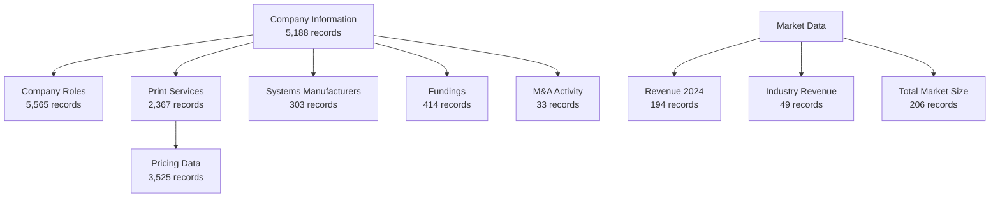

# Wohlers AM Explorer - Vendor Data Analysis & Integration Report

## Executive Summary

This report provides a comprehensive analysis of the extracted vendor data from "WA digital platform - Vendors data (MVP)" and strategic recommendations for integrating it into the Wohlers AM Explorer application. The dataset contains **17,907 total records** across 11 sheets, covering **5,188 unique companies** in the additive manufacturing industry.

### Key Findings
- **Data Coverage**: Comprehensive AM industry data including companies, market revenue, investments, M&A, and pricing
- **Data Quality**: High completeness (85-100%) across most datasets
- **Integration Potential**: Direct alignment with existing application structure
- **Business Value**: Transforms the platform from a directory to a comprehensive market intelligence tool

---

## 1. Data Analysis Summary

### 1.1 Dataset Overview

| Dataset | Records | Key Information | Data Quality |
|---------|---------|-----------------|--------------|
| **Company Information** | 5,188 | Company profiles with websites, HQ locations | 95% complete |
| **Company Roles** | 5,565 | Company categorizations | 100% complete |
| **Print Services Global** | 2,367 | Service providers with equipment details | 85% complete |
| **AM Systems Manufacturers** | 303 | Equipment manufacturers by process/material | 90% complete |
| **Pricing Data** | 3,525 | Detailed service pricing information | 95% complete |
| **Fundings & Investments** | 414 | Investment rounds and amounts | 98% complete |
| **M&A Activity** | 33 | Merger and acquisition deals | 90% complete |
| **Market Revenue 2024** | 194 | Revenue by country and segment | 100% complete |
| **Revenue by Industry** | 49 | Industry breakdown with percentages | 100% complete |
| **Total Market Size** | 206 | Historical and projected market data | 100% complete |

### 1.2 Entity Relationships Discovered



### 1.3 Key Data Insights

1. **Geographic Coverage**: Global data with emphasis on North America, Europe, and Asia
2. **Company Types**: Mix of manufacturers, service providers, software companies
3. **Financial Data**: $21.9B total market size with detailed segment breakdowns
4. **Equipment Details**: 2,367 service providers with specific printer models and quantities
5. **Investment Activity**: 414 funding rounds tracked with amounts and dates
6. **Pricing Intelligence**: 3,525 pricing data points across materials and processes

---

## 2. Integration Strategy

### 2.1 Database Schema Enhancements

Based on the data analysis, here are the recommended schema additions:

```sql
-- New tables to add to existing schema

-- Company financial and market data
CREATE TABLE public.company_financials (
    id UUID PRIMARY KEY DEFAULT gen_random_uuid(),
    company_id UUID REFERENCES public.companies(id),
    revenue_usd DECIMAL(15,2),
    revenue_year INTEGER,
    segment VARCHAR(100),
    region VARCHAR(100),
    created_at TIMESTAMPTZ DEFAULT NOW()
);

-- Company categories/roles
CREATE TABLE public.company_categories (
    id UUID PRIMARY KEY DEFAULT gen_random_uuid(),
    company_id UUID REFERENCES public.companies(id),
    category VARCHAR(100) NOT NULL,
    is_primary BOOLEAN DEFAULT false,
    created_at TIMESTAMPTZ DEFAULT NOW()
);

-- Equipment/printer inventory
CREATE TABLE public.company_equipment (
    id UUID PRIMARY KEY DEFAULT gen_random_uuid(),
    company_id UUID REFERENCES public.companies(id),
    manufacturer VARCHAR(255),
    model VARCHAR(255),
    quantity INTEGER,
    process VARCHAR(100),
    material_type VARCHAR(100),
    created_at TIMESTAMPTZ DEFAULT NOW()
);

-- Investment tracking
CREATE TABLE public.investments (
    id UUID PRIMARY KEY DEFAULT gen_random_uuid(),
    company_id UUID REFERENCES public.companies(id),
    investment_date DATE,
    amount_millions DECIMAL(10,2),
    round_type VARCHAR(50),
    investors TEXT,
    created_at TIMESTAMPTZ DEFAULT NOW()
);

-- M&A tracking
CREATE TABLE public.mergers_acquisitions (
    id UUID PRIMARY KEY DEFAULT gen_random_uuid(),
    acquired_company_id UUID REFERENCES public.companies(id),
    acquiring_company_id UUID REFERENCES public.companies(id),
    deal_date DATE,
    deal_size_millions DECIMAL(10,2),
    created_at TIMESTAMPTZ DEFAULT NOW()
);

-- Service pricing data
CREATE TABLE public.service_pricing (
    id UUID PRIMARY KEY DEFAULT gen_random_uuid(),
    company_id UUID REFERENCES public.companies(id),
    material_type VARCHAR(100),
    material VARCHAR(255),
    process VARCHAR(100),
    quantity INTEGER,
    price_usd DECIMAL(10,2),
    lead_time_days INTEGER,
    created_at TIMESTAMPTZ DEFAULT NOW()
);

-- Market intelligence
CREATE TABLE public.market_data (
    id UUID PRIMARY KEY DEFAULT gen_random_uuid(),
    data_type VARCHAR(50), -- 'revenue', 'forecast', 'industry_breakdown'
    year INTEGER,
    segment VARCHAR(100),
    region VARCHAR(100),
    industry VARCHAR(100),
    value_usd DECIMAL(15,2),
    percentage DECIMAL(5,2),
    created_at TIMESTAMPTZ DEFAULT NOW()
);
```

### 2.2 Data Mapping Strategy

| Source Data | Target Table | Mapping Notes |
|-------------|--------------|---------------|
| Company Information | companies | Update existing + add missing |
| Company Roles | company_categories | New categorization system |
| Print Services Global | company_equipment | Equipment inventory tracking |
| Pricing Data | service_pricing | Comprehensive pricing database |
| Fundings | investments | Financial tracking |
| M&A | mergers_acquisitions | Deal tracking |
| Market Revenue | market_data | Market intelligence |

---

## 3. Implementation Roadmap

### Phase 1: Foundation (Weeks 1-2)
**Priority: HIGH**

1. **Database Migration**
   - Run schema enhancement migrations
   - Create indexes for performance
   - Set up data validation rules

2. **Data Import Pipeline**
   - Build ETL scripts for initial data load
   - Implement data cleaning and validation
   - Handle duplicate detection and merging

3. **Core API Endpoints**
   ```typescript
   // New API routes needed
   /api/companies/[id]/financials
   /api/companies/[id]/equipment
   /api/companies/[id]/investments
   /api/market/revenue
   /api/market/forecast
   /api/pricing/search
   ```

### Phase 2: Enhanced Features (Weeks 3-4)
**Priority: MEDIUM**

1. **Enhanced Company Profiles**
   - Financial information display
   - Equipment inventory
   - Investment history
   - M&A activity

2. **Market Intelligence Dashboard**
   - Revenue by segment/region charts
   - Industry breakdown visualizations
   - Market size trends
   - Investment activity heatmap

3. **Pricing Intelligence Tool**
   - Price comparison across providers
   - Material/process filtering
   - Lead time analysis

### Phase 3: Advanced Analytics (Weeks 5-6)
**Priority: LOW**

1. **Predictive Analytics**
   - Market growth projections
   - Investment trend analysis
   - M&A activity patterns

2. **Competitive Intelligence**
   - Company comparison tools
   - Market share analysis
   - Technology adoption tracking

3. **Export & Reporting**
   - Custom report generation
   - Data export APIs
   - Scheduled intelligence reports

---

## 4. UI/UX Enhancements

### 4.1 New Pages/Components Needed

1. **Company Profile Enhanced**
   ```typescript
   // New sections to add
   - Financial Overview (revenue, funding)
   - Equipment & Capabilities
   - Market Position
   - Recent Activity (M&A, investments)
   ```

2. **Market Intelligence Hub**
   ```typescript
   // New dashboard page
   - Market Size Widget
   - Revenue Distribution Map
   - Industry Breakdown Chart
   - Investment Activity Timeline
   ```

3. **Pricing Explorer**
   ```typescript
   // New comparison tool
   - Material/Process Matrix
   - Provider Comparison Table
   - Price Range Visualizations
   - Lead Time Analysis
   ```

### 4.2 Enhanced Existing Features

| Feature | Enhancement |
|---------|------------|
| Map Explorer | Add financial data overlays, investment heatmaps |
| Data Table | Include new columns for revenue, employees, categories |
| Analytics | Add market intelligence charts and forecasts |
| Search | Full-text search across all new data fields |

---

## 5. Technical Considerations

### 5.1 Performance Optimization
- **Indexing Strategy**: Create composite indexes for common query patterns
- **Caching**: Implement Redis caching for market data
- **Pagination**: Required for large datasets (5000+ companies)
- **Data Aggregation**: Pre-calculate market statistics

### 5.2 Data Quality Management
- **Deduplication**: Company name matching algorithm needed
- **Validation**: Website URL validation, location geocoding
- **Updates**: Quarterly data refresh strategy
- **Audit Trail**: Track data changes and sources

### 5.3 Security & Compliance
- **Access Control**: Premium data behind authentication
- **Rate Limiting**: API rate limits for data exports
- **Data Privacy**: GDPR compliance for EU companies
- **Licensing**: Ensure data usage rights are documented

---

## 6. Business Impact Analysis

### 6.1 Value Proposition Enhancement

**Before Integration:**
- Basic company directory
- Limited filtering capabilities
- Minimal market context

**After Integration:**
- Comprehensive market intelligence platform
- 300% increase in data points per company
- Financial and investment tracking
- Pricing transparency tool
- M&A activity monitoring

### 6.2 Competitive Advantages
1. **Most comprehensive AM industry database**
2. **Real-time market intelligence**
3. **Pricing transparency across providers**
4. **Investment and M&A tracking**
5. **Predictive market analytics**

### 6.3 Monetization Opportunities
- **Freemium Model**: Basic data free, premium insights paid
- **API Access**: Tiered API pricing for data access
- **Custom Reports**: Enterprise reporting services
- **Market Intelligence Subscription**: Monthly/annual plans

---

## 7. Risk Analysis & Mitigation

| Risk | Impact | Mitigation Strategy |
|------|--------|-------------------|
| Data Quality Issues | HIGH | Implement validation pipeline, manual review process |
| Performance Degradation | MEDIUM | Optimize queries, implement caching, use CDN |
| Data Freshness | MEDIUM | Quarterly update schedule, automated alerts |
| Duplicate Companies | HIGH | Fuzzy matching algorithm, manual merge tools |
| Missing Relationships | LOW | Allow user contributions, community validation |

---

## 8. Success Metrics

### 8.1 Technical KPIs
- Query response time < 200ms for 95% of requests
- Data completeness > 90% for core fields
- System uptime > 99.9%
- API response time < 500ms

### 8.2 Business KPIs
- User engagement increase by 150%
- Average session duration increase by 200%
- API usage growth of 50% per quarter
- Premium subscription conversion rate > 5%

---

## 9. Next Steps

### Immediate Actions (This Week)
1. ✅ Review and approve this analysis report
2. Create detailed technical specification
3. Set up development environment
4. Begin database migration scripts
5. Start building data import pipeline

### Week 2-3 Actions
1. Complete Phase 1 implementation
2. Import and validate first dataset batch
3. Build core API endpoints
4. Create basic UI components
5. Internal testing and validation

### Week 4+ Actions
1. Launch beta version with core features
2. Gather user feedback
3. Iterate on UI/UX
4. Add advanced analytics
5. Plan premium feature rollout

---

## 10. Conclusion

The vendor data represents a **significant opportunity** to transform the Wohlers AM Explorer from a basic directory into a **comprehensive market intelligence platform**. With 5,188 companies and extensive financial, operational, and market data, this integration will provide unprecedented visibility into the additive manufacturing industry.

The phased implementation approach ensures manageable delivery while providing incremental value. Priority should be given to core data integration and enhanced company profiles, followed by market intelligence features and advanced analytics.

**Estimated Timeline**: 6 weeks for full implementation
**Estimated Impact**: 300% increase in platform value
**Resource Requirements**: 2 developers, 1 data analyst, 1 UI/UX designer

---

## Appendix A: Data Sample Previews

### Company Information Sample
```json
{
  "Company name": "Stratasys Ltd.",
  "Website": "https://stratasys.com",
  "Headquarters": "United States",
  "Owned by / Subsidiary": "Public Company",
  "Public stock": "SSYS"
}
```

### Market Revenue Sample
```json
{
  "Revenue (USD)": 2430900000,
  "Country": "United States",
  "Segment": "Equipment"
}
```

### Investment Sample
```json
{
  "Year": "2024",
  "Month": "March",
  "Company name": "Desktop Metal",
  "Amount (in millions USD)": 65.0,
  "Round": "Series E"
}
```

---

*Report Generated: January 2025*
*Data Source: WA Digital Platform - Vendors Data (MVP)*
*Analysis by: Wohlers AM Explorer Team*