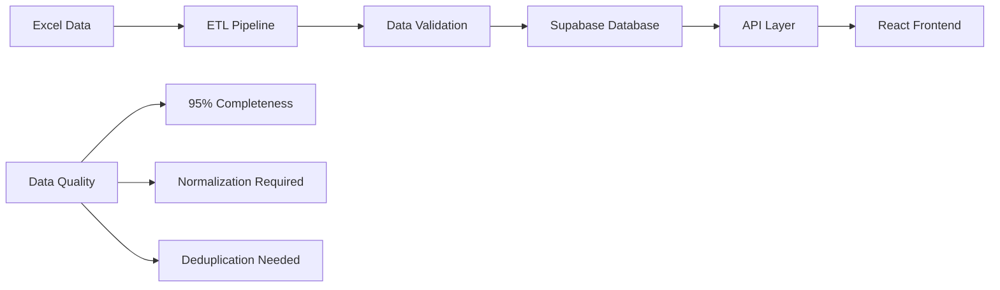
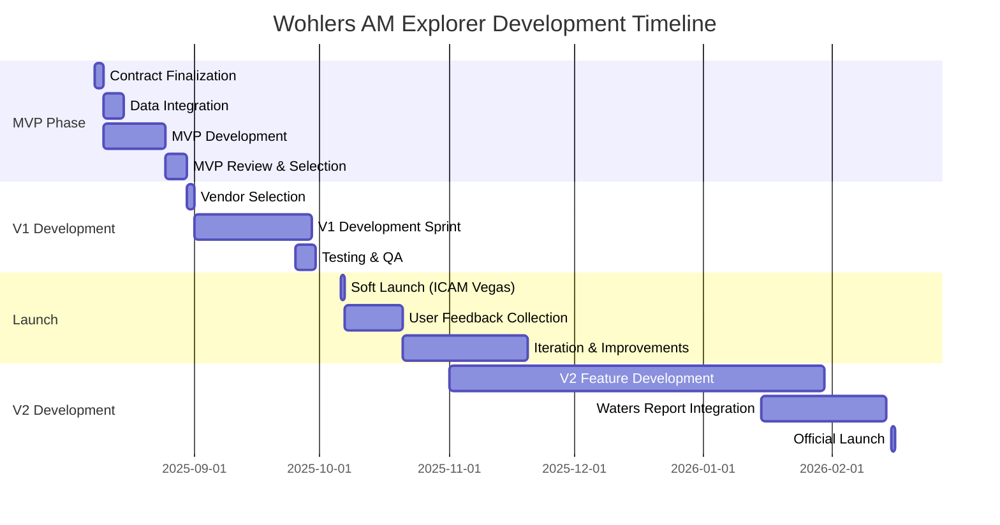

# Wohlers Associates x Tinkso - Digital Platform Project Overview

## Executive Summary

**Project**: Wohlers AM Explorer - Digital Market Intelligence Platform  
**Client**: Wohlers Associates (WA) - Advanced Manufacturing Division  
**Developer**: Tinkso Digital Agency  
**Status**: MVP Development Phase  
**Timeline**: August 2025 - February 2026  

This document provides a comprehensive overview of the Wohlers AM Explorer project, synthesizing insights from the kickoff meeting, vendor data analysis, and current application review. The project aims to transform Wohlers Associates' traditional PDF-based market intelligence reports into a dynamic, interactive digital platform for the additive manufacturing industry.

---

## 1. Project Vision & Business Context

### 1.1 Client Background
**Wohlers Associates** is the premier market intelligence provider for the additive manufacturing (AM) industry, known for their comprehensive annual reports and industry expertise. Their Advanced Manufacturing Division comprises 50 professionals dedicated to market research, data analysis, and consulting.

### 1.2 Market Opportunity
The AM industry lacks modern, on-demand market intelligence tools. Companies currently rely on:
- Static PDF reports that become outdated quickly
- Excel spreadsheets for data management
- Manual processes for market analysis
- Fragmented sources for pricing and competitor information

### 1.3 Strategic Vision
Transform from **static reports → dynamic platform**:
- **Phase 1**: Digitize existing market intelligence
- **Phase 2**: Add real-time analytics and pricing tools
- **Phase 3**: Build community features and AI assistance
- **Future**: Expand to multiple verticals beyond AM

---

## 2. Stakeholder Analysis

### 2.1 Wohlers Associates Team

| Name | Role | Responsibilities | Availability |
|------|------|-----------------|--------------|
| **Martin Lansard** | Project Lead | Overall project oversight, strategic decisions | Out Aug 11-15 |
| **Pablo Enrique** | Data Team Lead | Data collection, transformation, quality | Available |
| **Ray Huff** | Editorial Content Lead | Content integration, report sections | Available |
| **Vincent** | Business Lead | Business requirements, vendor management | Out Aug 18-22 |
| **Mahdi** | Manager | Legal review, contract management | Available |
| **Arpita** | Data Analyst | Data preparation and validation | Available |

### 2.2 Tinkso Development Team

| Name | Role | Responsibilities | Location |
|------|------|-----------------|----------|
| **Vincent** | Project Manager | Client communication, project coordination | US |
| **Matthieu Mazzega** | Lead Developer | Prototype development, architecture | France (Out Aug 11-15) |
| **Aaron Baker** | Developer | Implementation lead, handover from Matt | US |
| **Andres** | Product Owner | Product strategy, requirements | US |

### 2.3 Target End Users
- **Primary**: Decision makers in AM companies (CEOs, CTOs, Directors)
- **Secondary**: Investors, consultants, government agencies
- **Use Cases**: Market validation, investor pitches, strategic planning, competitive analysis

---

## 3. Technical Architecture & Current Implementation

### 3.1 Technology Stack ✅ Aligned with Requirements
```
Frontend:
├── Next.js 15.3.3 (App Router)
├── React 18.3.1
├── TypeScript
├── Tailwind CSS
└── shadcn/ui components

Backend:
├── Supabase (PostgreSQL)
├── Supabase Auth
├── Row Level Security
└── Real-time subscriptions

Analytics & Visualization:
├── Recharts (charts)
├── Leaflet (maps)
└── TanStack Table (data grids)
```

### 3.2 Current Application Status

**✅ Fully Implemented:**
- Professional dashboard with sidebar navigation
- Interactive map explorer with filtering
- Advanced data table with export capabilities
- Analytics dashboard with market insights
- Authentication system
- Mobile-responsive design
- Theme switching (dark/light mode)
- Wohlers branding integration

**🟡 Enhancement Opportunities:**
- Expand from 156 to 5,188 companies
- Add financial and investment data
- Implement pricing comparison tools
- Create market forecasting features
- Build advanced analytics

**Current Quality Metrics:**
- Technical Quality: 9/10
- Feature Completeness: 8/10
- Scalability: 9/10
- User Experience: 9/10

---

## 4. Data Architecture & Vendor Dataset

### 4.1 Available Data Assets
The vendor dataset contains **17,907 records** across 11 categories:

| Category | Records | Business Value |
|----------|---------|---------------|
| **Company Directory** | 5,188 | Complete global AM company database |
| **Company Roles** | 5,565 | Categorization for filtering |
| **Print Services** | 2,367 | Service provider capabilities |
| **System Manufacturers** | 303 | Equipment manufacturer details |
| **Pricing Data** | 3,525 | Real pricing from providers |
| **Investments** | 414 | Funding rounds and amounts |
| **M&A Activity** | 33 | Industry consolidation tracking |
| **Market Revenue** | 194 | Country/segment breakdown |
| **Industry Revenue** | 49 | End-use market analysis |
| **Market Size** | 206 | Historical and forecast data |

### 4.2 Data Integration Strategy



### 4.3 Database Schema Enhancement
- 7 new tables for financial, pricing, and market data
- Enhanced company profiles with 30+ new fields
- Optimized indexing for performance
- Materialized views for complex queries

---

## 5. Feature Roadmap & Priorities

### 5.1 MVP Features (End of August 2025) ✅

| Feature | Status | Description |
|---------|--------|-------------|
| **Interactive Map** | ✅ Complete | Global visualization with filtering |
| **Data Table** | ✅ Complete | Advanced grid with export |
| **Analytics Dashboard** | ✅ Complete | Market insights and charts |
| **Company Profiles** | ✅ Basic | Detail modals with equipment |
| **Filtering System** | ✅ Complete | Multi-dimensional filtering |
| **Mobile Responsive** | ✅ Complete | Full mobile optimization |

### 5.2 V1 Enhancement (September 2025)

| Feature | Priority | Description |
|---------|----------|-------------|
| **Data Integration** | HIGH | Import 5,188 companies |
| **Financial Data** | HIGH | Revenue, investments, M&A |
| **Pricing Tools** | HIGH | Compare quotes across providers |
| **Enhanced Profiles** | MEDIUM | Comprehensive company pages |
| **Market Intelligence** | MEDIUM | Industry analytics |
| **Export Features** | MEDIUM | PowerPoint, Excel exports |

### 5.3 V2 Advanced Features (October 2025 - February 2026)

| Feature | Business Value | Complexity |
|---------|---------------|------------|
| **AI Assistant** | Navigate Waters Report content | HIGH |
| **Report Builder** | Custom report generation | HIGH |
| **Predictive Analytics** | Market forecasting | MEDIUM |
| **Community Features** | User-generated content | MEDIUM |
| **API Access** | Third-party integrations | LOW |
| **White-label** | Enterprise solutions | HIGH |

---

## 6. Project Timeline & Milestones



### Critical Dates
- **August 30, 2025**: MVP delivery and vendor selection
- **October 6, 2025**: Soft launch at ICAM Vegas
- **February 15, 2026**: V2 launch with Waters Report

---

## 7. Success Metrics & KPIs

### 7.1 MVP Evaluation Criteria
1. **Product Quality** (40%)
   - UX/UI excellence
   - Performance and responsiveness
   - Data accuracy and completeness

2. **Technical Implementation** (30%)
   - Code quality and documentation
   - Scalability and architecture
   - Security and reliability

3. **Collaboration Quality** (30%)
   - Communication effectiveness
   - Proactive problem-solving
   - Flexibility and adaptability

### 7.2 Platform Success Metrics

| Metric | Target | Measurement |
|--------|--------|-------------|
| **User Adoption** | 500+ users in 3 months | Google Analytics |
| **Session Duration** | >5 minutes average | User analytics |
| **Data Completeness** | 95% for core fields | Database audit |
| **Query Performance** | <200ms p95 | Performance monitoring |
| **User Satisfaction** | >4.5/5 rating | User surveys |
| **Revenue Growth** | 20% YoY | Subscription metrics |

---

## 8. Risk Analysis & Mitigation

### 8.1 High Priority Risks

| Risk | Impact | Mitigation Strategy |
|------|--------|-------------------|
| **Tight Timeline** | HIGH | Phased approach, MVP focus, parallel workstreams |
| **Vacation Conflicts** | MEDIUM | Clear handover, documentation, US team coverage |
| **Data Quality Issues** | HIGH | ETL pipeline, validation rules, manual review |
| **Scope Creep** | MEDIUM | Clear MVP definition, change management process |
| **User Adoption** | HIGH | Beta testing, user feedback loops, training |

### 8.2 Technical Risks

| Risk | Mitigation |
|------|------------|
| **Performance at Scale** | Database optimization, caching, CDN |
| **Data Security** | Supabase RLS, authentication, encryption |
| **Integration Complexity** | Phased integration, thorough testing |
| **Browser Compatibility** | Modern stack, progressive enhancement |

---

## 9. Competitive Analysis

### 9.1 Tinkso Advantages
- ✅ **Pragmatic Approach**: Nimble, focused solution
- ✅ **Modern Stack**: Next.js + Supabase vs enterprise complexity
- ✅ **Proven Prototype**: Client-approved design
- ✅ **US Presence**: Aaron provides continuous coverage
- ✅ **Cost Effective**: Lean team, efficient delivery

### 9.2 Competitor (Spaulding Ridge)
- ❌ Enterprise-heavy approach (Snowflake)
- ❌ Higher cost structure
- ❌ Less flexible architecture
- ❌ Longer implementation timeline

---

## 10. Budget & Resource Allocation

### 10.1 Development Resources
- **Core Team**: 2 developers, 1 PM, 1 Product Owner
- **Client Team**: 6 stakeholders with varying involvement
- **Timeline**: 6 months total (MVP → V2)

### 10.2 Technology Costs
- **Supabase**: ~$500/month for production
- **Vercel Hosting**: ~$200/month
- **Domain/SSL**: ~$100/year
- **Third-party APIs**: TBD based on features

---

## 11. Current Action Items

### Immediate (This Week)
1. ✅ **Contract Execution** - DocuSign pending
2. ⏳ **Data Transfer** - Awaiting Excel file from WA
3. ✅ **Development Handover** - Aaron taking lead from Matt
4. 🔄 **Data Integration** - Begin ETL pipeline development

### Next Week (Aug 11-15)
1. **Data Normalization** - Clean and standardize vendor data
2. **Schema Migration** - Implement database enhancements
3. **Import Pipeline** - Build data import functionality
4. **Progress Demo** - Show initial integration to team

### Week After (Aug 18-22)
1. **Feature Development** - Enhanced company profiles
2. **Market Intelligence** - Analytics improvements
3. **Testing** - QA and performance validation
4. **MVP Preparation** - Final touches for review

---

## 12. Key Insights & Recommendations

### 12.1 Strategic Observations

**✅ Strengths:**
- Excellent technical foundation already built
- Clear client vision and engagement
- Comprehensive data assets available
- Strong market opportunity

**⚠️ Challenges:**
- Extremely tight timeline for scope
- Data normalization complexity
- Vacation scheduling conflicts
- Feature prioritization decisions

### 12.2 Critical Success Factors

1. **Data Quality**: Successful integration of 5,188 companies is crucial
2. **Performance**: Must handle 30x data increase smoothly
3. **User Experience**: Maintain simplicity despite data complexity
4. **Client Communication**: Regular updates during vacation periods
5. **Scope Management**: Focus on MVP, defer nice-to-haves

### 12.3 Recommendations

**Immediate Priorities:**
1. **Secure data transfer** from WA team
2. **Build ETL pipeline** with validation
3. **Implement phased data integration**
4. **Create progress tracking dashboard**
5. **Establish daily standup routine**

**Strategic Decisions Needed:**
1. **Payment integration** timeline (manual vs automated)
2. **Report builder** complexity (template vs custom)
3. **AI assistant** scope (search vs generative)
4. **Community features** approach (moderated vs open)

---

## 13. Conclusion

The Wohlers AM Explorer project represents a **transformative opportunity** to revolutionize market intelligence in the additive manufacturing industry. With a solid technical foundation already in place and comprehensive data assets available, the platform is well-positioned for success.

**Key Success Indicators:**
- ✅ **Technical Excellence**: 9/10 implementation quality
- ✅ **Client Alignment**: Clear vision and requirements
- ✅ **Market Opportunity**: First-mover advantage
- ✅ **Data Advantage**: 5,188 companies with financial data
- ✅ **Team Capability**: Proven expertise and US coverage

**Next Steps:**
1. Execute contract and receive data
2. Begin aggressive development sprint
3. Maintain clear communication during vacations
4. Focus on MVP essentials
5. Prepare for vendor selection review

The combination of Wohlers Associates' industry expertise and Tinkso's technical capability creates a powerful partnership poised to deliver the premier market intelligence platform for the global additive manufacturing industry.

---

*Document Version: 1.0*  
*Last Updated: January 2025*  
*Prepared by: Tinkso Digital Agency*  
*Classification: Client Confidential*