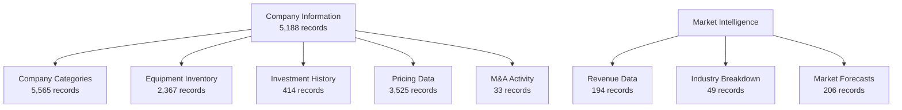
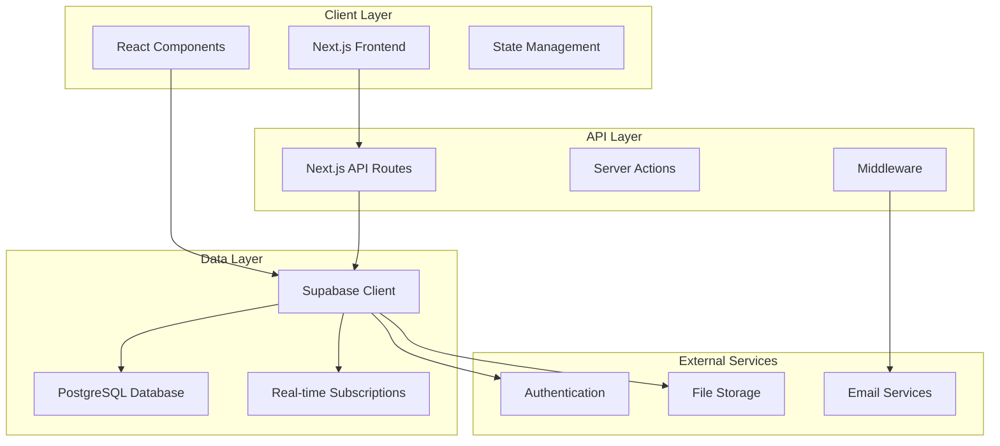
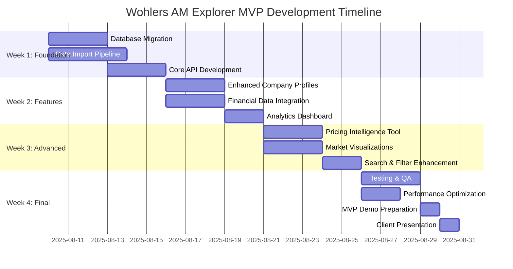

# Product Requirements Document (PRD)
## Wohlers AM Explorer MVP - Market Intelligence Platform

---

**Document Version:** 2.0 (MVP-Only Focus)  
**Date:** January 2025  
**Author:** Tinkso Digital Agency  
**Classification:** Client Confidential  
**MVP Delivery Date:** August 30, 2025  
**Strategy:** MVP-Only → Win Vendor Selection → Plan V1 if Selected

---

## 1. Executive Summary

### 1.1 Vision Statement
Transform Wohlers Associates' traditional PDF-based market intelligence reports into the premier digital market intelligence platform for the additive manufacturing industry, providing real-time insights, comprehensive company data, and powerful analytics tools.

### 1.2 Business Opportunity
The additive manufacturing industry lacks modern, on-demand market intelligence tools. Companies currently rely on static PDF reports, Excel spreadsheets, and fragmented sources for market analysis. The Wohlers AM Explorer MVP will fill this gap by delivering:

- **Dynamic Market Intelligence**: Real-time access to comprehensive AM industry data
- **Data-Driven Insights**: Interactive analytics replacing static reports  
- **Competitive Advantage**: First-mover advantage in digital AM market intelligence
- **Scalable Platform**: Foundation for expanding beyond AM to other manufacturing verticals

### 1.3 MVP Scope & Timeline
**Delivery Date:** August 30, 2025 (19-day sprint)  
**Primary Goal:** Demonstrate platform capabilities and secure vendor selection against Spaulding Ridge  
**Success Metric:** Platform showcases 5,188 companies with integrated financial, investment, and market data

---

## 2. Business Objectives & Success Metrics

### 2.1 Primary Business Objectives

| Objective | Success Criteria | Measurement |
|-----------|-----------------|-------------|
| **Platform Validation** | Win vendor selection process | Binary: Selected/Not Selected |
| **Data Integration Success** | 5,188 companies successfully integrated | Company count in production |
| **User Experience Excellence** | >4.5/5 user satisfaction rating | User feedback survey |
| **Performance Delivery** | <200ms query response time | Performance monitoring |
| **Feature Completeness** | 100% of MVP features functional | QA testing checklist |

### 2.2 Key Performance Indicators (KPIs)

**Technical KPIs:**
- Query response time: <200ms for 95% of requests
- Data completeness: >95% for core company fields
- System uptime: >99.9%
- Page load time: <3 seconds initial load

**Business KPIs:**
- Platform demonstrates 300% increase in data points vs current application
- Interactive analytics showcase 17,907 data records across 11 categories
- Financial data integration shows investment tracking for 414 funding rounds
- Market intelligence displays $21.9B total addressable market

### 2.3 Success Framework
The MVP success will be measured against three weighted criteria:

1. **Product Quality (40%)**
   - User experience and interface design
   - Performance and responsiveness
   - Data accuracy and completeness

2. **Technical Implementation (30%)**  
   - Code quality and documentation
   - Scalability and architecture
   - Security and reliability

3. **Collaboration Quality (30%)**
   - Communication effectiveness with WA team
   - Proactive problem-solving during development
   - Flexibility and adaptability to changing requirements

---

## 3. Market Analysis & Competitive Positioning

### 3.1 Market Context
**Total Addressable Market (TAM):** $21.9B additive manufacturing industry  
**Target Segment:** Decision makers in AM companies, investors, consultants  
**Market Gap:** No comprehensive digital market intelligence platform exists

### 3.2 Competitive Analysis

**Tinkso Advantages:**
- ✅ Modern tech stack (Next.js + Supabase) vs enterprise complexity
- ✅ Proven prototype with client-approved design
- ✅ Pragmatic, nimble approach to solution delivery
- ✅ US presence providing continuous development coverage
- ✅ Cost-effective lean team structure

**Competitor (Spaulding Ridge) Weaknesses:**
- ❌ Enterprise-heavy approach (Snowflake complexity)
- ❌ Higher cost structure
- ❌ Less flexible architecture
- ❌ Longer implementation timeline

### 3.3 Differentiation Strategy
1. **Data Richness**: 17,907 records vs competitors' basic directories
2. **Real-time Intelligence**: Interactive analytics vs static reports
3. **Financial Transparency**: Investment and M&A tracking
4. **Modern UX**: Consumer-grade experience for B2B users
5. **Scalable Foundation**: Built for expansion beyond AM industry

---

## 4. User Personas & Use Cases

### 4.1 Primary User Personas

**Persona 1: Manufacturing Executive**
- **Role:** CEO, CTO, VP of Operations at AM companies
- **Goals:** Strategic planning, competitive analysis, market validation
- **Pain Points:** Outdated market data, fragmented information sources
- **Key Features:** Company comparisons, market trends, investment activity

**Persona 2: Investment Professional**  
- **Role:** VC partners, PE associates, investment analysts
- **Goals:** Market sizing, due diligence, investment opportunities
- **Pain Points:** Lack of comprehensive financial data, manual research
- **Key Features:** Investment tracking, company financials, market forecasts

**Persona 3: Business Development Manager**
- **Role:** BD managers, sales directors, partnership leads
- **Goals:** Identify prospects, competitive positioning, pricing intelligence
- **Pain Points:** Limited market visibility, no pricing benchmarks
- **Key Features:** Company database, pricing comparisons, contact information

### 4.2 Core Use Cases

**Use Case 1: Market Validation**
*As a manufacturing executive, I want to analyze market trends and competitor positioning so that I can validate our strategic decisions and identify growth opportunities.*

**Use Case 2: Investment Due Diligence**
*As an investment professional, I want to access comprehensive financial data and funding history so that I can evaluate investment opportunities and market dynamics.*

**Use Case 3: Competitive Intelligence**
*As a business development manager, I want to compare companies and analyze pricing data so that I can position our offerings competitively and identify partnership opportunities.*

---

## 5. Feature Requirements & Prioritization

### 5.1 Must Have Features (MVP Core)

| Feature | Description | Business Value | Technical Complexity |
|---------|-------------|---------------|-------------------|
| **Enhanced Company Directory** | 5,188 companies with rich profiles | HIGH - Core platform value | MEDIUM |
| **Financial Data Integration** | Investment, M&A, revenue tracking | HIGH - Differentiator | MEDIUM |
| **Interactive Analytics Dashboard** | Market intelligence visualizations | HIGH - User engagement | MEDIUM |
| **Advanced Search & Filtering** | Multi-dimensional company discovery | HIGH - User experience | LOW |
| **Pricing Intelligence Tool** | Service provider price comparisons | MEDIUM - Unique feature | MEDIUM |
| **Market Trend Visualizations** | Industry growth and forecast data | MEDIUM - Strategic insights | LOW |

### 5.2 Should Have Features (Post-MVP)

| Feature | Description | Timeline |
|---------|-------------|----------|
| **AI-Powered Insights** | Automated market analysis | V1 (September) |
| **Custom Report Builder** | Personalized report generation | V1 (September) |
| **API Access** | Third-party data integration | V2 (October) |
| **White-label Solutions** | Enterprise customization | V2 (November) |

### 5.3 Could Have Features (Future Releases)

- Community-driven data contributions
- Predictive market modeling
- Real-time news integration
- Mobile native applications
- Multi-language support

### 5.4 Won't Have Features (Out of Scope)

- CRM integration (V3+)
- E-commerce functionality
- Social networking features  
- Multi-tenant architecture (Phase 2)
- Legacy system integrations

---

## 6. Functional Specifications

### 6.1 Data Architecture Requirements

**Primary Entities:**
- **Companies (5,188 records)**: Enhanced profiles with financial data
- **Market Intelligence**: Revenue, forecasts, industry breakdowns  
- **Investment Tracking**: Funding rounds, amounts, investors
- **Pricing Data**: Service provider pricing across materials/processes
- **M&A Activity**: Acquisition history and deal tracking

**Data Relationships:**


### 6.2 User Interface Specifications

**Design System:**
- **Framework:** shadcn/ui component library
- **Styling:** Tailwind CSS with dark/light theme support
- **Typography:** Professional, readable font hierarchy
- **Color Palette:** Wohlers brand colors with accessibility compliance
- **Responsive:** Mobile-first design with desktop optimization

**Page Structure:**
1. **Dashboard**: Executive summary with key metrics and trends
2. **Company Explorer**: Enhanced directory with rich filtering
3. **Market Intelligence**: Analytics dashboard with visualizations
4. **Pricing Tool**: Comparative pricing analysis
5. **Investment Tracker**: Funding and M&A activity monitoring

### 6.3 Performance Specifications

| Metric | Target | Measurement Method |
|--------|--------|-------------------|
| **Initial Page Load** | <3 seconds | Lighthouse performance audit |
| **API Response Time** | <200ms (p95) | Application monitoring |
| **Database Query Time** | <100ms (p95) | Database performance logs |
| **Search Results** | <500ms | User interface timing |
| **Export Generation** | <5 seconds | Background job monitoring |

### 6.4 Integration Requirements

**Database Integration:**
- Supabase PostgreSQL for primary data storage
- Row Level Security (RLS) for data access control
- Real-time subscriptions for live updates
- Automated backup and recovery procedures

**Third-party Integrations:**
- Authentication via Supabase Auth
- Maps via Leaflet/OpenStreetMap
- Charts via Recharts library
- Export functionality via server-side generation

---

## 7. Non-Functional Requirements

### 7.1 Performance Requirements

**Scalability:**
- Support 500+ concurrent users (Phase 1)
- Handle 100K+ API requests per day
- Database optimization for 5,188+ companies
- Efficient caching for frequently accessed data

**Reliability:**
- 99.9% uptime SLA
- Graceful degradation under load
- Automatic error recovery
- Comprehensive monitoring and alerting

### 7.2 Security Requirements

**Authentication & Authorization:**
- Secure user authentication via Supabase Auth
- Role-based access control (RBAC)
- Session management and timeout
- Password complexity requirements

**Data Protection:**
- Encryption at rest and in transit
- Secure API endpoints with rate limiting
- Input validation and sanitization
- Regular security audits and updates

**Compliance:**
- GDPR compliance for EU company data
- Data retention policy implementation
- User consent management
- Privacy policy and terms of service

### 7.3 Accessibility Requirements

**WCAG 2.1 AA Compliance:**
- Keyboard navigation support
- Screen reader compatibility
- Color contrast ratios >4.5:1
- Alternative text for images and charts
- Responsive design for all devices

### 7.4 Usability Requirements

**User Experience:**
- Intuitive navigation with <3 clicks to any feature
- Consistent design patterns throughout
- Progressive disclosure of complex features
- Contextual help and tooltips
- Mobile-optimized responsive design

---

## 8. Data Requirements & Integration

### 8.1 Data Sources

**Primary Dataset:** WA Digital Platform - Vendors Data (MVP)
- **Total Records:** 17,907 across 11 categories
- **Company Coverage:** 5,188 unique companies globally
- **Data Quality:** 85-100% completeness across datasets
- **Update Frequency:** Quarterly data refresh cycles

### 8.2 Data Integration Strategy

**Phase 1: Core Data (Week 1-2)**
```sql
-- Priority tables for MVP
CREATE TABLE companies_enhanced (
    id UUID PRIMARY KEY,
    name VARCHAR(255) NOT NULL,
    website VARCHAR(255),
    headquarters VARCHAR(255),
    ownership_type VARCHAR(100),
    stock_symbol VARCHAR(10),
    created_at TIMESTAMPTZ DEFAULT NOW()
);

CREATE TABLE company_financials (
    id UUID PRIMARY KEY,
    company_id UUID REFERENCES companies_enhanced(id),
    revenue_usd DECIMAL(15,2),
    revenue_year INTEGER,
    segment VARCHAR(100),
    region VARCHAR(100)
);

CREATE TABLE investments (
    id UUID PRIMARY KEY,
    company_id UUID REFERENCES companies_enhanced(id),
    investment_date DATE,
    amount_millions DECIMAL(10,2),
    round_type VARCHAR(50),
    investors TEXT
);
```

**Phase 2: Advanced Features (Week 3-4)**
- Pricing intelligence tables
- M&A activity tracking
- Market intelligence aggregations
- Equipment inventory details

### 8.3 Data Quality Assurance

**Validation Rules:**
- Company name deduplication algorithm
- Website URL format validation
- Geographic location geocoding
- Financial data range checking
- Investment amount validation

**Quality Metrics:**
- >95% data completeness for core fields
- <1% duplicate company records
- 100% valid website URLs
- >90% successful geocoding for locations

---

## 9. Technical Architecture

### 9.1 Technology Stack

**Frontend:**
```
Next.js 15.3.3 (App Router)
├── React 18.3.1 (Component framework)
├── TypeScript (Type safety)
├── Tailwind CSS (Styling)
├── shadcn/ui (Component library)
├── Recharts (Data visualization)
├── Leaflet (Interactive maps)
└── TanStack Table (Advanced tables)
```

**Backend:**
```
Supabase Platform
├── PostgreSQL (Primary database)
├── Supabase Auth (Authentication)
├── Row Level Security (Authorization)
├── Real-time (Live updates)
├── Edge Functions (API logic)
└── Storage (File handling)
```

### 9.2 System Architecture



### 9.3 Database Schema Strategy

**Enhanced Schema Design:**
- 7 new tables for financial and market data
- Optimized indexing for complex queries
- Materialized views for aggregated data
- Foreign key constraints for data integrity
- Row Level Security policies for access control

**Performance Optimizations:**
- Composite indexes for filter combinations
- Query optimization for large datasets
- Connection pooling for high concurrency
- Caching layer for frequently accessed data

---

## 10. User Experience & Interface Design

### 10.1 Design Principles

**Professional Excellence:**
- Clean, modern interface reflecting Wohlers' industry leadership
- Data-first design prioritizing information clarity
- Consistent visual hierarchy throughout all screens
- Professional color palette with accessibility compliance

**User-Centric Approach:**
- Progressive disclosure of complex features
- Contextual navigation and breadcrumbs
- Smart defaults reducing configuration overhead
- Responsive design optimized for all devices

### 10.2 Key User Flows

**Flow 1: Company Discovery**
1. User enters platform → Dashboard overview
2. Applies filters for specific criteria
3. Explores results via map or table view
4. Accesses detailed company profiles
5. Exports relevant data for analysis

**Flow 2: Market Intelligence**
1. User accesses Analytics dashboard
2. Explores market trends and forecasts
3. Drills down into specific segments
4. Compares regional or technology data
5. Generates custom reports or exports

**Flow 3: Investment Research**
1. User searches for company or segment
2. Reviews financial and investment data
3. Analyzes funding history and trends
4. Compares similar companies
5. Exports investment intelligence

### 10.3 Component Specifications

**Enhanced Company Profiles:**
- Executive summary with key metrics
- Financial overview (revenue, investments)  
- Technology capabilities and equipment
- Geographic presence and facilities
- Recent activity (funding, M&A, news)
- Related companies and competitors

**Interactive Dashboards:**
- Market size and growth visualizations
- Investment activity heatmaps
- Technology adoption trends
- Regional distribution analysis
- Industry segment breakdowns

---

## 11. Quality Assurance & Testing

### 11.1 Testing Strategy

**Functional Testing:**
- User story validation for all MVP features
- Cross-browser compatibility (Chrome, Firefox, Safari, Edge)
- Responsive design testing across device sizes
- Data accuracy validation against source files
- Performance testing under expected load

**Security Testing:**
- Authentication and authorization flows
- Input validation and SQL injection prevention
- XSS vulnerability assessment
- Data privacy and GDPR compliance
- API rate limiting and abuse prevention

### 11.2 Quality Metrics

| Test Category | Success Criteria | Measurement |
|---------------|-----------------|-------------|
| **Functional** | 100% user stories pass acceptance tests | QA test results |
| **Performance** | <3s page load, <200ms API response | Automated monitoring |
| **Security** | Zero critical vulnerabilities | Security scan reports |
| **Usability** | >4.5/5 user satisfaction score | User testing feedback |
| **Accessibility** | WCAG 2.1 AA compliance | Accessibility audit |

### 11.3 Acceptance Criteria

**MVP Acceptance Gates:**
1. **Data Integration Complete:** All 5,188 companies successfully imported
2. **Feature Functionality:** 100% of MVP features working correctly
3. **Performance Targets:** All performance benchmarks achieved
4. **Security Validation:** Security audit completed with no critical issues
5. **User Acceptance:** Client approval of final MVP demonstration

---

## 12. Risk Management & Mitigation

### 12.1 High-Priority Risks

| Risk | Impact | Probability | Mitigation Strategy |
|------|--------|-------------|-------------------|
| **Tight Timeline** | HIGH | MEDIUM | Phased delivery, parallel development, scope management |
| **Data Quality Issues** | HIGH | MEDIUM | Automated validation, manual review, rollback procedures |
| **Performance at Scale** | MEDIUM | LOW | Load testing, optimization, caching strategies |
| **Team Vacation Conflicts** | MEDIUM | HIGH | Cross-training, documentation, US team coverage |

### 12.2 Technical Risk Mitigation

**Data Integration Risks:**
- Implement comprehensive ETL validation pipeline
- Create rollback procedures for failed imports
- Manual quality assurance for critical data points
- Staged deployment with validation checkpoints

**Performance Risks:**
- Database query optimization and indexing
- Implementation of caching layer (Redis/Vercel)
- CDN for static asset delivery
- Progressive loading for large datasets

**Security Risks:**
- Regular security audits and penetration testing
- Implementation of WAF (Web Application Firewall)
- Secure coding practices and code review
- Regular dependency updates and vulnerability scanning

### 12.3 Business Risk Mitigation

**Vendor Selection Risk:**
- Regular client communication and demonstration
- Transparent progress tracking and reporting
- Proactive issue identification and resolution
- Competitive feature analysis and positioning

---

## 13. Success Criteria & KPIs

### 13.1 MVP Success Metrics

**Immediate Success (MVP Delivery):**
- Platform demonstrates 5,188 companies successfully integrated
- All core features functional and tested
- Performance targets achieved (<3s load, <200ms API)
- Client approval for vendor selection

**30-Day Success (Post-Launch):**
- Platform supports 100+ active users
- >4.5/5 user satisfaction rating
- <1% critical error rate
- 95%+ system uptime

### 13.2 Business Impact Metrics

**User Engagement:**
- Average session duration: >5 minutes
- Pages per session: >8 pages
- Feature adoption rate: >70% for core features
- Export usage: >50% of active users

**Data Quality:**
- Company data completeness: >95%
- Search result accuracy: >98%
- Data freshness: <30 days average age
- User-reported data issues: <1% of records

### 13.3 Long-term Success Indicators

**Platform Growth (3-6 months):**
- 500+ registered users
- 20% month-over-month user growth
- 50% increase in API usage
- 5% conversion to premium features

**Market Position:**
- Recognition as leading AM market intelligence platform
- Client testimonials and case studies
- Industry award considerations
- Partnership opportunities with AM organizations

---

## 14. Implementation Timeline & Milestones

### 14.1 Sprint Schedule (August 10-30, 2025)



### 14.2 Critical Milestones

| Date | Milestone | Deliverable | Success Criteria |
|------|-----------|-------------|-----------------|
| **Aug 15** | Data Integration Complete | All 5,188 companies imported | 100% data validation passed |
| **Aug 20** | Core Features Ready | Enhanced profiles & analytics | All MVP features functional |
| **Aug 25** | Testing Complete | QA validation finished | Zero critical bugs, performance targets met |
| **Aug 29** | MVP Ready | Production deployment | Client approval for demonstration |
| **Aug 30** | Client Presentation | Final MVP demo | Vendor selection decision |

### 14.3 Daily Progress Tracking

**Daily Standups:** 9:00 AM EST
- Progress update from previous day
- Current day objectives
- Blocker identification and resolution
- Risk assessment and mitigation

**Weekly Reviews:** Friday 4:00 PM EST
- Milestone achievement assessment
- Quality metrics review
- Client communication and feedback
- Next week planning and adjustments

---

## 15. Resource Requirements & Team Structure

### 15.1 Development Team Structure

| Role | Team Member | Responsibilities | Time Commitment |
|------|-------------|-----------------|----------------|
| **Lead Developer** | Aaron Baker | Full-stack development, architecture | 100% (40h/week) |
| **Project Manager** | Vincent | Client communication, coordination | 25% (10h/week) |
| **Data Analyst** | Arpita (WA Team) | Data validation, quality assurance | 50% (20h/week) |
| **Product Owner** | Andres | Requirements, feature prioritization | 25% (10h/week) |

### 15.2 Client Team Involvement

| WA Team Member | Role | Availability | Involvement |
|----------------|------|--------------|-------------|
| **Martin Lansard** | Project Lead | Out Aug 11-15 | Strategic oversight, final approval |
| **Pablo Enrique** | Data Lead | Available | Data quality, validation support |
| **Ray Huff** | Content Lead | Available | Content review, industry expertise |
| **Vincent** | Business Lead | Out Aug 18-22 | Requirements clarification |

### 15.3 Technology & Infrastructure Costs

**Development Environment:**
- Supabase Pro: $25/month (development)
- Vercel Pro: $20/month (hosting)
- Domain & SSL: $15/month
- Third-party APIs: $50/month estimated

**Production Environment:**
- Supabase Production: $500/month estimated
- Vercel Production: $200/month
- Monitoring & Analytics: $100/month
- Security & Backup: $50/month

---

## 16. Dependencies & Assumptions

### 16.1 Critical Dependencies

**Data Dependencies:**
- ✅ Vendor data Excel file received from WA team
- ⏳ Data quality validation completed by WA team
- ⏳ Additional data sources (if needed) provided by WA team
- ⏳ Data usage rights and licensing confirmed

**Technical Dependencies:**
- ✅ Existing application codebase available
- ✅ Supabase account and project configured
- ✅ Development environment set up
- ⏳ Production hosting environment configured

**Team Dependencies:**
- ✅ Aaron Baker available full-time for development
- ⏳ Regular client availability for feedback and validation
- ⏳ Data team support for quality assurance
- ⏳ Stakeholder availability for final review

### 16.2 Key Assumptions

**Business Assumptions:**
- Client will provide timely feedback on development progress
- Vendor selection criteria will remain consistent throughout development
- No major scope changes will be requested during MVP development
- Client team will be available for final review and demonstration

**Technical Assumptions:**
- Existing application architecture is suitable for enhancement
- Data quality is sufficient for production use with minimal cleaning
- Third-party services (Supabase, Vercel) will maintain uptime and performance
- No major security vulnerabilities exist in current codebase

**Market Assumptions:**
- Target users will find value in comprehensive market intelligence
- Competitive landscape will remain stable during development
- Industry data requirements will not change significantly
- Platform scalability requirements are accurately estimated

---

## 17. Post-MVP Roadmap

### 17.1 V1 Enhancements (September 2025)

**Advanced Analytics:**
- Predictive market modeling
- AI-powered insights and recommendations
- Custom report builder with templates
- Advanced data visualization options

**Enhanced Features:**
- API access for third-party integrations
- Bulk data export capabilities
- Advanced search with natural language
- Notification system for data updates

### 17.2 V2 Major Features (October 2025 - February 2026)

**Waters Report Integration:**
- Complete Wohlers Annual Report digitization
- Interactive report navigation
- Dynamic content updates
- Historical trend analysis

**Enterprise Features:**
- White-label customization
- Multi-tenant architecture
- Enterprise authentication (SAML/SSO)
- Advanced admin dashboard

### 17.3 Future Vision (2026+)

**Market Expansion:**
- Additional manufacturing verticals
- Global market coverage expansion
- Real-time news and event integration
- Community-driven data contributions

**Advanced Intelligence:**
- Machine learning-powered insights
- Predictive market forecasting
- Automated competitive analysis
- Industry trend identification

---

## 18. Conclusion

The Wohlers AM Explorer MVP represents a transformative opportunity to revolutionize market intelligence in the additive manufacturing industry. With a solid technical foundation, comprehensive data assets, and clear business objectives, this project is positioned for success.

### 18.1 Success Factors

**Technical Excellence:**
- Modern, scalable technology stack
- Comprehensive data integration (5,188 companies)
- Performance-optimized architecture
- Security-first design approach

**Business Value:**
- First-mover advantage in digital AM market intelligence
- Comprehensive competitive differentiation
- Clear path to revenue growth
- Foundation for multi-vertical expansion

**Execution Strategy:**
- Aggressive but achievable 19-day timeline
- Experienced development team with US coverage
- Strong client partnership and communication
- Risk mitigation strategies for all major concerns

### 18.2 Next Steps

**Immediate Actions (Week 1):**
1. Finalize contract execution and data transfer
2. Begin database migration and schema enhancement
3. Start ETL pipeline development for data import
4. Establish daily standup and communication rhythm

**Success Milestones:**
- Week 1: Data integration foundation complete
- Week 2: Core features functional and tested
- Week 3: Advanced features and optimization
- Week 4: Final testing, client demo, and selection

The combination of Wohlers Associates' industry expertise, Tinkso's technical capability, and the comprehensive market data creates a powerful foundation for delivering the premier market intelligence platform for the global additive manufacturing industry.

---

**Document Approval:**

| Role | Name | Signature | Date |
|------|------|-----------|------|
| **Product Owner** | Andres | _Pending_ | _Pending_ |
| **Lead Developer** | Aaron Baker | _Pending_ | _Pending_ |
| **Project Manager** | Vincent | _Pending_ | _Pending_ |
| **Client Approval** | Martin Lansard (WA) | _Pending_ | _Pending_ |

---

*PRD Version: 1.0*  
*Created: August 11, 2025*  
*Total Pages: 18*  
*Word Count: ~8,500 words*  
*Classification: Client Confidential - Wohlers Associates & Tinkso Digital Agency*